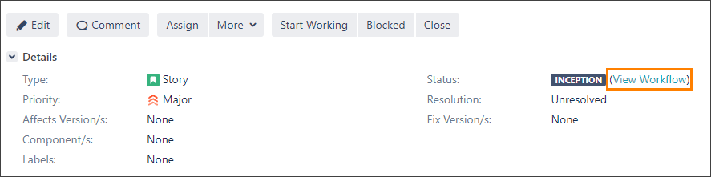
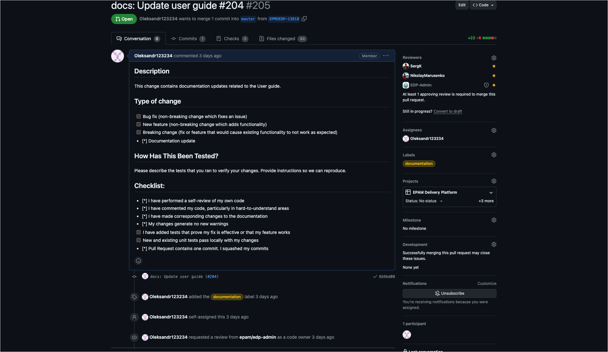

# KubeRocketCI Project Rules. Working Process

This page contains the details on the project rules and working process for KubeRocketCI team and contributors. Explore the main points about working with GitHub, following the main commit flow, as well as the details about commit types and message below.

## Project Rules

Before starting the development, please check the project rules:

1. It is highly recommended to become familiar with the GitHub flow. For details, please refer to the [GitHub official documentation](https://docs.github.com/en/get-started/using-github/github-flow) and pay attention to the main points:

  a. Creating pull requests in GitHub.

  b. Resolution of Merge Conflict.

  c. Comments resolution.

  d. One GitHub task should have one Pull Request (PR) if it doesn't change multiple operators. If there are many changes within one PR, amend the commit.

2. Only the Assignee is responsible for the PR merger and Jira task status.

3. Every PR should be merged in a timely manner.

4. Log time to Jira ticket.

## Working Process

With KubeRocketCI, the main workflow is based on the getting a Jira task and creating a Pull Request according to the rules described below.

!!! Workflow
    Get Jira task → implement, verify by yourself the results → create Pull Request (PR) → send for review → resolve comments/add changes, ask colleagues for the final review → track the PR merge → verify by yourself the results → change the status in the Jira ticket to CODE COMPLETE or RESOLVED → share necessary links with a QA specialist in the QA Verification channel → QA specialist closes the Jira task after his verification → Jira task should be CLOSED.

**Commit Flow**

1. Get a task in the Jira/GitHub dashboard. Please be aware of the following points:

  === "Jira"

      a. Every task has a reporter who can provide more details in case something is not clear.

      b. The responsible person for the task and code implementation is the assignee who tracks the following:

       - Actual Jira task status.

       - Time logging.

       - Add comments, attach necessary files.

       - In comments, add link that refers to the merged PR (optional, if not related to many repositories).

       - Code review and the final merge.

       - MS Teams chats - ping other colleagues, answer questions, etc.

       - Verification by a QA specialist.

       - Bug fixing.

      c. Pay attention to the task Status that differs in different entities, the workflow will help to see the whole task processing:

      !

      d. There are several entities that are used on the KubeRocketCI project: Story, Improvement, Task, Bug.

  === "GitHub"

      a. Every task has a reporter who can provide more details in case something is not clear.

      b. The responsible person for the task and code implementation is the assignee who tracks the following:

       - Actual GitHub task status.

       - Add comments, attach necessary files.

       - In comments, add link that refers to the merged PR (optional, if not related to many repositories).

       - Code review and the final merge.

       - MS Teams chats - ping other colleagues, answer questions, etc.

       - Verification by a QA specialist.

       - Bug fixing.

      c. If the task is created on your own, make sure it is populated completely. See an example below:

      !

2. Implement feature, improvement, fix and check the results on your own. If it is impossible to check the results of your work before the merge, verify all later.

3. When committing, use the pattern: commit type: Commit message (#GitHub ticket number).

  a. commit type:

  `feat`: (new feature for the user, not a new feature for build script)

  `fix`: (bug fix for the user, not a fix to a build script)

  `docs`: (changes to the documentation)

  `style`: (formatting, missing semicolons, etc; no production code change)

  `refactor`: (refactoring production code, eg. renaming a variable)

  `test`: (adding missing tests, refactoring tests; no production code change)

  `chore`: (updating grunt tasks etc; no production code change)

  `!`: (added to other commit types to mark breaking changes) For example:

      feat!: Add ingress links column into Applications table on stage page (#77)

      BREAKING CHANGE: Ingress links column has been added into the Applications table on the stage details page

  b. Commit message:

  * brief, for example:

    ``fix: Remove secretKey duplication from registry secrets (#63)``

    or

  * descriptive, for example:

    feat: Provide the ability to configure hadolint check (#88)

    \* Add configuration files .hadolint.yaml and .hadolint.yml to stash

    !!! note
        It is mandatory to start a commit message from a capital letter.

  c. GitHub tickets are typically identified using a number preceded by the **#** sign and enclosed in parentheses.

  !!! note
      Make sure there is a descriptive commit message for a breaking change Pull Request. For example:
   
        feat!: Add ingress links column into Applications table on stage page (#77)
   
        BREAKING CHANGE: Ingress links column has been added into the Applications table on the stage details page

4. Create a Pull Request, for details, please refer to the [Code Review Process](https://docs.github.com/en/pull-requests/collaborating-with-pull-requests/reviewing-changes-in-pull-requests/about-pull-request-reviews):

  !

  !!! note
      If a Pull Request contains both new functionality and breaking changes, make sure the functionality description is placed before the breaking changes. For example:
  
      feat!: Update Gerrit to improve access
  
      * Implement Developers group creation process
      * Align group permissions
  
      BREAKING CHANGES: Update Gerrit config according to groups

## Related Articles

* [Conventional Commits](https://www.conventionalcommits.org/)
* [Karma](http://karma-runner.github.io/1.0/dev/git-commit-msg.html)
