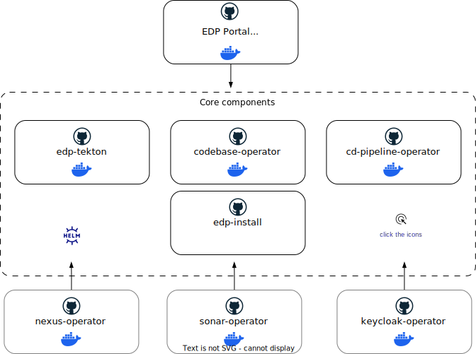

# Overview

The EPAM Delivery Platform (EDP) Developer Guide serves as a comprehensive technical resource specifically designed for developers. It offers detailed insights into expanding the functionalities of EDP. This section focuses on explaining the development approach and fundamental architectural blueprints that form the basis of the platform's ecosystem.

Within these pages, you'll find architectural diagrams, component schemas, and deployment strategies essential for grasping the structural elements of EDP. These technical illustrations serve as references, providing a detailed understanding of component interactions and deployment methodologies. Understanding the architecture of EDP and integrating third-party solutions into its established framework enables the creation of efficient, scalable, and customizable solutions within the EPAM Delivery Platform.

The diagram below illustrates how GitHub repositories and Docker registries are interconnected within the EDP ecosystem.

