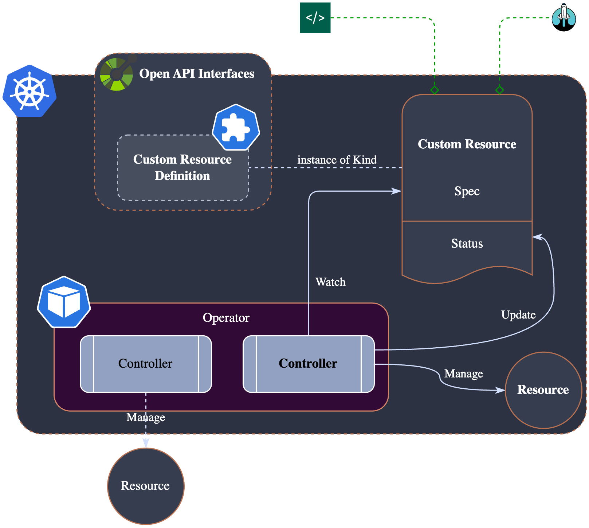
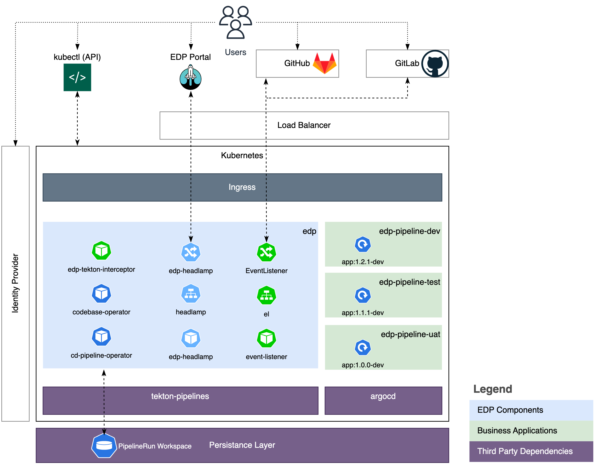

# Kubernetes Deployment

This section provides a comprehensive overview of the EDP deployment approach on a Kubernetes cluster. EDP is designed and functions based on a set of key guiding principles:

* **Operator Pattern Approach:** [Approach](https://kubernetes.io/docs/concepts/extend-kubernetes/operator/) is used for deployment and configuration, ensuring that the platform aligns with Kubernetes native methodologies (see schema below).
* **Loosely Coupling:** EDP comprises several loosely coupled operators responsible for different platform parts. These operators can be deployed independently, enabling the most straightforward platform customization and delivery approach.

  !

The following deployment diagram illustrates the platform's core components, which provide the minimum functional capabilities required for the platform operation: build, push, deploy, and run applications. The platform relies on several mandatory dependencies:

* **Ingress:** An ingress controller responsible for routing traffic to the platform.
* **Tekton Stack:** Includes Tekton pipelines, triggers, dashboard, chains, etc.
* **ArgoCD:** Responsible for GitOps deployment.

!

* **Codebase Operator:** Responsible for managing git repositories, versioning, and branching. It also implements Jira integration controller.
* **CD Pipeline Operator:** Manages Continuous Delivery (CD) pipelines and CD stages (which is an abstraction of Kubernetes Namespace). Operator acts as the bridge between the artifact and deployment tools, like Argo CD. It defines the CD pipeline structure, artifacts promotion logic and triggers the pipeline execution.
* **Tekton Pipelines:** Manages Tekton pipelines and processes events (EventListener, Interceptor) from Version Control Systems. The pipelines are integrated with external tools like SonarQube, Nexus, etc.
* **EDP Portal:** This is the User Interface (UI) component, built on top of Headlamp.

**Business applications** are deployed on the platform using the CD Pipeline Operator and Argo CD. By default, the CD Pipeline Operator uses Argo CD as a deployment tool. However, it can be replaced with any other tool, like FluxCD, Spinnaker, etc. The target environment for the application deployment is a Kubernetes cluster where EDP is deployed, but it can be any other Kubernetes cluster.
