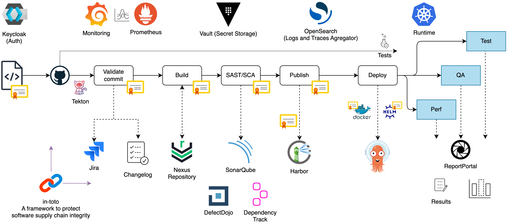

# Reference CI/CD Pipeline

This document provides an in-depth overview of the Continuous Integration and Continuous Delivery (CI/CD) pipeline reference architecture implemented within the EPAM Delivery Platform (EDP). The pipeline is designed to facilitate efficient and automated software deployment across diverse environments, leveraging a suite of tools and methodologies for enhanced reliability, scalability, and security.

## CI/CD Pipeline Architecture

The CI/CD pipeline within EDP orchestrates the software delivery process, encompassing several sequential stages to ensure robustness and reliability.

!

The CI/CD Pipeline follows a modular and scalable architecture that leverages various tools to ensure the reliability and efficiency of the software delivery process. The architecture can be divided into stages, each responsible for specific tasks. Explore the key components involved in the pipeline and their functionalities.

1. **Source Code:** The pipeline starts with the source code, representing the application's codebase. Developers commit their changes to the source code repository, triggering the pipeline.

2. **Validate Commit Message:** The commit message validation component checks the format and content of the commit message. It ensures the commit message follows the correct format and includes a valid Tracking Issue key. It helps maintain a standardized commit message format throughout the application development.

3. **Build:** The Build component compiles the source code, runs unit tests, and generates the application artifact. It consumes the artifact from the Artifact Repository (Nexus), ensuring consistent and reliable builds.

4. **SAST with SonarQube:** The Static Analysis Security Testing (SAST) component utilizes SonarQube to analyze the source code for potential security vulnerabilities, code smells, and quality issues. This step helps identify and address security or code quality issues early in development.

5. **SCA:** The Software Composition Analysis (SCA) component performs dependency analysis using cdxgen, Dependency-Track, semgrep, and DefectDojo. It checks for known vulnerabilities or license compliance issues in the application's dependencies. By identifying and resolving these issues, it ensures the security and stability of the software.

6. **Publish:** The Publish component publishes the application artifact to the Artifact Repository. It posts Docker images to the Docker Registry and stores binary artifacts in the Nexus Repository. This process ensures that the artifacts are securely stored and easily accessed for future deployments.

7. **Deploy:** The Deploy component uses Argo CD or Tekton to deploy applications to target environments in Kubernetes, leveraging Helm charts to ensure seamless deployment. Deploy to Test/Quality Assurance/Performance Environments: The final stages of the pipeline involve deploying the application to different environments for testing and quality assurance purposes. The results of the tests are consolidated and reported to the Report Portal, facilitating efficient test reporting and analysis.

The overall architecture of the CI/CD Pipeline ensures a streamlined and automated software delivery process, from source code to deployment. It provides developers with the necessary tools and processes to ensure their applications' quality, security, and scalability. Furthermore, Tekton Chains enhances supply chain security by signing and generating in-toto metadata that verifies the integrity of artifacts and the CI/CD Pipeline.

!!!note
    The tools mentioned in this document are just examples and can be replaced with other tools that offer similar functionality. For instance, instead of **Harbor** for the Docker Registry, it is possible to use **AWS ECR**. Consider using **Azure Artefacts** or **JFrog Artifactory** instead of **Nexus** for the artifact repository. Instead of setting up an self-managed instance of **SonarQube**, leverage *SonarCloud*, the cloud-based version of SonarQube, as an alternative. The CI/CD Pipeline architecture is flexible and adaptable, allowing the use of different tools based on specific project requirements and platform preferences.
