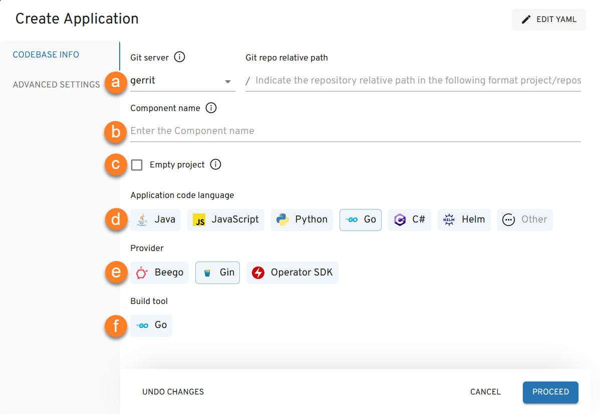
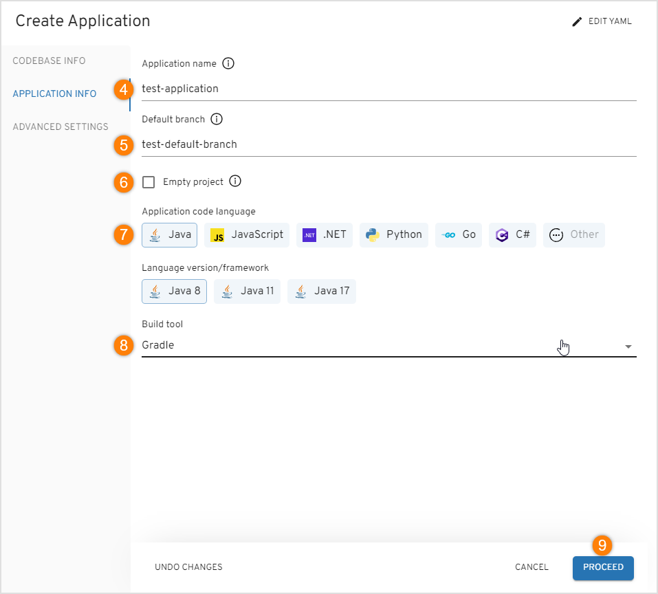
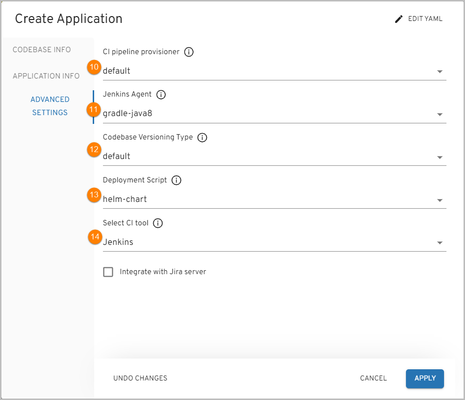
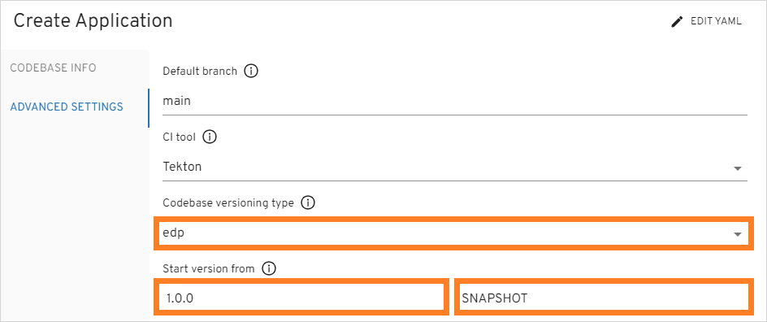
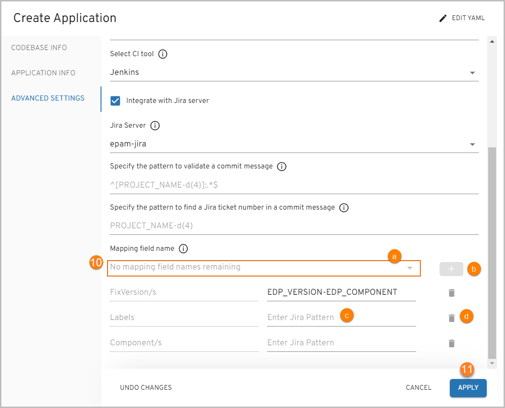

# Add Application

Headlamp allows to create, clone, import an application and add it to the environment. It can also be deployed in Gerrit (if the Clone or Create strategy is used) with the Code Review and Build pipelines built in Jenkins/Tekton.

To add an application, navigate to the **Applications** section on the navigation bar and click **Create** (the plus sign icon in the lower-right corner of the screen). Once clicked, the **Create Application** dialog will appear. You can create an Application [in YAML](#YAML) or [via the three-step menu](#menu) in the dialog.

## Create Application in YAML 

Click **Edit YAML** in the upper-right corner of the **Create Application** dialog to open the YAML editor and create the Application.

!

To edit YAML in the minimal editor, turn on the **Use minimal editor** toggle in the upper-right corner of the **Create Application** dialog.

To save the changes, select the **Save & Apply** button.

## Create Application in the Dialog 

The **Create Application** dialog contains the three steps:

* The Codebase Info Menu
* The Application Info Menu
* The Advanced Settings Menu

### The Codebase Info Menu

Follow the instructions below to fill in the fields of the **Codebase Info** menu:

1. In the **Codebase type** field, select **Application**.

2. In the **Repository onboarding strategy** field, select the necessary configuration strategy:

   * **Create** – creates a project on the pattern in accordance with an application language, a build tool, and a framework.
  
  !
  
  * **Clone** – clones the indicated repository into EPAM Delivery Platform. Fill in the **Repository URL** field. While cloning the existing repository, it is required to fill in the additional fields as well. Select the **Repository credentials** check box in case you clone the private repository, and fill in the repository login and password/access token.
  
  !
  
  * **Import** - allows configuring a replication from the Git server. While importing the existing repository, select the Git server from the drop-down list and define the relative path to the repository, such as */epmd-edp/examples/basic/edp-auto-tests-simple-example*.
  
  !
  
  !!! note
      In order to use the **Import** strategy, make sure to adjust it by the [Enable VCS Import Strategy](../operator-guide/import-strategy.md) page.
      The **Import** strategy is not applicable for Gerrit.

3. Click the **Proceed** button to switch to the next menu.

### The Application Info Menu

The **Application Info** menu should look like the picture below:

   !

Follow the instructions below to fill in the fields of the **Application Info** menu:

1. Type the name of the application in the **Application name** field by entering at least two characters
and by using the lower-case letters, numbers and inner dashes.

2. Specify the name of the default branch where you want the development to be performed.

  !!! note
      The default branch cannot be deleted.
      For the **Clone** and **Import** strategies: if you want to use the existing branch, enter its name into this field.

3. To create an application with an empty repository in Gerrit, select the **Empty project** check box.

  !!! note
      The empty repository option is available only for the **Create** strategy.

4. Select any of the supported application languages with its framework
in the **Application Code Language/framework** field:

  * Java – selecting specific Java version (8,11,17 are available).
  * JavaScript - selecting JavaScript allows using React, Vue, Angular and Express frameworks.
  * Python - selecting Python allows using the Python v.3.8, FastAPI, Flask frameworks.
  * Go - selecting Go allows using the Beego and Operator SDK frameworks.
  * C# - selecting C# allows using the DotNet v.6.0 frameworks.
  * Other - selecting Other allows extending the default code languages when creating a codebase
  with the clone/import strategy. To add another code language,
  inspect the [Add Other Code Language](../operator-guide/add-other-code-language.md) section.

  !!! note
      The **Create** strategy does not allow to customize the default code language set.

5. Choose the necessary build tool in the **Select Build Tool** field:

  * Java - selecting Java allows using the Gradle or Maven tool;
  * JavaScript - selecting JavaScript allows using the NPM tool;
  * C# - selecting C# allows using the .Net tool;
  * Python - selecting Python allows using Python tool;
  * Go - selecting Go allows using Go tool;

  !!! note
      The **Select Build Tool** field disposes of the default tools and can be changed in accordance with the selected code language.

6. Click the **Proceed** button to switch to the next menu.

  ### The Advanced Settings Menu

The **Advanced Settings** menu should look similar to the picture below:

  !

Follow the instructions below to fill in the fields of the **Advanced Setting** menu:

1. Select the CI pipeline provisioner that will be handling a codebase. For details, refer to the [Manage Jenkins CI Pipeline Job Provisioner](../operator-guide/manage-jenkins-ci-job-provision.md) instruction and become familiar with the main steps to add another job provisioner.

2. Select Jenkins agent that will be used to handle a codebase. For details, refer to the [Manage Jenkins Agent](../operator-guide/add-jenkins-agent.md) instruction and inspect the steps that should be done to add a new Jenkins agent.

3. Select the necessary codebase versioning type:

  * **default** - using the default versioning type, in order to specify the version of the current artifacts, images,
  and tags in the Version Control System, a developer should navigate to the corresponding file
  and change the version **manually**.

  * **edp** - using the edp versioning type, a developer indicates the version number that will be used for all the artifacts stored
  in artifactory: binaries, pom.xml, metadata, etc. The version stored in repository (e.g. pom.xml) will not be affected or used.
  Using this versioning overrides any version stored in the repository files without changing actual file.

  When selecting the edp versioning type, the extra field will appear:

  !

  a. Type the version number from which you want the artifacts to be versioned.

  !!! note
      The **Start Version From** field should be filled out in compliance with the semantic versioning rules, e.g. 1.2.3 or 10.10.10.
      Please refer to the [Semantic Versioning](https://semver.org/) page for details.

4. In the **Deployment Script** field, specify one of the available options:
helm-chart / openshift-template that are predefined in case it is OpenShift or EKS.

5. In the **Select CI Tool** field, choose the necessary tool: Jenkins or GitLab CI,
where Jenkins is the default tool and
the GitLab CI tool can be additionally adjusted. For details,
please refer to the [Adjust GitLab CI Tool](../operator-guide/gitlabci-integration.md) page.

  !!! note
      The GitLab CI tool is available only with the **Import** strategy and makes the **Jira integration** feature unavailable.

  !

6. Select the **Integrate with Jira Server** check box in case it is required to connect Jira tickets with the commits
and have a respective label in the Fix Version field.

  !!! note
      To adjust the Jira integration functionality, first apply the necessary changes described on the [Adjust Jira Integration](../operator-guide/jira-integration.md) page, and setup the [Adjust VCS Integration With Jira](../operator-guide/jira-gerrit-integration.md).
      Pay attention that the Jira integration feature is not available when using the GitLab CI tool.

7. In the **Jira Server** field, select the Jira server.

8. Specify the pattern to validate a commit message. Use regular expression to indicate the pattern that is followed on the project to validate a commit message in the code review pipeline. An example of the pattern: `^[PROJECT_NAME-d{4}]:.*$`.

9. Specify the pattern to find a Jira ticket number in a commit message. Based on this pattern, the value from EDP will be displayed in Jira. Combine several variables to obtain the desired value:

  !

10. In the **Mapping field name** section, specify the names of the Jira fields that should be filled in with attributes from EDP:

  a. Select the name of the field in a Jira ticket from the **Mapping field name** drop-down menu. The available fields are the following: *Fix Version/s*, *Component/s* and *Labels*.

  b. Click the plus icon to add the mapping field name.

  c. Enter Jira pattern for the field name:

  * For the **Fix Version/s** field, select the **EDP_VERSION** variable that represents an EDP upgrade version,
  as in _2.7.0-SNAPSHOT_. Combine variables to make the value more informative. For example, the pattern **EDP_VERSION-EDP_COMPONENT** will be displayed as _2.7.0-SNAPSHOT-nexus-operator_ in Jira.
  * For the **Component/s** field, select the **EDP_COMPONENT** variable that defines the name of the existing repository. For example, _nexus-operator_.
  * For the **Labels** field, select the **EDP_GITTAG** variable that defines a tag assigned to the commit in GitHub. For example, _build/2.7.0-SNAPSHOT.59_.

  d. Click the bin icon to remove the Jira field name.

11. Click the Apply button to add the application to the Applications list.

!!! note
    After the complete adding of the application, inspect the [Application Overview](application.md) part.

## Related Articles

* [Application Overview](application.md)
* [Add CD Pipelines](add-cd-pipeline.md)
* [Add Other Code Language](../operator-guide/add-other-code-language.md)
* [Adjust GitLab CI Tool](../operator-guide/gitlabci-integration.md)
* [Adjust Jira Integration](../operator-guide/jira-integration.md)
* [Adjust VCS Integration With Jira](../operator-guide/jira-gerrit-integration.md)
* [Enable VCS Import Strategy](../operator-guide/import-strategy.md)
* [Manage Jenkins CI Pipeline Job Provisioner](../operator-guide/manage-jenkins-ci-job-provision.md)
* [Manage Jenkins Agent](../operator-guide/add-jenkins-agent.md)
* [Perf Server Integration](../operator-guide/perf-integration.md)