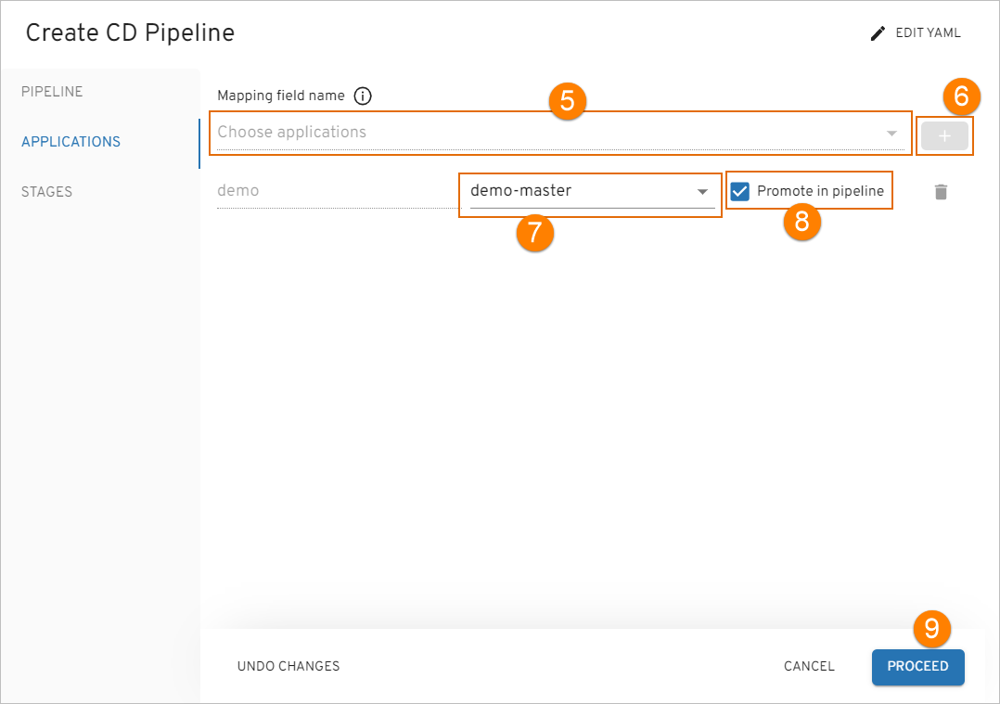
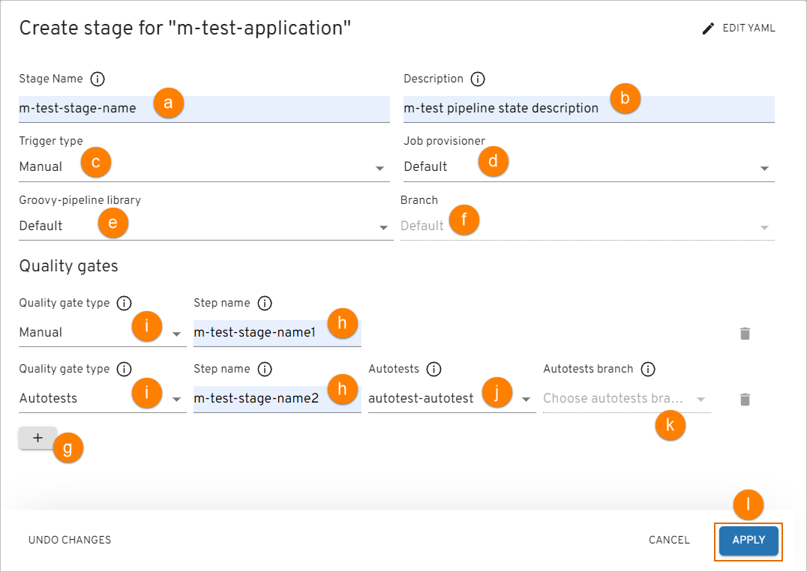
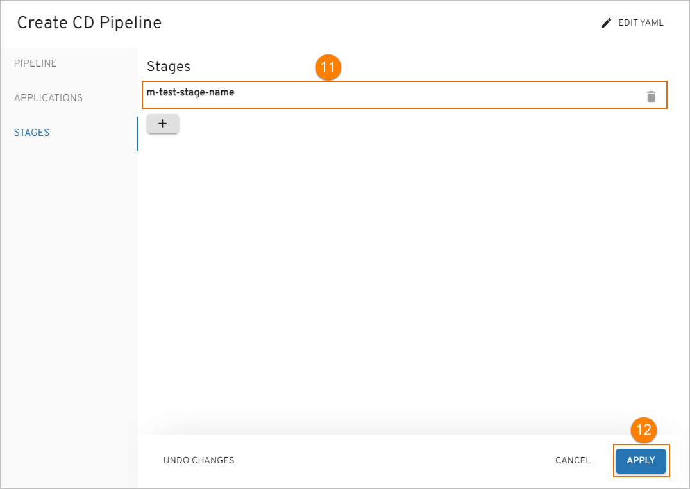
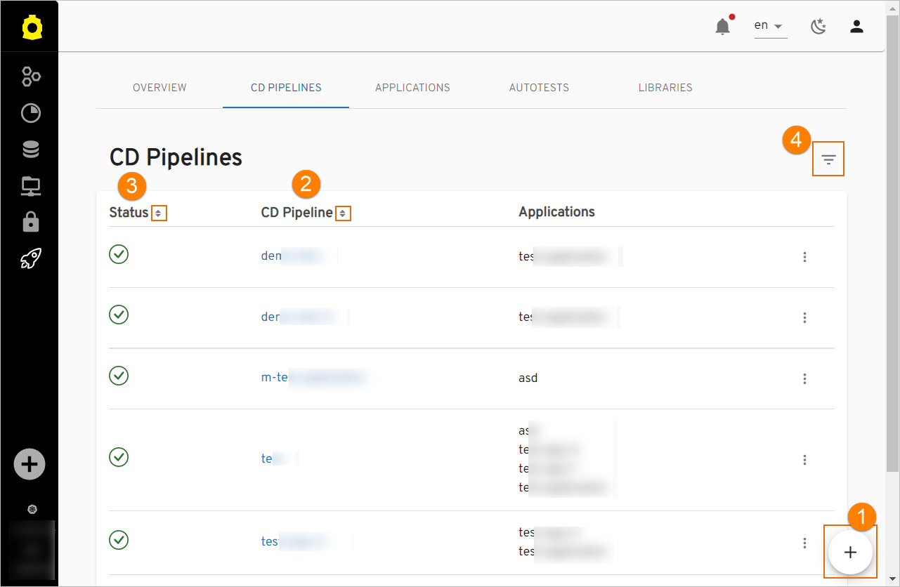
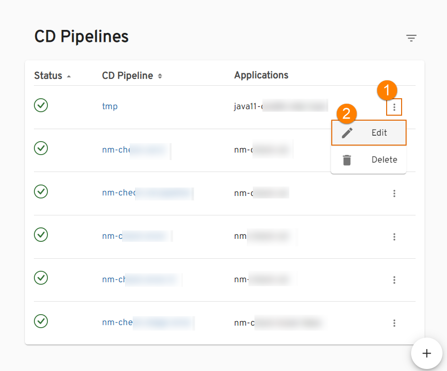

# Add CD Pipeline

Headlamp provides the ability to deploy an environment on your own and specify the essential components.

Navigate to the **CD Pipelines** section on the navigation bar and click **Create** (the plus sign icon in the lower-right corner of the screen). Once clicked, the **Create CD Pipeline** dialog will appear.

The creation of the CD pipeline becomes available as soon as an application is created including its provisioning
in a branch and the necessary entities for the environment. You can create the CD pipeline [in YAML](#YAML) or [via the three-step menu](#menu) in the dialog.

[//]: # (After the complete adding of the CD pipeline, inspect the [Check CD Pipeline Availability]&#40;#check-cd-pipeline-availability&#41;)

[//]: # (part.)

## Create CD Pipeline in YAML 
Click **Edit YAML** in the upper-right corner of the **Create CD Pipeline** dialog to open the YAML editor and create the CD Pipeline.

!

To edit YAML in the minimal editor, turn on the **Use minimal editor** toggle in the upper-right corner of the **Create CD Pipeline** dialog.

To save the changes, select the **Save & Apply** button.

## Create CD Pipeline in the Dialog 
The **Create CD Pipeline** dialog contains the three steps:

* The Pipeline Menu
* The Applications Menu
* The Stages Menu

### The Pipeline Menu

!

1. Select the existing namespace from the drop-down list.

2. Type the name of the pipeline in the **Pipeline Name** field by entering at least two characters and by using
the lower-case letters, numbers and inner dashes.

  !!! note
      The namespace created by the CD pipeline has the following pattern combination: **[cluster name]-[cd pipeline name]-[stage name]**.
      Please be aware that the namespace length should not exceed 63 symbols.

3. Select the deployment type from the drop-down list:
  * Container - the pipeline will be deployed in a Docker container;
  * Custom - this mode allows to deploy non-container applications and customize the Init stage of CD pipeline.

4. Click the **Proceed** button to switch to the next menu.

  ### The Applications Menu

  !

5. Select the necessary application from the **Mapping field name** drop-down menu.
6. Select the plus sign icon near the selected application to specify the necessary codebase Docker branch for the application (the output for the branch and other stages from other CD pipelines).
7. Select the application branch from the drop-down menu.
8. Select the **Promote in pipeline** check box in order to transfer the application from one to another stage
by the specified codebase Docker branch. If the **Promote in pipeline** check box is not selected,
the same codebase Docker stream will be deployed regardless of the stage, i.e. the codebase Docker stream input,
which was selected for the pipeline, will always be used.

  !!! note
      The newly created CD pipeline has the following pattern combination: [pipeline name]-[branch name].
      If there is another deployed CD pipeline stage with the respective codebase Docker stream (= image stream as an OpenShift term),
      the pattern combination will be as follows: [pipeline name]-[stage name]-[application name]-[verified].

9. Click the **Proceed** button to switch to the next menu.

  ### The Stages Menu

10. Click the plus sign icon in the **Stages** menu and fill in the necessary fields in the Adding Stage window :

  !

  !

  a. Type the stage name;

  !!! note
      The namespace created by the CD pipeline has the following pattern combination: **[cluster name]-[cd pipeline name]-[stage name]**.
      Please be aware that the namespace length should not exceed 63 symbols.

  b. Enter the description for this stage;

  c. Select the trigger type. The available trigger types are _Manual_ and _Auto_. By selecting the _Auto_ trigger type, the CD pipeline will be launched automatically after the image is built.
  Every trigger type has a set of default stages that differ by the input stage (auto-deploy-input or manual-deploy-input).
  
  !!! note
      When changing the Trigger Type, the job-provision automatically will change the set of stages to the corresponding stages set for the CD pipeline.

[//]: # (  !!! note)

[//]: # (      Please be aware that autotests used in the CD pipeline cannot be removed. For the details on how to create an autotest codebase, please refer to the [Add Autotest]&#40;add-autotest.md&#41; section.)

  d. Select the job provisioner. In case of working with non container-based applications, there is an option to use
a custom job provisioner. Please refer to the [Manage Jenkins CD Job Provision](../operator-guide/manage-jenkins-cd-job-provision.md)
page for details.

  e. Select the groovy-pipeline library;

  f. Select the branch;

  g. Add an unlimited number of quality gates by clicking a corresponding plus sign icon and remove them as well
by clicking the recycle bin icon;

  h. Type the step name, which will be displayed in Jenkins, for every quality gate;

  i. Select the quality gate type:

  * Manual - means that the promoting process should be confirmed in Jenkins manually;
  * Autotests - means that the promoting process should be confirmed by the successful passing of the autotests.

  In the additional fields, select the previously created autotest name (j) and specify its branch for the autotest
  that will be launched on the current stage (k).

  !!! note
      Execution sequence. The image promotion and execution of the pipelines depend on the sequence in which
      the environments are added.

  l. Click the **Apply** button to display the stage in the Stages menu.

11. Edit the stage by clicking its name and applying changes, and remove the added stage by clicking the recycle bin icon
next to its name.

!

13. Click the **Apply** button to start the provisioning of the pipeline. After the CD pipeline is added, the new project
with the stage name will be created in OpenShift.

### Check CD Pipeline Availability

As soon as the CD pipeline is provisioned and added to the CD Pipelines list, there is an ability to:

  !

1. Create another application by clicking the plus sign icon in the lower-right corner of the screen and performing the same steps as described
in the [Add CD Pipeline](#add-cd-pipeline) section.

2. Sort the existing CD pipelines in a table by clicking the sorting icon in the **CD Pipeline** column. The CD pipelines will be displayed
in alphabetical order.

3. Sort the existing CD pipelines by their status in a table by clicking the sorting icon in the **Status** column.

4. Search the necessary CD pipeline by the namespace or by entering the corresponding name, language or the build tool into the **Filter** tool.

#### Edit CD Pipeline

* Edit the CD pipeline by selecting the options icon next to its name in the CD Pipelines list, and then selecting **Edit**:

  !

  * apply the necessary changes (the list of applications for deploy, application branches, and promotion in the pipeline) and click the **Apply** button to confirm the editions:

   !

  * add new extra stages steps by clicking the plus sign icon and filling in the application branch and promotion in the pipeline.

* Check the CD pipeline general information, metadata, and stages by clicking the CD pipeline name in the CD Pipelines list:

  !

  * the **Edit** option in the options icon near the CD pipeline name refers to the same **Edit CD Pipeline** page as mentioned above and allows to apply the necessary changes;
  
  !

  * the **Create** menu in the **Stages** section opens the **Create stage** dialog;

  * the options icon menu near the stage name allows editing or deleting the stage;
  
    !!! note
        You cannot remove the last stage, as the CD pipeline does not exist without stages.

  * the expand icon near the stage name allows displaying the general information, quality gates, and metadata for the stage.

* Delete the added CD pipeline by selecting the options icon next to its name in the CD Pipelines list, and then selecting **Delete**.

  !!! info
      In OpenShift, if the deployment fails with the ImagePullBackOff error, delete the POD.

## Related Articles

* [Manage Jenkins CD Pipeline Job Provision](../operator-guide/manage-jenkins-cd-job-provision.md)