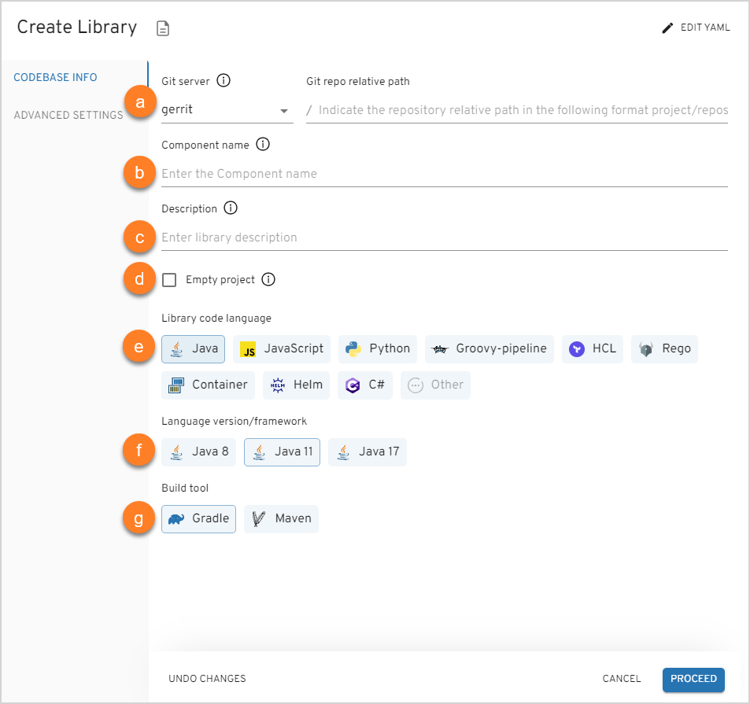
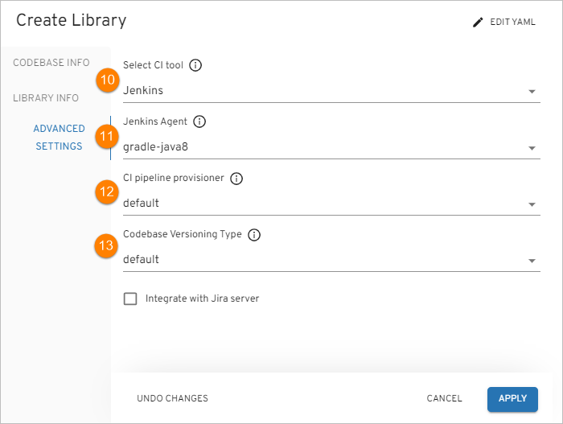
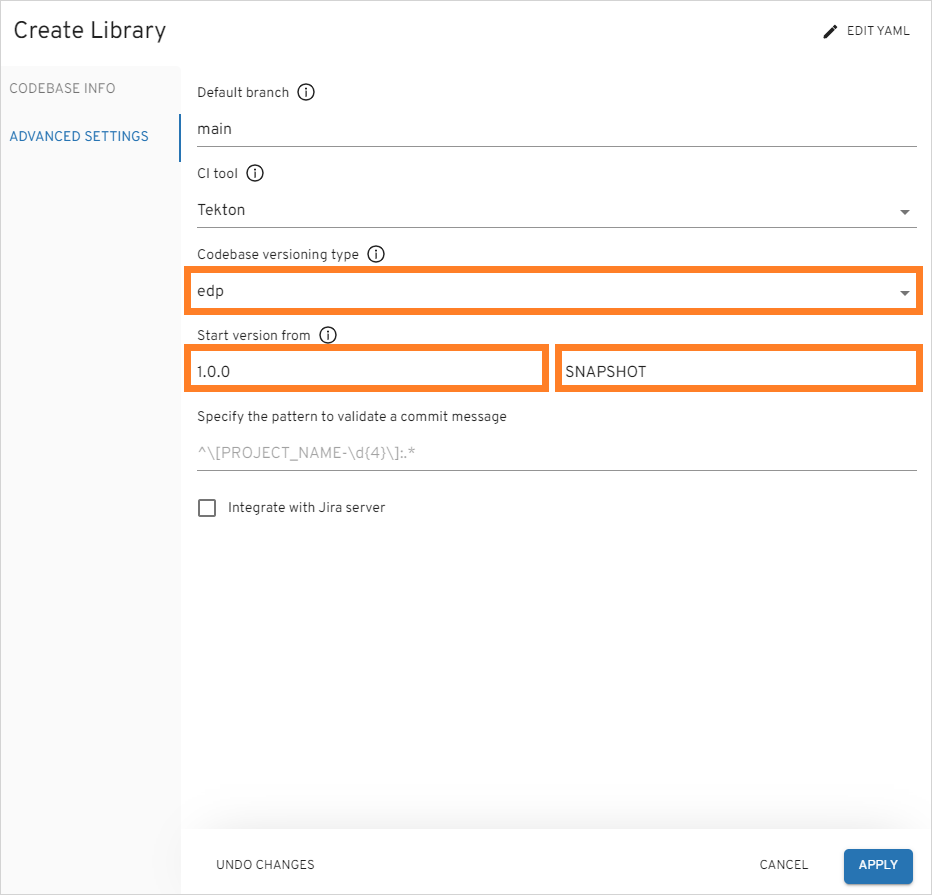
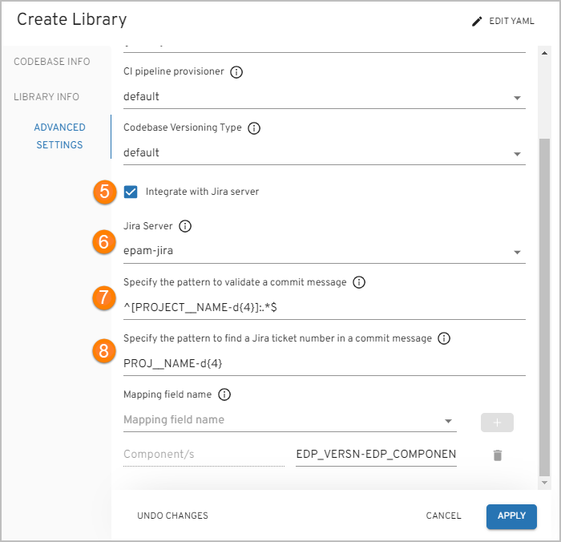
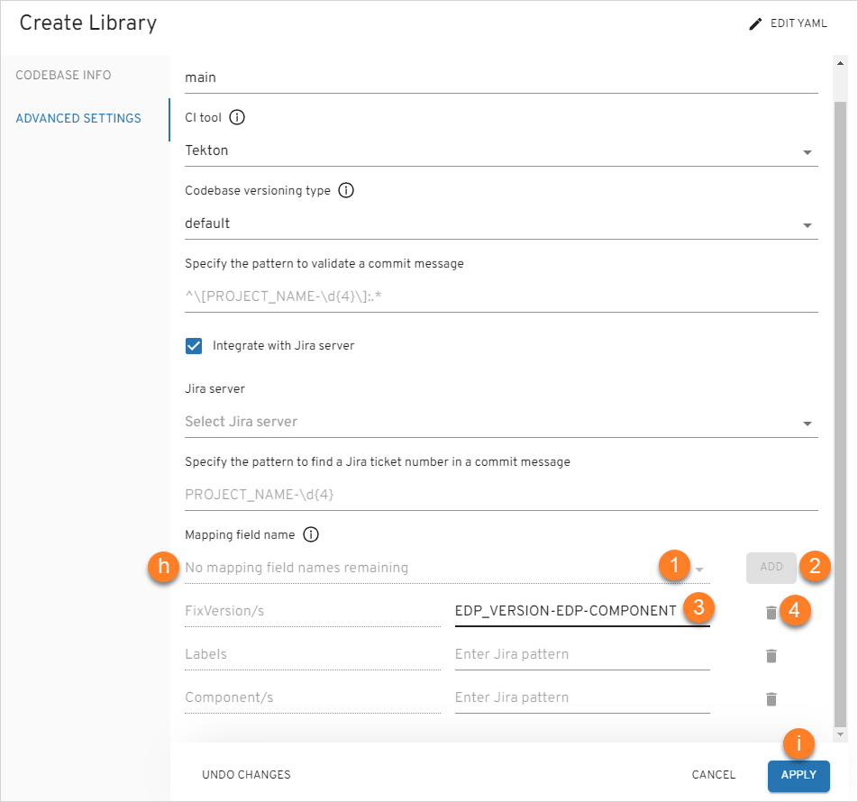

# Add Library

Headlamp helps to create, clone or import a library and add it to the environment. It can also be deployed in Gerrit (if the Clone or Create strategy is used) with the Code Review and Build pipelines built in Jenkins/Tekton.

To add a library, navigate to the **Libraries** section on the navigation bar and click **Create** (the plus sign icon in the lower-right corner of the screen). Once clicked, the **Create Library** dialog will appear. You can create a library [in YAML](#YAML) or [via the three-step menu](#menu) in the dialog.

## Create Library in YAML 

Click **Edit YAML** in the upper-right corner of the **Create Library** dialog to open the YAML editor and create the Library.

!

To edit YAML in the minimal editor, turn on the **Use minimal editor** toggle in the upper-right corner of the **Create Application** dialog.

To save the changes, select the **Save & Apply** button.

## Create Library in the Dialog 

The **Create Library** dialog contains the three steps:

* The Codebase Info Menu
* The Library Info Menu
* The Advanced Settings Menu

### The Codebase Info Menu

!

1. Select the existing namespace from the drop-down list.

2. In the **Codebase Integration Strategy** field, select the necessary configuration strategy:

  * **Create** – creates a project on the pattern in accordance with a code language, a build tool, and a framework.

  * **Clone** – clones the indicated repository into EPAM Delivery Platform. While cloning the existing repository, it is required to fill in the additional fields as well. Select the **Codebase Authentication** check box in case you clone the private repository, and fill in the repository login and password/access token.

  * **Import** - allows configuring a replication from the Git server. While importing the existing repository, select the Git server from the drop-down list and define the relative path to the repository, such as */epmd-edp/examples/basic/edp-auto-tests-simple-example*.

  !!! note
      In order to use the **Import** strategy, make sure to adjust it by the [Enable VCS Import Strategy](../operator-guide/import-strategy.md) page.

3. Click the Proceed button to switch to the next menu.

  ### The Library Info Menu

  !

4. Type the name of the library in the **Library name** field by entering at least two characters and by using the lower-case letters, numbers and inner dashes.

5. Specify the name of the default branch where you want the development to be performed.

  !!! note
      The default branch cannot be deleted.

6. To create a library with an empty repository in Gerrit, select the **Empty project** check box.

  !!! note
      The empty repository option is available only for the **Create** strategy.

7. Select any of the supported code languages with its framework in the **Application code language/framework** field:

  * Java – selecting Java allows to specify Java 8 or Java 11, and further usage of the Gradle or Maven tool.
  * JavaScript - selecting JavaScript allows using the NPM tool.
  * DotNet - selecting DotNet allows using the DotNet v.2.1 and DotNet v.3.1.
  * Groovy-pipeline - selecting Groovy-pipeline allows having the ability to customize a stages logic. For details,
  please refer to the [Customize CD Pipeline](../user-guide/customize-cd-pipeline.md) page.
  * Python - selecting Python allows using the Python v.3.8.
  * Terraform - selecting Terraform allows using the Terraform different versions via the **Terraform version manager** ([tfenv](https://github.com/tfutils/tfenv#usage)).
  EDP supports all actions available in Terraform, thus providing the ability to modify the virtual infrastructure and launch some checks with the help of linters.
  For details, please refer to the [Use Terraform Library in EDP](../user-guide/terraform-stages.md) page.
  * Rego - this option allows using Rego code language with an Open Policy Agent (OPA) Library. For details, please
  refer to the [Use Open Policy Agent](../user-guide/opa-stages.md) page.
  * Container - this option allows using the Kaniko tool for building the container images from a Dockerfile. For details, please refer to the [CI Pipeline for Container](../user-guide/container-stages.md) page.
  * Other - selecting Other allows extending the default code languages when creating a codebase with the Clone/Import strategy.
  To add another code language, inspect the [Add Other Code Language](../operator-guide/add-other-code-language.md) page.

  !!! note
      The **Create** strategy does not allow to customize the default code language set.

8. The **Select Build Tool** field disposes of the default tools and can be changed in accordance with the selected code language:

9. Click the Proceed button to switch to the next menu.

  ### The Advanced Settings Menu

  !

10. In the **Select CI Tool** field, choose the necessary tool: Jenkins or GitLab CI, where Jenkins is the default tool and the GitLab CI tool can be additionally adjusted. For details, please refer to the [Adjust GitLab CI Tool](../operator-guide/gitlabci-integration.md) page.

  !!! note
      The GitLab CI tool is available only with the **Import** strategy and makes the **Jira integration** feature unavailable.

11. Select the **Jenkins agent** that will be used to handle a codebase. For details, refer to the [Manage Jenkins Agent](../operator-guide/add-jenkins-agent.md) instruction and inspect the steps that should be done to add a new Jenkins agent.

12. Select the **CI pipeline provisioner** that will be used to handle a codebase. For details, refer to the [Manage Jenkins CI Pipeline Job Provisioner](../operator-guide/manage-jenkins-ci-job-provision.md) instruction and become familiar with the main steps to add an additional job provisioner.

13. Select the necessary codebase versioning type:

  * **default**: Using the default versioning type, in order to specify the version of the current artifacts, images, and tags in the Version Control System, a developer should navigate to the corresponding file and change the version **manually**.

  * **edp**: Using the edp versioning type, a developer indicates the version number from which all the artifacts will be versioned and, as a result, **automatically** registered in the corresponding file (e.g. pom.xml).

  When selecting the edp versioning type, the extra field will appear:

  !

  a. Type the version number from which you want the artifacts to be versioned.

  !!! note
      The **Start Version From** field should be filled out in compliance with the semantic versioning rules, e.g. 1.2.3 or 10.10.10. Please refer to the [Semantic Versioning](https://semver.org/) page for details.

  !

14. Select the **Integrate with Jira Server** check box in case it is required to connect Jira tickets with the commits
and have a respective label in the Fix Version field.

  !!! note
      To adjust the Jira integration functionality, first apply the necessary changes described on the [Adjust Jira Integration](../operator-guide/jira-integration.md) page,
      and [Adjust VCS Integration With Jira](../operator-guide/jira-gerrit-integration.md). Pay attention that the Jira integration feature is not available when using the GitLab CI tool.

15. As soon as the Jira server is set, select it in the **Select Jira Server** field.

16. Specify the pattern to validate a commit message. Use regular expression to indicate the pattern that is followed on the project to validate a commit message in the code review pipeline. An example of the pattern: `^[PROJECT_NAME-d{4}]:.*$`

17. Specify the pattern to find a Jira ticket number in a commit message. Based on this pattern, the value from EDP will be displayed in Jira.

18. In the **Advanced Mapping** section, specify the names of the Jira fields that should be filled in with attributes from EDP:

  !

  a. Select the name of the field in a Jira ticket. The available fields are the following: *Fix Version/s*, *Component/s* and *Labels*.

  b. Click the plus icon to add the mapping field name.

  c. Enter Jira pattern for the field name:

  * For the **Fix Version/s** field, select the **EDP_VERSION** variable that represents an EDP upgrade version, as in _2.7.0-SNAPSHOT_.
  Combine variables to make the value more informative. For example, the pattern **EDP_VERSION-EDP_COMPONENT** will be displayed as _2.7.0-SNAPSHOT-nexus-operator_ in Jira.
  * For the **Component/s** field select the **EDP_COMPONENT** variable that defines the name of the existing repository. For example, _nexus-operator_.
  * For the **Labels** field select the **EDP_GITTAG**variable that defines a tag assigned to the commit in Git Hub. For example, _build/2.7.0-SNAPSHOT.59_.

  d. Click the bin icon to remove the Jira field name.

19. Click the Apply button to add the library to the Libraries list.

  !!! note
      After the complete adding of the library, inspect the [Library Overview](library.md) part.

## Related Articles

* [Library Overview](library.md)
* [Add CD Pipeline](add-cd-pipeline.md)
* [Add Other Code Language](../operator-guide/add-other-code-language.md)
* [Adjust GitLab CI Tool](../operator-guide/gitlabci-integration.md)
* [Adjust Jira Integration](../operator-guide/jira-integration.md)
* [Adjust VCS Integration With Jira](../operator-guide/jira-gerrit-integration.md)
* [Enable VCS Import Strategy](../operator-guide/import-strategy.md)
* [Manage Jenkins CI Pipeline Job Provisioner](../operator-guide/manage-jenkins-ci-job-provision.md)
* [Manage Jenkins Agent](../operator-guide/add-jenkins-agent.md)
* [Perf Server Integration](../operator-guide/perf-integration.md)

[//]: # (* [Use Terraform Library in EDP]&#40;terraform-stages.md&#41;)

[//]: # (* [Use Open Policy Agent Library in EDP]&#40;opa-stages.md&#41;)
