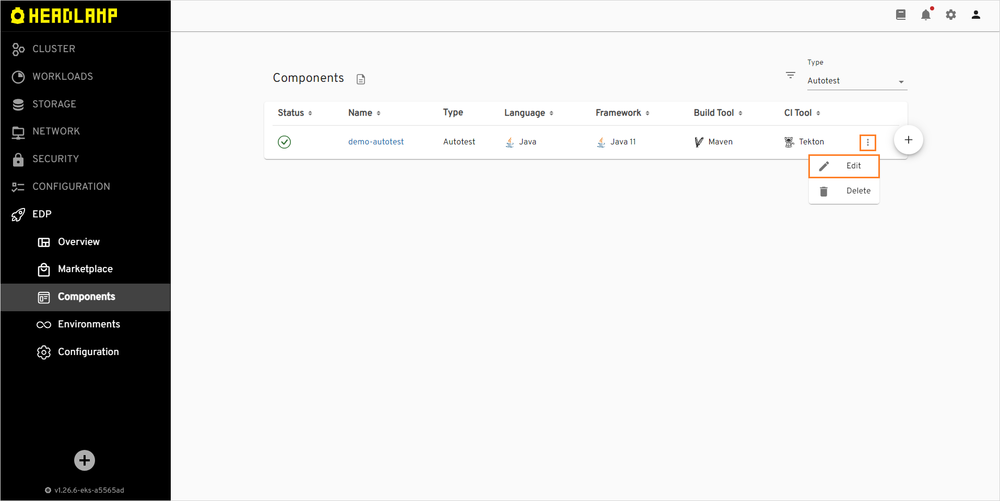
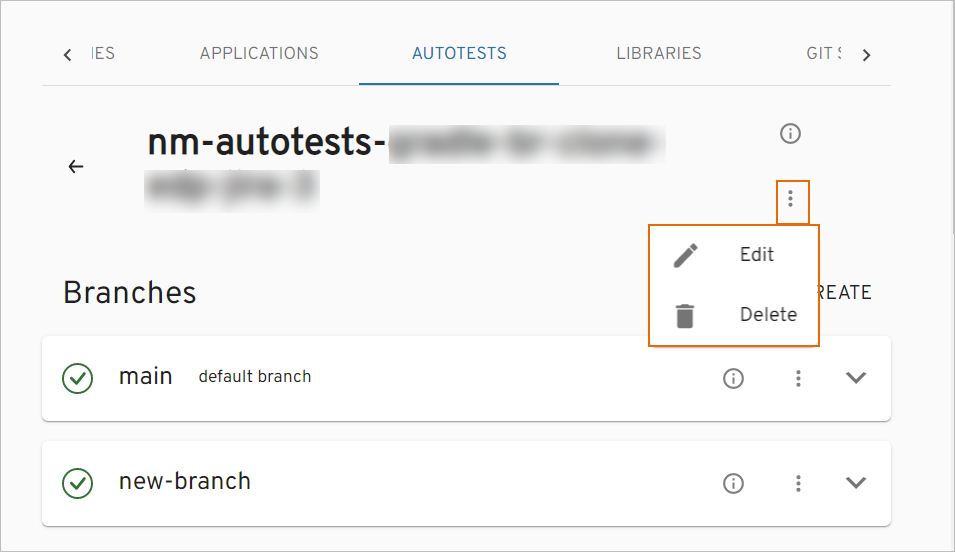
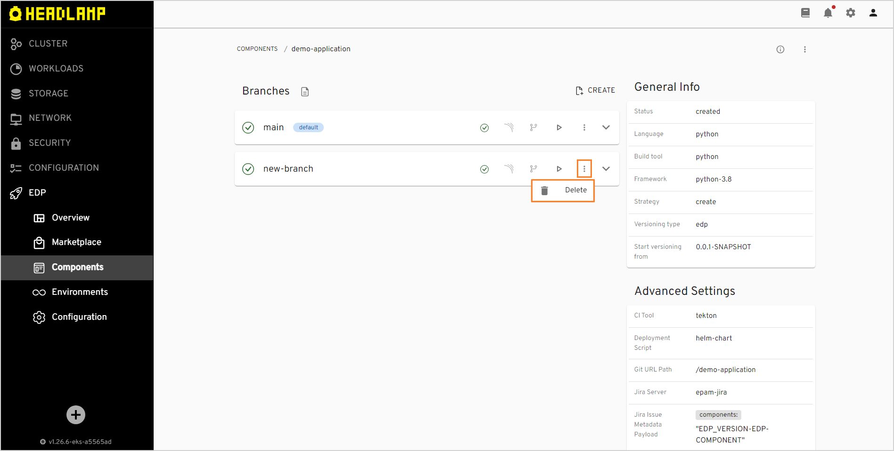

# Autotest

This section describes the subsequent possible actions that can be performed with the newly added or existing autotests.

## Check and Remove Autotest

As soon as the autotest is successfully provisioned, the following will be created:

- Code Review and Build pipelines in Jenkins for this autotest. The Build pipeline will be triggered automatically if at least one environment is already added.
- A new project in Gerrit or another VCS.
- SonarQube integration will be available after the Build pipeline in Jenkins is passed.
- Nexus Repository Manager will be available after the Build pipeline in Jenkins is passed as well.

!!! info
    To navigate quickly to OpenShift, Jenkins, Gerrit, SonarQube, Nexus, and other resources, click the **Overview** section on the navigation bar and hit the necessary link.

The added autotest will be listed in the Autotests list allowing you to do the following:

!

1. Create another autotest by clicking the plus sign icon in the lower-right corner of the screen and performing the same steps as described on the [Add Autotest](add-autotest.md) page.

2. Open autotest data by clicking its link name. Once clicked, the following blocks will be displayed:

  * **Branches** - displays the status and name of the deployment branch.
  * **General Info** - displays common information about the cloned/imported autotest, such as language, if the project is empty or not, build tool, framework, strategy, and default branch.
  * **Advanced Settings** - displays the specified job provisioner, CI tool, deployment script, Jenkins agent, Jira server,Jira issue metadata payload, commit message pattern, and ticket name pattern.
  * **Metadata** - displays the autotest name, namespace, creation date, finalizers, generation, resource version, and UID. Open this block by selecting the information icon near the options icon next to the autotest name.

3. Edit the autotest by selecting the options icon next to its name in the Autotests list, and then selecting **Edit**. For details see the [Edit Existing Autotest](#edit-existing-autotest) section.

4. Remove autotest with the corresponding database and Jenkins pipelines by selecting the options icon next to its name in the Autotests list, and then selecting **Delete**:

  !!! note
      The autotest that is used in a CD pipeline cannot be removed.

5. Sort the existing autotests in a table by clicking the sorting icons in the table header. Sort the autotests alphabetically by their name, language, build tool, framework, and CI tool. You can also sort the autotests by their status: Created, Failed, or In progress.

6. Search the necessary autotests by the namespace or by entering the corresponding name, language or the build tool into the **Filter** tool.

7. Select a number of autotests displayed per page (15, 25 or 50 rows)  and navigate between pages if the number of autotests exceeds the capacity of a single page.

## Edit Existing Autotest

EDP Headlamp provides the ability to enable, disable or edit the Jira Integration functionality for autotests.

1. To edit an autotest directly from the Autotests overview page or when viewing the autotest data:

  - Select **Edit** in the options icon menu:

    !

    !

  - The Edit Autotest dialog opens.

2. To enable Jira integration, on the **Edit Autotest** page do the following:

   !

   a. Mark the **Integrate with Jira server** check box and fill in the necessary fields. Please see steps 15-19 on the [Add Autotests page](add-autotest.md#the-advanced-settings-menu).

   b. Select the **Apply** button to apply the changes.

   c. Navigate to Jenkins and add the _create-jira-issue-metadata_ stage in the Build pipeline. Also add the _commit-validate_ stage in the Code Review pipeline.

  !!! note
      Pay attention that the Jira integration feature is not available when using the GitLab CI tool.

  !!! note
      To adjust the Jira integration functionality, first apply the necessary changes described on the [Adjust Jira Integration](../operator-guide/jira-integration.md) and [Adjust VCS Integration With Jira](../operator-guide/jira-gerrit-integration.md) pages.

3. To disable Jira integration, in the **Edit Autotest** dialog do the following:

   a. Unmark the **Integrate with Jira server** check box.

   b. Select the **Apply** button to apply the changes.

   c. Navigate to Jenkins and remove the _create-jira-issue-metadata_ stage in the Build pipeline. Also remove the _commit-validate_ stage in the Code Review pipeline.

As a result, the necessary changes will be applied.

## Add a New Branch

!!! note
    Pay attention when specifying the branch name: the branch name is involved in the formation of the autotest version, so it must comply with the [versioning semantic rules](https://semver.org/) for the application.

When adding an autotest, the default branch is a **master** branch. In order to add a new branch, follow the steps below:

1. Navigate to the **Branches** block by clicking the application name link in the Applications list.

2. Select the options icon related to the necessary branch and then select **Create**:

  !

3. Click **Edit YAML** in the upper-right corner of the **Create Autotest** dialog to open the YAML editor and add a branch. Otherwise, fill in the required fields in the dialog:

  !

  a. **Release Branch** - select the **Release Branch** check box if you need to create a release branch.

  b. **Branch name** - type the branch name. Pay attention that this field remains static if you create a release branch. If you want to use the existing branch, enter its name into this field.

  c. **From Commit Hash** - paste the commit hash from which the branch will be created. Note that if the **From Commit Hash** field is empty, the latest commit from the branch name will be used.

  d. **Branch version** - enter the necessary branch version for the artifact. The Release Candidate (RC) postfix is concatenated to the branch version number.

  e. **Default branch version** - type the branch version that will be used in a master branch after the release creation. The Snapshot postfix is concatenated to the master branch version number.

  f. Click the **Apply** button and wait until the new branch will be added to the list.

!!! info
    Adding of a new branch is indicated in the context of the edp versioning type. To get more information on how to add a branch using the default versioning type, please refer to the [Add Autotest](add-autotest.md) instruction.

The default autotest repository is cloned and changed to the new indicated version before the build, i.e. the new indicated version will not be committed to the repository; thus, the existing repository will keep the default version.

## Build Branch

In order to build branch from the latest commit, do the following:

1. Navigate to the **Branches** block by clicking the autotest name link in the Autotests list.
2. Select the options icon related to the necessary branch and then select **Build**:

  !

The pipeline run status is displayed near the branch name in the **Branches** block:

  !

The corresponding item appears on the **Tekton Dashboard** in the **PipelineRuns** section:

  !

## Edit Branch

In order to edit a branch with the corresponding record in the Headlamp database, do the following:

1. Navigate to the **Branches** block by clicking the autotest name link in the Autotests list.
2. Select the options icon related to the necessary branch and then select **Edit**:

  !

3. Edit the YAML file in a standard or minimal editor and select **Save & Apply**:

  !

## Delete Branch

!!! note
    The default **master** branch cannot be removed.

In order to delete the added branch with the corresponding record in the Headlamp database, do the following:

1. Navigate to the **Branches** block by clicking the library name link in the Libraries list.
2. Select the options icon related to the necessary branch and then select **Delete**:

  !

## Add Autotest as a Quality Gate

In order to add an autotest as a quality gate to a newly added CD pipeline, do the following:

1. Create a CD pipeline with the necessary parameters. Please refer to the [Add CD Pipeline](add-cd-pipeline.md) section for the details.

2. In the **Stages** menu, select the **Autotest** quality gate type. It means the promoting process should be confirmed by the successful passing of the autotests.

3. In the additional fields, select the previously created autotest name and specify its branch.

4. After filling in all the necessary fields, click the Create button to start the provisioning of the pipeline. After the CD pipeline is added, the new namespace containing the stage name will be created in Kubernetes (in OpenShift, a new project will be created) with the following name pattern: _[cluster name]-[cd pipeline name]-[stage name]_.

## Configure Autotest Launch at Specific Stage

In order to configure the added autotest launch at the specific stage with necessary parameters, do the following:

1. Add the necessary stage to the CD pipeline. Please refer to the [Add CD Pipeline](add-cd-pipeline.md) documentation for the details.

2. Navigate to the **run.json** file and add the stage name and the specific parameters.

## Launch Autotest Locally

There is an ability to run the autotests locally using the IDEA (Integrated Development Environment Application, such as IntelliJ, NetBeans etc.). To launch the autotest project for the local verification, perform the following steps:

1. Clone the project to the local machine.

2. Open the project in IDEA and find the **run.json** file to copy out the necessary command value.

3. Paste the copied command value into the Command line field and run it with the necessary values and namespace.

4. As a result, all launched tests will be executed.

## Related Articles

* [Add Application](add-application.md)
* [Add Autotests](add-autotest.md)
* [Add CD Pipeline](add-cd-pipeline.md)
* [Adjust Jira Integration](../operator-guide/jira-integration.md)
* [Adjust VCS Integration With Jira](../operator-guide/jira-gerrit-integration.md)
