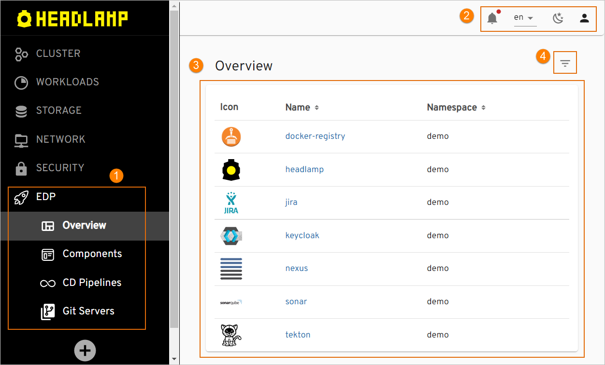

# Overview

!!! important
    Headlamp will replace the Admin Console tool that will be deprecated in the upcoming releases.

The EDP Headlamp User guide is intended for developers and provides details on working with EDP Headlamp, different codebase types, and EDP CI/CD flow.

## Headlamp

Headlamp is a central management tool in the EDP ecosystem that provides the ability to define pipelines, project resources and new technologies in a simple way. Using Headlamp enables to manage business entities:

- Create such codebase types as Applications, Libraries and Autotests;
- Create/Update CD Pipelines;

!!! note
    To interact with Headlamp via REST API, explore the [Create Codebase Entity](../developer-guide/rest-api.md) page.

!

1. **Navigation bar** – consists of six sections: Overview, CD Pipelines, Applications, Autotests, Libraries, and Git Servers. Click the necessary section to add an entity or open a home page.
2. **Login bar** – contains notifications, language selection options, color scheme change, and login menu.
3. **Main links** – displays the corresponding links to the major adjusted toolset, to the management tool and to the OpenShift cluster.
4. **Filter** - used for searching and filtering the namespaces.

Headlamp is a complete tool allowing to manage and control the codebases (applications, autotests, libraries) added to the environment as well as to create a CD pipeline.
Inspect the main features available in Headlamp by following the corresponding link:

- [Add Application](add-application.md)
- [Add Autotest](add-autotest.md)
- [Add Library](add-library.md)
- [Add Git Server](add-git-server.md)
- [Add CD Pipeline](add-cd-pipeline.md)