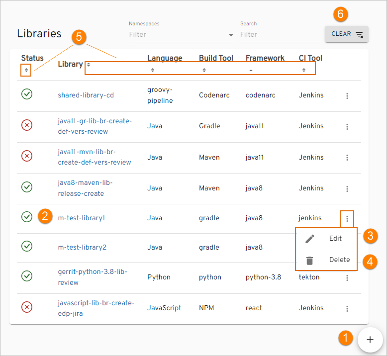
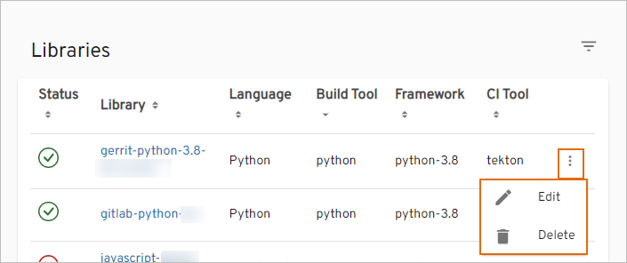
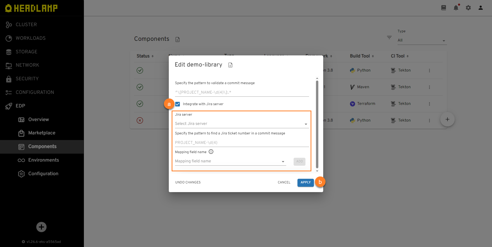

# Library

This section describes the subsequent possible actions that can be performed with the newly added or existing libraries.

## Check and Remove Library

As soon as the library is successfully provisioned, the following will be created:

- Code Review and Build pipelines in Jenkins for this library. The Build pipeline will be triggered automatically if at least one environment is already added.
- A new project in Gerrit or another VCS.
- SonarQube integration will be available after the Build pipeline in Jenkins is passed.
- Nexus Repository Manager will be available after the Build pipeline in Jenkins is passed as well.

!!! info
    To navigate quickly to OpenShift, Jenkins, Gerrit, SonarQube, Nexus, and other resources, click the **Overview** section on the navigation bar and hit the necessary link.

The added library will be listed in the Libraries list allowing to do the following:

!

1. Create another library by clicking the plus sign icon in the lower-right corner of the screen and performing the same steps as described on the [Add Library](add-library.md) page.

2. Open library data by clicking its link name. Once clicked, the following blocks will be displayed:

  * **General Info** - displays common information about the created/cloned/imported library, such as language, if the project is empty or not, build tool, framework, strategy, and default branch.
  * **Advanced Settings** - displays the specified job provisioner, CI tool, deployment script, Jenkins agent, Jira server,Jira issue metadata payload, commit message pattern, and ticket name pattern.
  * **Branches** - displays the status and name of the deployment branch.
  * **Metadata** - displays the library name, namespace, creation date, finalizers, generation, resource version, and UID. Open this block by selecting the information icon near the options icon next to the library name.

3. Edit the library by selecting the options icon next to its name in the Libraries list, and then selecting **Edit**. For details see the [Edit Existing Library](#edit-existing-library) section.

4. Remove library with the corresponding database and Jenkins pipelines by selecting the options icon next to its name in the Libraries list, and then selecting **Delete**:

  !!! note
      The library that is used in a CD pipeline cannot be removed.

5. Sort the existing libraries in a table by clicking the sorting icons in the table header. Sort the libraries alphabetically by their name, language, build tool, framework, and CI tool. You can also sort the libraries by their status: Created, Failed, or In progress.

6. Search the necessary libraries by the namespace or by entering the corresponding name, language or the build tool into the **Filter** tool.

7. Select a number of libraries displayed per page (15, 25 or 50 rows)  and navigate between pages if the number of libraries exceeds the capacity of a single page.

## Edit Existing Library

EDP Headlamp provides the ability to enable, disable or edit the Jira Integration functionality for libraries.

1. To edit a library directly from the Libraries overview page or when viewing the library data:

  - Select **Edit** in the options icon menu:

    !

    !

  - The Edit Library dialog opens.

2. To enable Jira integration, in the **Edit Library** dialog do the following:

   !

   a. Mark the **Integrate with Jira server** check box and fill in the necessary fields. Please see steps 14-18 on the [Add Library page](add-library.md#the-advanced-settings-menu).

   b. Select the **Apply** button to apply the changes.

   c. Navigate to Jenkins and add the _create-jira-issue-metadata_ stage in the Build pipeline. Also add the _commit-validate_ stage in the Code Review pipeline.

3. To disable Jira integration, in the **Edit Library** dialog do the following:

   a. Unmark the **Integrate with Jira server** check box.

   b. Select the **Apply** button to apply the changes.

   c. Navigate to Jenkins and remove the _create-jira-issue-metadata_ stage in the Build pipeline. Also remove the _commit-validate_ stage in the Code Review pipeline.

As a result, the necessary changes will be applied.

## Add a New Branch

!!! note
    Pay attention when specifying the branch name: the branch name is involved in the formation of the library version, so it must comply with the [versioning semantic rules](https://semver.org/) for the library.

When adding a library, the default branch is a **master** branch. In order to add a new branch, follow the steps below:

1. Navigate to the **Branches** block by clicking the application name link in the Applications list.
2. Select the options icon related to the necessary branch and then select **Create**:

  !

2. Click **Edit YAML** in the upper-right corner of the **Create Library** dialog to open the YAML editor and add a branch. Otherwise, fill in the required fields in the dialog:

  !

  a. **Release Branch** - select the **Release Branch** check box if you need to create a release branch.

  b. **Branch name** - type the branch name. Pay attention that this field remains static if you create a release branch. For the **Clone** and **Import** strategies: If you want to use the existing branch, enter its name into this field.

  c. **From Commit Hash** - paste the commit hash from which the branch will be created. For the **Clone** and **Import** strategies: Note that if the **From Commit Hash** field is empty, the latest commit from the branch name will be used.

  d. **Branch version** - enter the necessary branch version for the artifact. The Release Candidate (RC) postfix is concatenated to the branch version number.

  e. **Default branch version** - type the branch version that will be used in a master branch after the release creation. The Snapshot postfix is concatenated to the master branch version number.

  f. Click the **Apply** button and wait until the new branch will be added to the list.

  !!! info
      Adding of a new branch is indicated in the context of the edp versioning type.

The default application repository is cloned and changed to the new indicated version before the build, i.e. the new indicated version will not be committed to the repository; thus, the existing repository will keep the default version.

## Edit Branch

In order to edit a branch with the corresponding record in the Headlamp database, do the following:

1. Navigate to the **Branches** block by clicking the library name link in the Libraries list.
2. Select the options icon related to the necessary branch and then select **Edit**:

  !

3. Edit the YAML file in a standard or minimal editor and select **Save & Apply**:

  !

## Delete Branch

!!! note
    The default **master** branch cannot be removed.

In order to delete the added branch with the corresponding record in the Headlamp database, do the following:

1. Navigate to the **Branches** block by clicking the library name link in the Libraries list.
2. Select the options icon related to the necessary branch and then select **Delete**:

  !

### Related Articles

* [Add Library](add-library.md)
