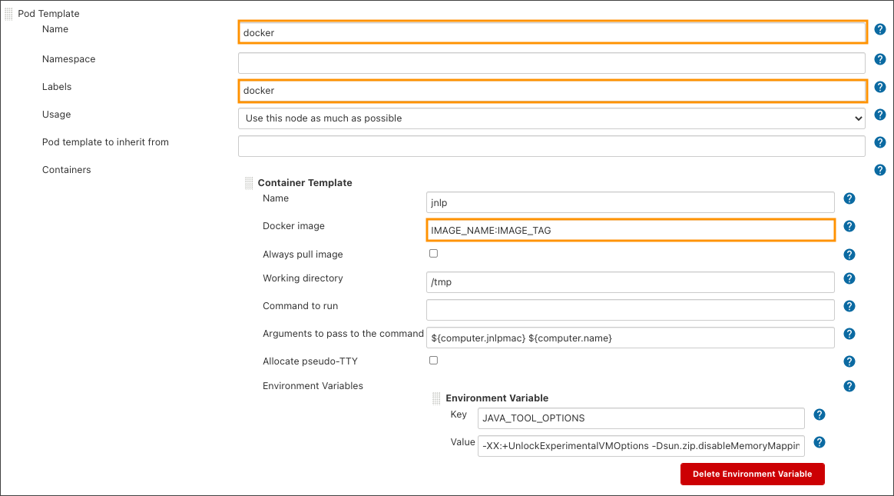

# Manage Jenkins Agent

Inspect the main steps to add and update Jenkins agent.

## Create/Update Jenkins Agent

Every Jenkins agent is based on epamedp/edp-jenkins-base-agent. Check [DockerHub](https://hub.docker.com/r/epamedp/edp-jenkins-base-agent/tags?page=1&ordering=last_updated) for the latest version.
Use it to create a new agent (or update an old one). See the example with Dockerfile of gradle-java11-agent below:

   <details>
   <summary><b>View: Dockerfile</b></summary>

````
    # Copyright 2021 EPAM Systems.
    # Licensed under the Apache License, Version 2.0 (the "License");
    # you may not use this file except in compliance with the License.
    # You may obtain a copy of the License at
    # http://www.apache.org/licenses/LICENSE-2.0
    # Unless required by applicable law or agreed to in writing, software
    # distributed under the License is distributed on an "AS IS" BASIS,
    # WITHOUT WARRANTIES OR CONDITIONS OF ANY KIND, either express or implied.
    # See the License for the specific language governing permissions and
    # limitations under the License.

    FROM epamedp/edp-jenkins-base-agent:1.0.1
    SHELL ["/bin/bash", "-o", "pipefail", "-c"]
    ENV GRADLE_VERSION=7.1 \
        PATH=$PATH:/opt/gradle/bin

    # Install Gradle
    RUN curl -skL -o /tmp/gradle-bin.zip https://services.gradle.org/distributions/gradle-$GRADLE_VERSION-bin.zip && \
        mkdir -p /opt/gradle && \
        unzip -q /tmp/gradle-bin.zip -d /opt/gradle && \
        ln -sf /opt/gradle/gradle-$GRADLE_VERSION/bin/gradle /usr/local/bin/gradle

    RUN yum install java-11-openjdk-devel.x86_64 -y && \
        rpm -V java-11-openjdk-devel.x86_64 && \
        yum clean all -y

    WORKDIR $HOME/.gradle

    RUN chown -R "1001:0" "$HOME" && \
        chmod -R "g+rw" "$HOME"

    USER 1001
````
   </details>

After the Docker agent update/creation, build and load the image into the project registry (e.g. [DockerHub](https://hub.docker.com/), [AWS ECR](https://aws.amazon.com/ecr/), etc.).


## Add Jenkins Agent Configuration

To add a new Jenkins agent, take the steps below:

1. Run the following command. Please be aware that &#8249;edp-project&#8250; is the name of the EDP tenant.

        kubectl edit configmap jenkins-slaves -n <edp-project>

  !!! note
      On an OpenShift cluster, run the `oc` command instead of `kubectl` one.

    Add new agent template.
      <details>
      <summary><b>View: ConfigMap jenkins-slaves</b></summary>

        data:
          docker-template: |-
           <org.csanchez.jenkins.plugins.kubernetes.PodTemplate>
               <inheritFrom></inheritFrom>
               <name>docker</name>
               <namespace></namespace>
               <privileged>false</privileged>
               <alwaysPullImage>false</alwaysPullImage>
               <instanceCap>2147483647</instanceCap>
               <slaveConnectTimeout>100</slaveConnectTimeout>
               <idleMinutes>5</idleMinutes>
               <activeDeadlineSeconds>0</activeDeadlineSeconds>
               <label>docker</label>
               <serviceAccount>jenkins</serviceAccount>
               <nodeSelector>beta.kubernetes.io/os=linux</nodeSelector>
               <nodeUsageMode>NORMAL</nodeUsageMode>
               <workspaceVolume class="org.csanchez.jenkins.plugins.kubernetes.volumes.workspace.EmptyDirWorkspaceVolume">
               <memory>false</memory>
               </workspaceVolume>
               <volumes/>
               <containers>
               <org.csanchez.jenkins.plugins.kubernetes.ContainerTemplate>
                    <name>jnlp</name>
                    <image>IMAGE_NAME:IMAGE_TAG</image>
                    <privileged>false</privileged>
                    <alwaysPullImage>false</alwaysPullImage>
                    <workingDir>/tmp</workingDir>
                    <command></command>
                    <args>${computer.jnlpmac} ${computer.name}</args>
                    <ttyEnabled>false</ttyEnabled>
                    <resourceRequestCpu></resourceRequestCpu>
                    <resourceRequestMemory></resourceRequestMemory>
                    <resourceLimitCpu></resourceLimitCpu>
                    <resourceLimitMemory></resourceLimitMemory>
                    <envVars>
                      <org.csanchez.jenkins.plugins.kubernetes.model.KeyValueEnvVar>
                      <key>JAVA_TOOL_OPTIONS</key>
                      <value>-XX:+UnlockExperimentalVMOptions -Dsun.zip.disableMemoryMapping=true</value>
                      </org.csanchez.jenkins.plugins.kubernetes.model.KeyValueEnvVar>
                    </envVars>
                     <ports/>
                   </org.csanchez.jenkins.plugins.kubernetes.ContainerTemplate>
                 </containers>
                 <envVars/>
                 <annotations/>
                 <imagePullSecrets/>
                 <podRetention class="org.csanchez.jenkins.plugins.kubernetes.pod.retention.Default"/>
                </org.csanchez.jenkins.plugins.kubernetes.PodTemplate>

  !!! note
      The **name** and **label** properties should be unique(In example above **docker**). Insert image name and tag instead of **IMAGE_NAME:IMAGE_TAG**.

2. Open Jenkins to ensure that everything is added correctly. Click the **Manage Jenkins** option, navigate to the **Manage Nodes and Clouds**->**Configure Clouds**->**Kubernetes**->**Pod Templates...**,
and scroll down to find new Jenkins agent **Pod Template details...**:

  

  As a result, the newly added Jenkins agent will be available in the **Advanced Settings** block of the Admin Console tool during the codebase creation:

  


## Modify Existing Agent Configuration

If your application is integrated with EDP, take the steps below to change an existing agent configuration:

1. Run the following command. Please be aware that &#8249;edp-project&#8250; is the name of the EDP tenant.

        kubectl edit configmap jenkins-slaves -n <edp-project>

  !!! note
      On an OpenShift cluster, run the `oc` command instead of `kubectl` one.

2. Find the agent template in use and change and change the parameters.

3. Open Jenkins and check the correct addition. Click the **Manage Jenkins** option, navigate to the **Manage Nodes and Clouds**->**Configure Clouds**->**Kubernetes**->**Pod Templates...**,
and scroll down to **Pod Template details...** with the necessary data.
