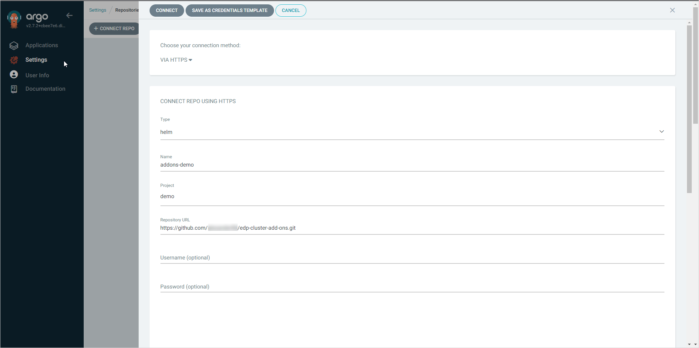
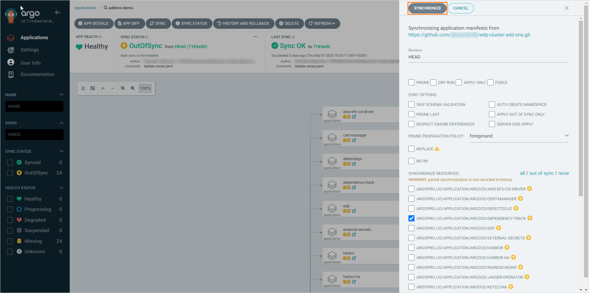

# Install via Add-Ons

This page describes the entity of Cluster Add-Ons for EPAM Delivery Platform, as well as their purpose, benefits and usage.

## What Are Add-Ons

EDP Add-Ons is basically a Kubernetes-based structure that enables users to quickly install additional components for the platform using Argo CD applications.

Add-Ons have been introduced into EDP starting from version 3.4.0. They empower users to seamlessly incorporate the platform with various additional components, such as SonarQube, Nexus, Keycloak, Jira, and more. This eliminates the need for manual installations, as outlined in the [Install EDP](../operator-guide/install-edp.md) page.

In a nutshell, Add-Ons represent separate Helm Charts that imply to be installed by one click using the Argo CD tool.

## Add-Ons Repository Structure

All the Add-Ons are stored in our public [GitHub repository](https://github.com/epam/edp-cluster-add-ons) adhering to the GitOps approach. Apart from default Helm and Git files, it contains both custom resources called Applications for Argo CD and application source code. The repository follows the GitOps approach to enable Add-Ons with the capability to rollback changes when needed. The repository structure is the following:

      ├── CHANGELOG.md
      ├── LICENSE
      ├── Makefile
      ├── README.md
      ├── add-ons
      └── chart

* **add-ons** - the directory that contains Helm charts of the applications that can be integrated with EDP using Add-Ons.

* **chart** - the directory that contains Helm charts with application templates that will be used to create custom resources called Applications for Argo CD.

## Enable EDP Add-Ons

To enable EDP Add-Ons, it is necessary to have the configured Argo CD, and connect and synchronize the forked repository. To do this, follow the guidelines below:

1. Fork the Add-Ons repository to your personal account.

2. Provide the parameter values for the values.yaml files of the desired Add-Ons you are going to install.

3. Navigate to **Argo CD** -> **Settings** -> **Repositories**. Connect your forked repository where you have the values.yaml files changed by clicking the **+ Connect repo** button:

  !

4. In the appeared window, fill in the following fields and click the **Connect** button:

  * Name - select the namespace where the project is going to be deployed;
  * Choose your connection method - choose Via SSH;
  * Type - choose Helm;
  * Repository URL - enter the URL of your forked repository.

  !

5. As soon as the repository is connected, the new item in the repository list will appear:

  !

6. Navigate to **Argo CD** -> **Applications**. Click the **+ New app** button:

  !

7. Fill in the required fields:

  * Application Name - addons-demo;
  * Project name - select the namespace where the project is going to be deployed;
  * Sync policy - select **Manual**;
  * Repository URL - enter the URL of your forked repository;
  * Revision - **Head**;
  * Path - select **chart**;
  * Cluster URL - enter the URL of your cluster;
  * Namespace - enter the namespace which must be equal to the **Project name** field.

8. As soon as the repository is synchronized, the list of applications that can be installed by Add-Ons will be shown:

  !

## Install EDP Add-Ons

Now that Add-Ons are enabled in Argo CD, they can be installed by following the steps below:

1. Choose the Add-On to install.

2. On the chosen Add-On, click the **⋮** button and then **Details**:

  !

3. To install the Add-On, click the **⋮** button -> **Sync**:

  !

4. Once the Add-On is installed, the *Sync OK* message will appear in the Add-On status bar:

  !

5. Open the application details by clicking on the little square with an arrow underneath the Add-On name:

  !

6. Track application resources and status in the **App details** menu:

  !

As we see, Argo CD offers great observability and monitoring tools for its resources which comes in handy when using EDP Add-Ons.

## Available Add-Ons List

The list of the available Add-Ons:

|Name|Description|Default|
|:-|:-|:-:|
|Argo CD|A GitOps continuous delivery tool that helps automate the deployment, configuration, and lifecycle management of applications in Kubernetes clusters.|false|
|AWS EFS CSI Driver|A Container Storage Interface (CSI) driver that enables the dynamic provisioning of Amazon Elastic File System (EFS) volumes in Kubernetes clusters.|true|
|Cert Manager|A native Kubernetes certificate management controller that automates the issuance and renewal of TLS certificates.|true|
|DefectDojo|A security vulnerability management tool that allows tracking and managing security findings in applications.|true|
|DependencyTrack|A Software Composition Analysis (SCA) platform that helps identify and manage open-source dependencies and their associated vulnerabilities.|true|
|EDP|An internal platform created by EPAM to enhance software delivery processes using DevOps principles and tools.|false|
|Extensions OIDC|EDP Helm chart to provision OIDC clients for different Add-Ons using EDP Keycloak Operator.|true|
|External Secrets|A Kubernetes Operator that fetches secrets from external secret management systems and injects them as Kubernetes Secrets.|true|
|Fluent Bit|A lightweight and efficient log processor and forwarder that collects and routes logs from various sources in Kubernetes clusters.|false|
|Harbor|A cloud-native container image registry that provides support for vulnerability scanning, policy-based image replication, and more.|true|
|Nginx ingress|An Ingress controller that provides external access to services running within a Kubernetes cluster using Nginx as the underlying server.|true|
|Jaeger Operator|An operator for deploying and managing Jaeger, an end-to-end distributed tracing system, in Kubernetes clusters.|true|
|Keycloak|An open-source Identity and Access Management (IAM) solution that enables authentication, authorization, and user management in Kubernetes clusters.|true|
|Keycloak PostgreSQL|A PostgreSQL database operator that simplifies the deployment and management of PostgreSQL instances in Kubernetes clusters.|false|
|MinIO Operator|An operator that simplifies the deployment and management of MinIO, a high-performance object storage server compatible with Amazon S3, in Kubernetes clusters.|true|
|OpenSearch|A community-driven, open-source search and analytics engine that provides scalable and distributed search capabilities for Kubernetes clusters.|true|
|OpenTelemetry Operator|An operator for automating the deployment and management of OpenTelemetry, a set of observability tools for capturing, analyzing, and exporting telemetry data.|true|
|PostgreSQL Operator|An operator for running and managing PostgreSQL databases in Kubernetes clusters with high availability and scalability.|true|
|Prometheus Operator|An operator that simplifies the deployment and management of Prometheus, a monitoring and alerting toolkit, in Kubernetes clusters.|true|
|Redis Operator|An operator for managing Redis, an in-memory data structure store, in Kubernetes clusters, providing high availability and horizontal scalability.|true|
|StorageClass|A Kubernetes resource that provides a way to define different classes of storage with different performance characteristics for persistent volumes.|true|
|Tekton|A flexible and cloud-native framework for building, testing, and deploying applications using Kubernetes-native workflows.|true|
|Vault|An open-source secrets management solution that provides secure storage, encryption, and access control for sensitive data in Kubernetes clusters.|true|
