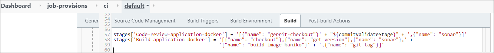

# Add Other Code Language

There is an ability to extend the default code languages when creating a codebase with the Clone or Import strategy.

!

!!! warning
    The Create strategy does not allow to customize the default code language set.

To customize the Build Tool list, perform the following:

*  Edit the edp-admin-console deployment by adding the necessary code language into the **BUILD TOOLS** field:

       kubectl edit deployment edp-admin-console -n edp

  !!! note
      Using an OpenShift cluster, run the `oc` command instead of `kubectl` one.


  !!! info
      `edp` is the name of the EDP tenant here and in all the following steps.

  <details>
  <summary><b>View: edp-admin-console deployment</b></summary>

```yaml
...
spec:
  containers:
  - env:
    ...
    - name: BUILD_TOOLS
      value: docker # List of custom build tools in Admin Console, e.g. 'docker,helm';
    ...
...
```
  </details>

* Add the Jenkins agent by following the [instruction](../operator-guide/add-jenkins-agent.md).

* Add the Custom CI pipeline provisioner by following the [instruction](../operator-guide/manage-jenkins-ci-job-provision.md).

* As a result, the newly added Jenkins agent will be available in the **Select Jenkins Slave** dropdown list of the
Advanced Settings block during the codebase creation:

  !

If it is necessary to create Code Review and Build pipelines, add corresponding entries (e.g. stages[Build-application-docker], [Code-review-application-docker]). See the example below:

```java
...
stages['Code-review-application-docker'] = '[{"name": "gerrit-checkout"}' + "${commitValidateStage}" + ',{"name": "sonar"}]'
stages['Build-application-docker'] = '[{"name": "checkout"},{"name": "get-version"},{"name": "sonar"},' +
                                     '{"name": "build-image-kaniko"}' + ',{"name": "git-tag"}]'
...
```

  !

!!! note
    Application is one of the available options. Another option might be to add a library. Please refer to the [Add Library](../user-guide/add-library.md) page for details.

## Related Articles

* [Add Application](../user-guide/add-application.md)
* [Add Library](../user-guide/add-library.md)
* [Manage Jenkins Agent](../operator-guide/add-jenkins-agent.md)
* [Manage Jenkins CI Pipeline Job Provisioner](manage-jenkins-ci-job-provision.md)
