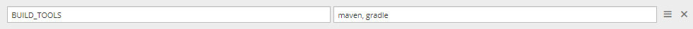

# Add Other Code Language

There is an ability to extend the default code languages when creating a codebase with the clone strategy.


!!! warning
    The create strategy does not allow to customize the default code language set.

In order to customize the Build Tool list, perform the following:

* Navigate to OpenShift, and edit the edp-admin-console deployment by adding the necessary code language into
the BUILD TOOLS field.

  

  !!! note
      Use the comma sign to separate the code languages in order to make them available, e.g. maven, gradle.

* Add the Jenkins slave by following the [Add Jenkins Slave](https://github.com/epam/edp-jenkins-operator/blob/master/documentation/add-jenkins-slave.md#add-jenkins-slave) instruction.

* As a result, the newly added Jenkins slave will be available in the **Select Jenkins Slave** dropdown list of the
Advanced Settings block during the codebase creation:

  

* Extend or modify the Jenkins provisioner by following the [Add Job Provisioner](https://github.com/epam/edp-jenkins-operator/blob/master/documentation/add-job-provision.md) instruction.

If it is necessary to create Code Review and Build pipelines, add corresponding entries (e.g. stages[Build-application-docker], [Code-review-application-docker]). See the example below:

```java
...
stages['Code-review-application-docker'] = '[{"name": "gerrit-checkout"}' + "${commitValidateStage}" + ',{"name": "sonar"}]'
stages['Build-application-docker'] = '[{"name": "checkout"},{"name": "get-version"},{"name": "sonar"},' +
                                     '{"name": "build-image-kaniko"}' + "${createJFVStage}" + ',{"name": "git-tag"}]'
...
```


!!! note
    Application is one of the available options. Another option might be to add a library. Please refer to the [Add Library](../user-guide/add-library.md) page for details

## Related Articles

* [Add Jenkins Slave](https://github.com/epam/edp-jenkins-operator/blob/master/documentation/add-jenkins-slave.md#add-jenkins-slave)
* [Add Job Provisioner](https://github.com/epam/edp-jenkins-operator/blob/master/documentation/add-job-provision.md)
* [Add Library](../user-guide/add-library.md)
