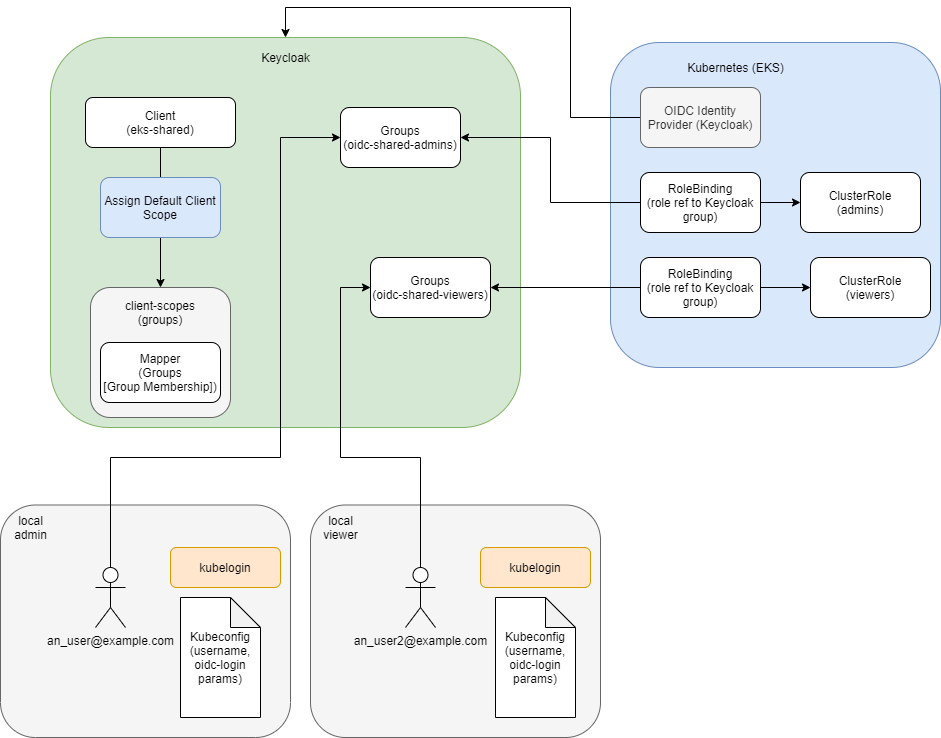
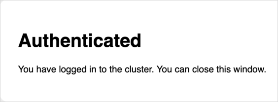

# EKS OIDC With Keycloak

This article provides the instruction of configuring Keycloak as [OIDC Identity Provider](https://aws.amazon.com/blogs/containers/introducing-oidc-identity-provider-authentication-amazon-eks/) for EKS.
The example is written on Terraform (HCL).

## Prerequisites

To follow the instruction, check the following prerequisites:

1. terraform 0.14.10
2. hashicorp/aws = 4.8.0
3. mrparkers/keycloak >= 3.0.0
4. hashicorp/kubernetes ~> 2.9.0
5. kubectl = 1.22
6. kubelogin  >= v1.25.1
7. Ensure that Keycloak has network availability for AWS (not in a private network).

!!! note
    To connect OIDC with a cluster, install and configure the [kubelogin](https://github.com/int128/kubelogin) plugin. For Windows, it is recommended to download the kubelogin as a binary and add it to your PATH.


## Solution Overview

The solution includes three types of the resources - AWS (EKS), Keycloak, Kubernetes.
The left part of Keycloak resources remain unchanged after creation, thus allowing us to associate a claim for a user group membership.
Other resources can be created, deleted or changed if needed.
The most crucial from Kubernetes permissions are Kubernetes RoleBindings and ClusterRoles/Roles.
Roles present a set of permissions, in turn RoleBindings map Kubernetes Role to representative Keycloak groups, so a group member can have just appropriate permissions.

!


## Keycloak Configuration

To configure Keycloak, follow the steps described below.

* Create a client:<a name="keycloak_client"></a>

```terraform
resource "keycloak_openid_client" "openid_client" {
  realm_id                                  = "openshift"
  client_id                                 = "kubernetes"
  access_type                               = "CONFIDENTIAL"
  standard_flow_enabled                     = true
  implicit_flow_enabled                     = false
  direct_access_grants_enabled              = true
  service_accounts_enabled                  = true
  oauth2_device_authorization_grant_enabled = true
  backchannel_logout_session_required       = true

  root_url    = "http://localhost:8000/"
  base_url    = "http://localhost:8000/"
  admin_url   = "http://localhost:8000/"
  web_origins = ["*"]

  valid_redirect_uris = [
    "http://localhost:8000/*"
  ]
}
```

* Create the client scope:

```terraform
resource "keycloak_openid_client_scope" "openid_client_scope" {
  realm_id               = <realm_id>
  name                   = "groups"
  description            = "When requested, this scope will map a user's group memberships to a claim"
  include_in_token_scope = true
  consent_screen_text    = false
}
```

* Add scope to the client by selecting all default client scope:

```terraform
resource "keycloak_openid_client_default_scopes" "client_default_scopes" {
  realm_id  = <realm_id>
  client_id = keycloak_openid_client.openid_client.id

  default_scopes = [
    "profile",
    "email",
    "roles",
    "web-origins",
    keycloak_openid_client_scope.openid_client_scope.name,
  ]
}
```

* Add the following mapper to the client scope:

```terraform

resource "keycloak_openid_group_membership_protocol_mapper" "group_membership_mapper" {
  realm_id            = <realm_id>
  client_scope_id     = keycloak_openid_client_scope.openid_client_scope.id
  name                = "group-membership-mapper"
  add_to_id_token     = true
  add_to_access_token = true
  add_to_userinfo     = true
  full_path           = false

  claim_name = "groups"
}
```

* In the authorization token, get groups membership field with the list of group membership in the realm:
```json
...
  "email_verified": false,
  "name": "An User",
  "groups": [
    "<env_prefix_name>-oidc-viewers",
    "<env_prefix_name>-oidc-cluster-admins"
  ],
  "preferred_username": "an_user@example.com",
  "given_name": "An",
  "family_name": "User",
  "email": "an_user@example.com"
  ...
```

* Create group/groups, e.g. admin group:

```terraform
resource "keycloak_group" "oidc_tenant_admin" {
  realm_id = <realm_id>
  name     = "kubernetes-oidc-admins"
}
```

## EKS Configuration

To configure EKS, follow the steps described below. In AWS Console, open EKS home page -> Choose a cluster -> Configuration tab -> Authentication tab.

The Terraform code for association with Keycloak:

* terraform.tfvars
```terraform
...
cluster_identity_providers = {
  keycloak = {
    client_id                     = <keycloak_client_id>
    identity_provider_config_name = "Keycloak"
    issuer_url                    = "https://<keycloak_url>/auth/realms/<realm_name>"
    groups_claim                  = "groups"
  }
...
```
* the resource code
```terraform
resource "aws_eks_identity_provider_config" "keycloak" {
  for_each = { for k, v in var.cluster_identity_providers : k => v if true }

  cluster_name = var.platform_name

  oidc {
    client_id                     = each.value.client_id
    groups_claim                  = lookup(each.value, "groups_claim", null)
    groups_prefix                 = lookup(each.value, "groups_prefix", null)
    identity_provider_config_name = try(each.value.identity_provider_config_name, each.key)
    issuer_url                    = each.value.issuer_url
    required_claims               = lookup(each.value, "required_claims", null)
    username_claim                = lookup(each.value, "username_claim", null)
    username_prefix               = lookup(each.value, "username_prefix", null)
  }

  tags = var.tags
}
```
!!! note
    The resource creation takes around 20-30 minutes. The resource doesn't support updating, so each change will lead to deletion of the old instance and creation of a new instance instead.

## Kubernetes Configuration

To connect the created Keycloak resources with permissions, it is necessary to create Kubernetes Roles and RoleBindings:

* ClusterRole
```terraform
resource "kubernetes_cluster_role_v1" "oidc_tenant_admin" {
  metadata {
    name = "oidc-admin"
  }
  rule {
    api_groups = ["*"]
    resources  = ["*"]
    verbs      = ["*"]
  }
}
```
* ClusterRoleBinding
```terraform
resource "kubernetes_cluster_role_binding_v1" "oidc_cluster_rb" {
  metadata {
    name = "oidc-cluster-admin"
  }
  role_ref {
    api_group = "rbac.authorization.k8s.io"
    kind      = "ClusterRole"
    name      = kubernetes_cluster_role_v1.oidc_tenant_admin.metadata[0].name
  }
  subject {
    kind      = "Group"
    name      = keycloak_group.oidc_tenant_admin.name
    api_group = "rbac.authorization.k8s.io"
    # work-around due https://github.com/hashicorp/terraform-provider-kubernetes/issues/710
    namespace = ""
  }
}
```

!!! note
    When creating the Keycloak group, ClusterRole, and ClusterRoleBinding, a user receives cluster admin permissions. There is also an option to provide admin permissions just to a particular namespace or another resources set in another namespace. For details, please refer to the [Mixing Kubernetes Roles](https://octopus.com/blog/k8s-rbac-roles-and-bindings) page.

## Kubeconfig

Template for kubeconfig:

```yaml
apiVersion: v1
preferences: {}
kind: Config

clusters:
- cluster:
    server: https://<eks_url>.eks.amazonaws.com
    certificate-authority-data: <certificate_authtority_data>
  name: <cluster_name>

contexts:
- context:
    cluster: <cluster_name>
    user: <keycloak_user_email>
  name: <cluster_name>

current-context: <cluster_name>

users:
- name: <keycloak_user_email>
  user:
    exec:
      apiVersion: client.authentication.k8s.io/v1beta1
      command: kubectl
      args:
      - oidc-login
      - get-token
      - -v1
      - --oidc-issuer-url=https://<keycloak_url>/auth/realms/<realm>
      - --oidc-client-id=<keycloak_client_id>
      - --oidc-client-secret=<keycloak_client_secret>
```
Flag -v1 can be used for debug, in a common case it's not needed and can be deleted.

To find the client secret:

1. Open Keycloak
2. Choose **realm**
3. Find **keycloak_client_id** that was previously created
4. Open Credentials tab
5. Copy Secret

## Testing

Before testing, ensure that a user is a member of the correct Keycloak group.
To add a user to a Keycloak group:

1. Open Keycloak
2. Choose **realm**
3. Open user screen with search field
4. Find a user and open the configuration
5. Open Groups tab
6. In Available Groups, choose an appropriate group
8. Click the **Join** button
9. The group should appear in the Group Membership list

Follow the steps below to test the configuration:

* Run kubectl command, it is important to specify the correct kubeconfig:
```shell
KUBECONFIG=<path_to_oidc_kubeconfig> kubectl get ingresses -n <namespace_name>
```
* After the first run and redirection to the Keycloak login page, log in using credentials (login:password) or using SSO Provider.
In case of the successful login, you will receive the following notification that can be closed:

!

* As the result, a respective response from the Kubernetes will appear in the console
in case a user is configured correctly and is a member of the correct group and Roles/RoleBindings.

* If something is not set up correctly, the following output error will be displayed:
```shell
Error from server (Forbidden): ingresses.networking.k8s.io is forbidden:
User "https://<keycloak_url>/auth/realms/<realm>#<keycloak_user_id>"
cannot list resource "ingresses" in API group "networking.k8s.io" in the namespace "<namespace_name>"
```

## Session Update

To update the session, clear cache.
The default location for the login cache:

```shell
rm -rf ~/.kube/cache
```

## Access Cluster via Lens

To access the Kubernetes cluster via [Lens](https://k8slens.dev/), follow the steps below to configure it:

* Add a new kubeconfig to the location where Lens has access. The default location of the kubeconfig is **~/.kube/config** but it can be changed by navigating to **File** -> **Preferences** -> **Kubernetes** -> **Kubeconfig Syncs**;
* (Optional) Using Windows, it is recommended to reboot the system after adding a new kubeconfig.
* Authenticate on the Keycloak login page to be able to access the cluster;

!!! note
    Lens does not add namespaces of the project automatically, so it is necessary to add them manually, simply go to **Settings** -> **Namespaces** and add the namespaces of a project.

## Related Articles

* [Headlamp OIDC Configuration](headlamp-oidc.md)