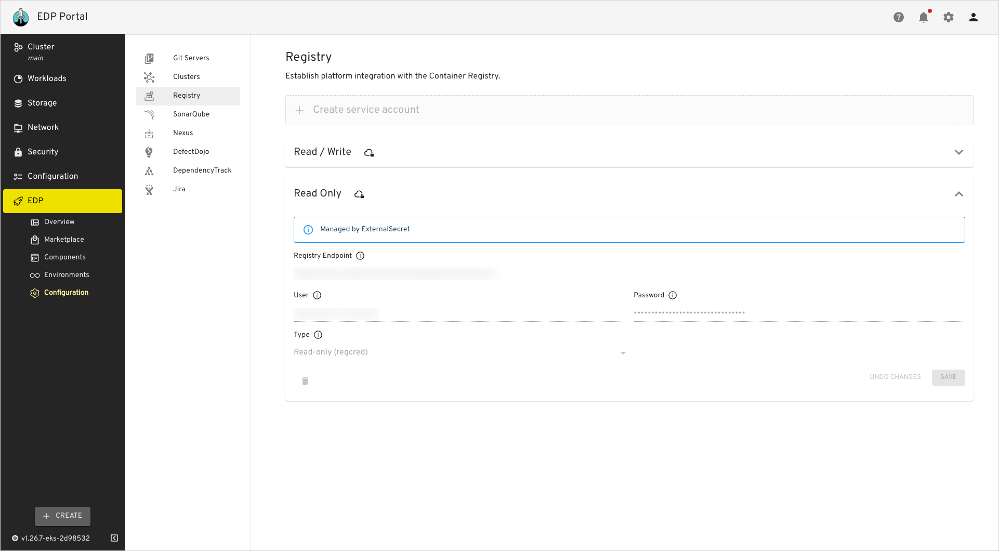

# Integrate Harbor With EDP Pipelines

[Harbor](https://goharbor.io/docs/2.8.0/) serves as a tool for storing images and artifacts.
This documentation contains instructions on how to [create a project](https://goharbor.io/docs/2.0.0/working-with-projects/create-projects/) in Harbor and set up a robot account for interacting with the registry from CI pipelines.

## Overview

Harbor integration with Tekton enables the centralized storage of container images within the cluster,
eliminating the need for external services. By leveraging Harbor as the container registry, users can manage
and store their automation results and reports in one place.

## Integration Procedure

The integration process involves two steps:

1. Creating a project to store application images.

2. Creating two accounts with different permissions to push (read/write) and pull (read-only) project images.

### Create New Project

The process of creating new projects is the following:

1. Log in to the Harbor console using your credentials.
2. Navigate to the **Projects** menu, click the **New Project** button:

  !

3. On the **New Project** menu, enter a project name that matches your EDP namespace in the **Project Name** field. Keep other fields as default and click **OK** to continue:

  !

### Set Up Robot Account

To make EDP and Harbor project interact with each other, set up a robot account:

1. Navigate to your newly created project, select **Robot Accounts** menu and choose **New Robot Account**:

  !

2. In the pop-up window, fill in the fields as follows:

  * **Name** - `edp-push`;
  * **Expiration time** -  set the value which is aligned with your organization policy;
  * **Description** - `read/write permissions`;
  * **Permissions** - `Pull Repository` and `Push Repository`.

  To proceed, click the **ADD** button:

  !

3. In the appeared window, copy the robot account credentials or click the **Export to file** button to save the secret and account name locally:

  !

4. Provision the **kaniko-docker-config** secrets using kubectl, EDP Portal or with the externalSecrets operator:

  !!! example
        The `auth` string can be generated by this command:<br>
        ```bash
        echo -n "robot\$edp-project+edp:secret" | base64
        ```

  === "kubectl"

      ```yaml
        apiVersion: v1
        kind: Secret
        metadata:
          name: kaniko-docker-config
          namespace: edp
          labels:
            app.edp.epam.com/secret-type: registry
            app.edp.epam.com/integration-secret: true
        type: kubernetes.io/dockerconfigjson
        stringData:
          .dockerconfigjson: |
            {
              "auths" : {
                "harbor-registry.com":
                  {
                    "username":"registry-username",
                    "password":"registry-password",
                    "auth": "secret-string"
                  }
              }
            }
      ```

  === "Manual Secret"

      Navigate to `EDP Portal UI` -> `EDP` -> `Configuration` -> `Registry`. Fill in the required fields and click `Save`.

      !

  === "External Secrets Operator"

      ```json
      "kaniko-docker-config":
        {"auths" : "harbor-registry.com":
          {
            "username":"registry-username",
            "password":"registry-password",
            "auth": "secret-string"
          }
        }
      ```

      Navigate to `EDP Portal UI` -> `EDP` -> `Configuration` -> `Registry`. Here, you will observe the `Managed by ExternalSecret` message:

      !

  !!! note
      More details of External Secrets Operator Integration can be found in the [External Secrets Operator Integration](external-secrets-operator-integration.md) page.

5. Repeat steps 2-3 with values below:

  * **Name** - `edp-pull`;
  * **Expiration time** -  set the value which is aligned with your organization policy;
  * **Description** - `read-only permissions`;
  * **Permissions** - `Pull Repository`.

6. Provision the **regcred** secrets using kubectl, EDP Portal or with the externalSecrets operator:

  !!! example
        The `auth` string can be generated by this command:<br>
        ```bash
        echo -n "robot\$edp-project+edp-push:secret" | base64
        ```

  === "kubectl"

      ```yaml
      apiVersion: v1
      kind: Secret
      metadata:
        name: regcred
        namespace: edp
        labels:
          app.edp.epam.com/secret-type: registry
          app.edp.epam.com/integration-secret: true
      type: kubernetes.io/dockerconfigjson
      stringData:
        .dockerconfigjson: |
          {
            "auths" : {
              "harbor-registry.com":
                {
                  "username":"registry-username",
                  "password":"registry-password",
                  "auth": "secret-string"
                }
            }
          }
      ```

  === "Manual Secret"

      Navigate to `EDP Portal UI` -> `EDP` -> `Configuration` -> `Registry`. Fill in the required fields and click **Save**.

      !

  === "External Secrets Operator"

      ```json
      "regcred":
        {"auths" : "harbor-registry.com":
          {
            "username":"registry-username",
            "password":"registry-password",
            "auth": "secret-string"
          }
        }
      ```

      Navigate to `EDP Portal UI` -> `EDP` -> `Configuration` -> `Registry`. Here, you will observe the `Managed by ExternalSecret` message:

      !

  !!! note
      More details of External Secrets Operator Integration can be found in the [External Secrets Operator Integration](external-secrets-operator-integration.md) page.

7. In the [values.yaml](https://github.com/epam/edp-install/blob/master/deploy-templates/values.yaml) file for the **edp-install** Helm chart, set the following values for the specified fields:

  === "Manual Secret"

      If the `kaniko-docker-config` secret has been created manually:

      ```yaml title="values.yaml"
      ...
      kaniko:
        existingDockerConfig: "kaniko-docker-config"
      global:
        dockerRegistry:
          url: harbor-registry.com
          type: "harbor"
      ...
      ```
  === "External Secrets Operator"

      If the `kaniko-docker-config` secret has been created via External Secrets Operator:

        ```yaml title="values.yaml"
        ...
        kaniko:
          existingDockerConfig: "kaniko-docker-config"
        externalSecrets:
          enabled: true
        global:
          dockerRegistry:
            url: harbor-registry.com
            type: "harbor"
        ...
        ```

8. (Optional)  If you've already deployed the EDP Helm chart, you can update it using the following command:

  ```bash
  helm update --install edp epamedp/edp-install \
  --values values.yaml \
  --namespace edp
  ```

As a result, application images built in EDP Portal will be stored in Harbor project and will be deployed from the harbor registry.

Harbor projects can be added and retained with a retention policy generated through the EDP script in [edp-cluster-add-ons](https://github.com/epam/edp-cluster-add-ons/tree/main/add-ons/harbor-ha/hack/harbor).


## Related Articles

* [Install EDP](install-edp.md)
* [Install Harbor](install-harbor.md)
* [Adjust Jira Integration](jira-integration.md)
* [Custom SonarQube Integration](sonarqube.md)
