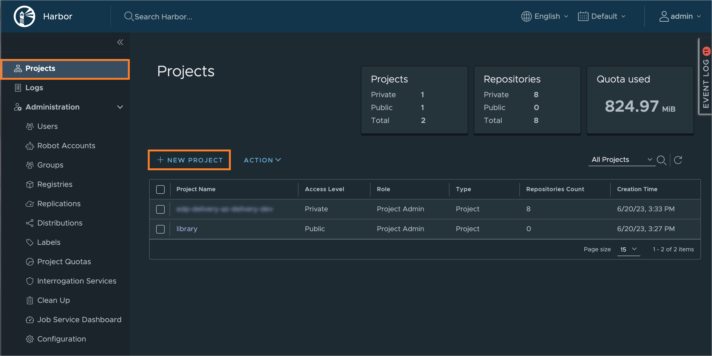
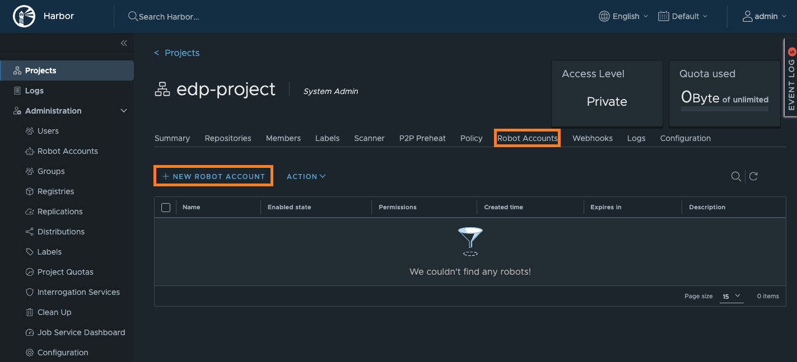
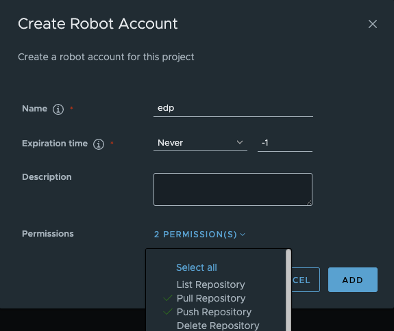

# Integrate Harbor With EDP Pipelines

[Harbor](https://goharbor.io/docs/2.8.0/) serves as a tool for storing images and artifacts.
This documentation contains instructions on how to [create a project](https://goharbor.io/docs/2.0.0/working-with-projects/create-projects/) in Harbor and set up a robot account for interacting with the registry from CI pipelines.

## Overview

Harbor integration with Tekton enables the centralized storage of container images within the cluster,
eliminating the need for external services. By leveraging Harbor as the container registry, users can manage
and store their automation results and reports in one place.

## Integration Procedure

The integration procedure consists of two steps:<br>

* Creating a project where the application images will be stored;
* Creating an account that will be used to put images into the project.

### Create New Project

The process of creating new projects is the following:

1. Log in to the Harbor console using your credentials.
2. Navigate to the **Projects** menu, click the **New Project** button:

  !

3. On the **New Project** menu, enter a project name that matches your EDP namespace in the **Project Name** field. Keep other fields as default and click **OK** to continue:

  !

### Set Up Robot Account

To make EDP and Harbor project interact with each other, set up a robot account:

1. Navigate to your newly created project, select **Robot Accounts** menu and choose **New Robot Account**:

  !

2. In the pop-up window, fill in the fields as follows:

  * **Name** - type the name of a robot account;
  * **Expiration time** - select _Never_;
  * **Description** - add description;
  * **Permissions** - keep the _Pull Repository_ and _Push Repository_ permissions.

  To proceed, click the **ADD** button:

  !

3. In the appeared window, copy the robot account credentials or click the **Export to file** button to save all locally:

  !

4. Create the **kaniko-docker-config** Kubernetes secret using the template below. Fill in the fields with your own values:

  === "Manually"

      ```yaml
      apiVersion: v1
      kind: Secret
      metadata:
        name: kaniko-docker-config
        namespace: platform
      type: kubernetes.io/dockerconfigjson
      stringData:
        .dockerconfigjson: |
          {
            "auths" : {
              "harbor-registry.com": { "auth": "<base64 encoded "user:secret" string>" }
            }
          }
      ```

  === "External Secret Operator"

      By default, EDP allows to get a value from the SecretStore, in which the value of `kaniko-docker-config`:

      ```json title="/edp/deploy-secrets"
      {
        "kaniko-docker-config":  {"auths" : {"harbor-registry.com": { "auth": "<base64 encoded "user:secret" string>" }}}
      }
      ```

  !!! example
      The `auth` string can be generated by this command:<br>
      ```bash
      echo -n "robot\$edp-project+edp:secret" | base64
      ```

5. In the [values.yaml](https://github.com/epam/edp-install/blob/master/deploy-templates/values.yaml) file for the **edp-install** helm chart, set the following values for the specified fields:

  * If `kaniko-docker-config` secret has been created manually.

    ```yaml title="values.yaml"
    ...
    kaniko:
      existingDockerConfig: "kaniko-docker-config"
    global:
      dockerRegistry:
        url: harbor-registry.com
        type: "harbor"
    ...
    ```

  * If `kaniko-docker-config` secret has been created via External Secrets Operator

    ```yaml title="values.yaml"
    ...
    kaniko:
      existingDockerConfig: "kaniko-docker-config"
    externalSecrets:
      enabled: true
    global:
      dockerRegistry:
        url: harbor-registry.com
        type: "harbor"
    ...
    ```

6. (Optional) Update the EDP Helm chart if it has already been deployed:

  ```bash
  helm update --install edp epamedp/edp-install \
  --values values.yaml \
  --namespace <edp-project>
  ```

7. After completing the steps above, you can get back and continue [installing EDP](../operator-guide/install-edp.md).
  As a result, application images built in Headlamp UI will be stored in your Harbor project.

## Related Articles

* [Install EDP](install-edp.md)
* [Install Harbor](install-harbor.md)
* [Adjust Jira Integration](jira-integration.md)
* [Custom SonarQube Integration](sonarqube.md)
