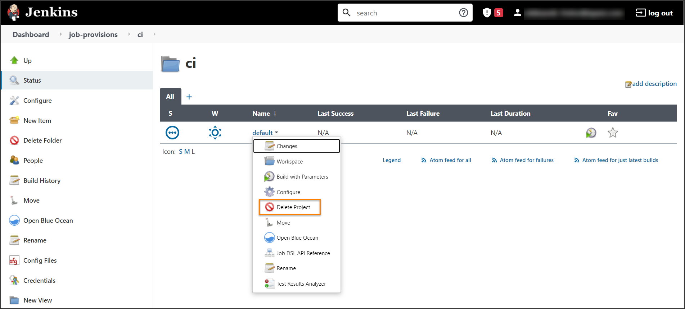

# Delete Jenkins Job Provision

To delete the job provisioner, take the following steps:

1. Delete the job provisioner from Jenkins. Navigate to Admin Console->Jenkins->jobs->job-provisions folder, select the necessary provisioner and click the drop-down right to the provisioner name.
Select **Delete project**.

  !
