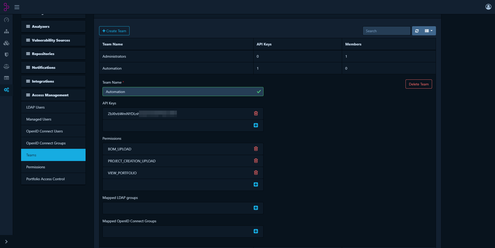
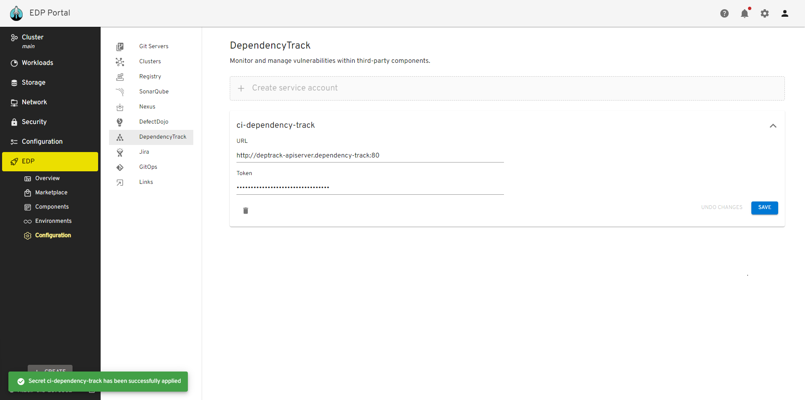
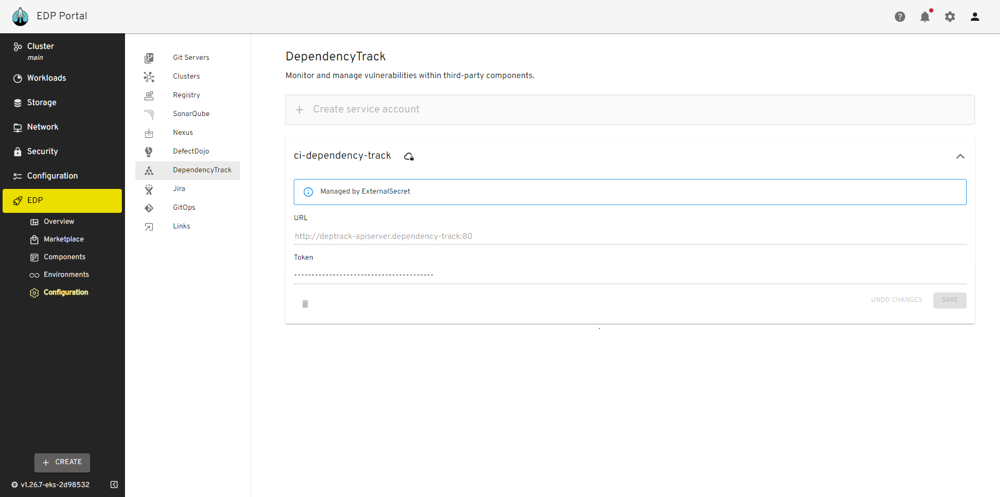

# Install DependencyTrack

This documentation guide provides comprehensive instructions for installing and integrating DependencyTrack with the EPAM Delivery Platform.

## Prerequisites

* [Kubectl](https://v1-26.docs.kubernetes.io/releases/download/) version 1.26.0 is installed.
* [Helm](https://helm.sh) version 3.12.0+ is installed.

## Installation

To install DependencyTrack use [EDP addons](add-ons-overview.md) approach.

## Configuration

1. Open `Administration` -> `Access Management` -> `Teams`. Click `Create Team` -> `Automation` and click `Create`.

2. Click `+` in `Permissions` and add:

   ```
   BOM_UPLOAD
   PROJECT_CREATION_UPLOAD
   VIEW_PORTFOLIO
   ```

3. Click `+` in `API keys` to create token:

!

4. Provision secrets using manifest, EDP Portal, or with the externalSecrets operator:

=== "manifest"

    ```yaml
    apiVersion: v1
    kind: Secret
    metadata:
      name: ci-dependency-track
      namespace: <edp>
      labels:
        app.edp.epam.com/secret-type: dependency-track
        app.edp.epam.com/integration-secret: "true"
    stringData:
      token: <dependency-track-token>
      url: <dependency-track-api-url>
    type: Opaque
    ```

=== "EDP Portal UI"

    Go to the `EDP Portal UI` open `EDP` -> `Configuration` -> `DependencyTrack` apply `Token` and `URL` click the `save` button.

    !

=== "External Secrets Operator"

    Store DependencyTrack URL and Token in the AWS Parameter Store with the following format:
    ```yaml
    "ci-dependency-track":
    {
      "token": "XXXXXXXXXXXX",
      "url": "https://dependency-track.example.com"
    }
    ```

    Go to the `EDP Platform UI` open `EDP` -> `Configuration` -> `DependencyTrack` see the `Managed by External Secret`.

    !

    More detail on External Secrets Operator Integration can be found on [the following page](external-secrets-operator-integration.md)

After following the instructions provided, you should be able to integrate your DependencyTrack with the EPAM Delivery Platform.

## Related Articles

* [Install External Secrets Operator](install-external-secrets-operator.md)
* [External Secrets Operator Integration](external-secrets-operator-integration.md)
* [Cluster Add-Ons Overview](add-ons-overview.md)
