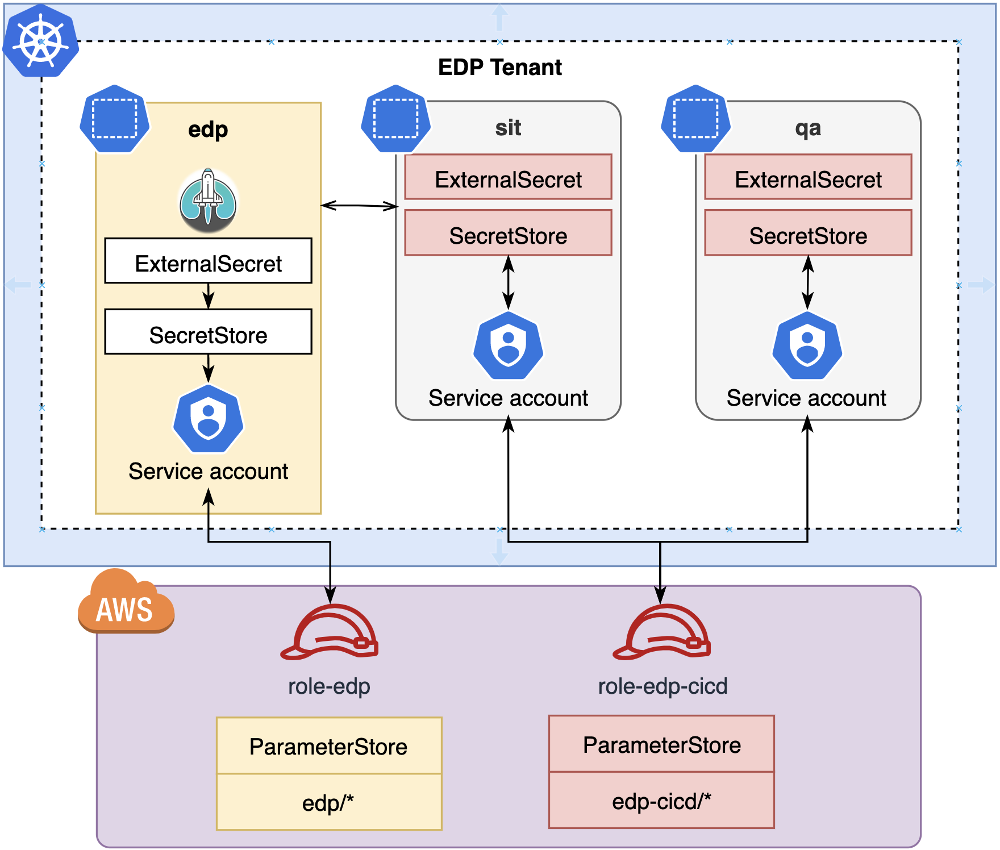

# External Secrets Operator Integration

[External Secrets Operator (ESO)](https://external-secrets.io/) can be integrated with EDP.

There are [multiple Secrets Providers](https://external-secrets.io/latest/guides-introduction/) that can be used within ESO. EDP is integrated with two major providers:

* [Kubernetes Secrets](https://kubernetes.io/docs/concepts/configuration/secret/)
* [AWS Systems Manager Parameter Store](https://docs.aws.amazon.com/systems-manager/latest/userguide/systems-manager-parameter-store.html)

## Kubernetes

All secrets are stored in Kubernetes in pre-defined namespaces. EDP suggests using the following approach for secrets management:

* `EDP_NAMESPACE-vault`, where EDP_NAMESPACE is a name of the namespace where EDP is deployed, such as `edp-vault`. This namespace is used by EDP platform. Access to secrets in the `edp-vault` is permitted only for `EDP Administrators`.

* `EDP_NAMESPACE-cicd-vault`, where EDP_NAMESPACE is a name of the namespace where EDP is deployed, such as `edp-cicd-vault`. Development team uses access to secrets in the `edp-cicd-vault`for microservices development.

See a diagram below for more details:


### EDP Install Scenario
In order to [install EDP](./install-edp.md), a list of passwords must be created: super-admin-db, db-admin-console, and keycloak. Secrets are provided automatically when using ESO.

1. Create a common namespace for secrets and EDP:

    ```bash
    kubectl create namespace edp-vault
    kubectl create namespace edp
    ```

2. Create secrets in the `edp-vault` namespace:

    ```yaml
    apiVersion: v1
    kind: Secret
    metadata:
      name: super-admin-db
      namespace: edp-vault
    data:
      password: cGFzcw==  # pass
      username: dXNlcg==  # user
    type: Opaque
    ```

3. In the `edp-vault` namespace, create a Role with a permission to read secrets:

    ```yaml
    apiVersion: rbac.authorization.k8s.io/v1
    kind: Role
    metadata:
      namespace: edp-vault
      name: external-secret-store
    rules:
    - apiGroups: [""]
      resources:
      - secrets
      verbs:
      - get
      - list
      - watch
    - apiGroups:
      - authorization.k8s.io
      resources:
      - selfsubjectrulesreviews
      verbs:
      - create
    ```

4. In the `edp-vault` namespace, create a ServiceAccount used by `SecretStore`:

    ```yaml
    apiVersion: v1
    kind: ServiceAccount
    metadata:
      name: secret-manager
      namespace: edp
    ```

5. Connect the Role from the `edp-vault` namespace with the ServiceAccount in the `edp` namespace:

    ```yaml
    apiVersion: rbac.authorization.k8s.io/v1
    kind: RoleBinding
    metadata:
      name: eso-from-edp
      namespace: edp-vault
    subjects:
      - kind: ServiceAccount
        name: secret-manager
        namespace: edp
    roleRef:
      apiGroup: rbac.authorization.k8s.io
      kind: Role
      name: external-secret-store
    ```

6. Create a SecretStore in the `edp` namespace, and use ServiceAccount for authentication:

    ```yaml
    apiVersion: external-secrets.io/v1beta1
    kind: SecretStore
    metadata:
      name: edp-vault
      namespace: edp
    spec:
      provider:
        kubernetes:
          remoteNamespace: edp-vault  # namespace with secrets
          auth:
            serviceAccount:
              name: secret-manager
          server:
            caProvider:
              type: ConfigMap
              name: kube-root-ca.crt
              key: ca.crt
    ```

7. Each secret must be defined by the `ExternalSecret` object. A code example below creates the `super-admin-db` secret in the `edp` namespace based on a secret with the same name in the `edp-vault` namespace:

    ```yaml
    apiVersion: external-secrets.io/v1beta1
    kind: ExternalSecret
    metadata:
      name: super-admin-db
      namespace: edp
    spec:
      refreshInterval: 1h
      secretStoreRef:
        kind: SecretStore
        name: edp-vault
      # target:
      #   name: secret-to-be-created  # name of the k8s Secret to be created. metadata.name used if not defined
      data:
      - secretKey: username       # key to be created
        remoteRef:
          key: super-admin-db     # remote secret name
          property: username      # value will be fetched from this field
      - secretKey: password       # key to be created
        remoteRef:
          key: super-admin-db     # remote secret name
          property: password      # value will be fetched from this field
    ```

Apply the same approach for enabling secrets management in the namespaces used for microservices development, such as `sit` and `qa` on the diagram above.

## AWS Systems Manager Parameter Store

AWS SSM Parameter Store can be used as a [Secret Provider for ESO](https://external-secrets.io/latest/provider-aws-parameter-store/). For EDP, it is recommended to use the [IAM Roles For Service Accounts approach](https://external-secrets.io/latest/provider-aws-parameter-store/#eks-service-account-credentials) (see a diagram below).



### EDP Install Scenario
In order to [install EDP](./install-edp.md), a list of passwords must be created: super-admin-db, db-admin-console, and keycloak. Follow the steps below, to get secrets from the SSM:

1. In the AWS, create an AWS IAM policy and an IAM role used by `ServiceAccount` in `SecretStore`. The IAM role must have permissions to get values from the SSM Parameter Store.<a name="step 1"></a>

    a. Create an IAM policy that allows to get values from the Parameter Store with the `edp/` path. Use your `AWS Region` and `AWS Account Id`:

    ```json
    {
    "Version": "2012-10-17",
    "Statement": [
        {
            "Sid": "VisualEditor0",
            "Effect": "Allow",
            "Action": "ssm:GetParameter*",
            "Resource": "arn:aws:ssm:eu-central-1:012345678910:parameter/edp/*"
        }
    ]
    }
    ```

    b. Create an AWS IAM role with trust relationships (defined below) and attach the IAM policy. Put your string for `Federated` value ([see more](./enable-irsa.md) on IRSA enablement for EKS Cluster) and AWS region.<a name="step 1.b"></a>

    ```json
    {
        "Version": "2012-10-17",
        "Statement": [
            {
                "Effect": "Allow",
                "Principal": {
                    "Federated": "arn:aws:iam::012345678910:oidc-provider/oidc.eks.eu-central-1.amazonaws.com/id/XXXXXXXXXXXXXXXXXX"
                },
                "Action": "sts:AssumeRoleWithWebIdentity",
                "Condition": {
                    "StringLike": {
                        "oidc.eks.eu-central-1.amazonaws.com/id/XXXXXXXXXXXXXXXXXX:sub": "system:serviceaccount:edp:*"
                    }
                }
            }
        ]
    }
    ```

2. In the AWS Parameter Store, create a secret with the `/edp/my-json-secret` name:<a name="step 2"></a>

    ```json
    {
      "super-admin-db": {"username": "super-user", "password": "pass"},
      "db-admin-console": {"username": "edp-user", "password": "pass"},
      "keycloak": {"username": "realm-user", "password": "pass"},
    }
    ```

3. In the `edp` Kubernetes namespace, create the following objects:

```yaml
---
apiVersion: v1
kind: ServiceAccount
metadata:
  annotations:
    eks.amazonaws.com/role-arn: arn:aws:iam::012345678910:role/ROLE_NAME
  name: secret-manager
  namespace: edp
---
apiVersion: external-secrets.io/v1beta1
kind: SecretStore
metadata:
  name: aws-parameter-store
  namespace: edp
spec:
  provider:
    aws:
      service: ParameterStore
      region: AWS_REGION
      auth:
        jwt:
          serviceAccountRef:
            name: secret-manager
---
apiVersion: external-secrets.io/v1beta1
kind: ExternalSecret
metadata:
  name: super-admin-db
  namespace: edp
spec:
  refreshInterval: 1h
  secretStoreRef:
    kind: SecretStore
    name: aws-parameter-store
  data:
  - secretKey: username
    remoteRef:
      key: /edp/my-json-secret
      property: super-admin-db.username
  - secretKey: password
    remoteRef:
      key: /edp/my-json-secret
      property: super-admin-db.password
```

where:

* `ROLE_NAME` - is a value defined on [step 1.b](#step 1.b),
* `AWS_REGION` - is the AWS region, used on [step 1](#step 1).

As a result, a secret with the `super-admin-db` name is created in the `edp` namespace with the content defined in JSON format on [step 2](#step 2).

## Related Articles
* [Install External Secrets Operator](install-external-secrets-operator.md)