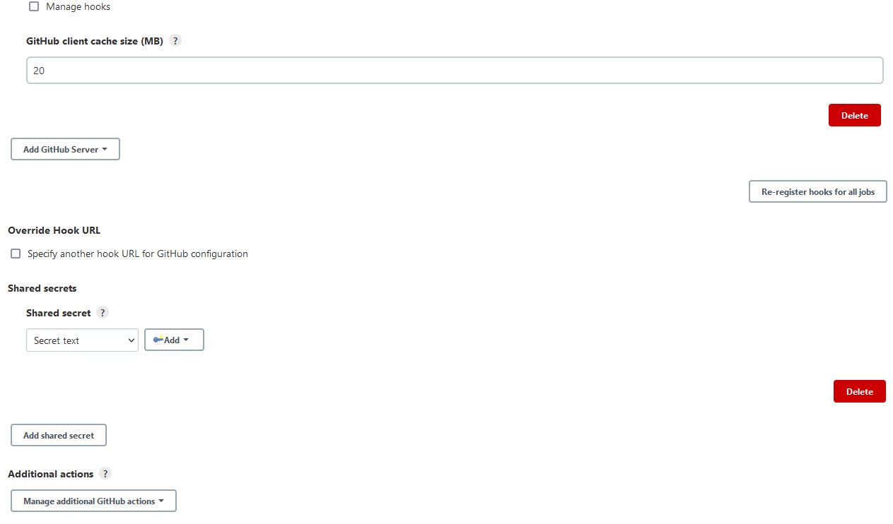

# GitHub Integration

Follow the steps below to automatically integrate Jenkins with GitHub webhooks.

!!! note
    Before applying the GitHub integration, make sure to enable VCS Import strategy. For details, please refer to the [Enable VCS Import Strategy](import-strategy.md) page.

1. Create a new job provisioner by following the [instruction](manage-jenkins-ci-job-provision.md#github-github). The job provisioner will create a job suite for an application added to EDP. It will also create webhooks for the project in GitHub using a GitHub token.

2. Ensure the classic personal access token for GitHub is created.

3. Navigate to **Jenkins** -> **Credentials** -> **System** -> **Global credentials** -> **Add credentials**, and create new credentials with the *Secret text* kind. In the Secret field, provide the GitHub API token, fill in the **ID** field with the `github-access-token` value:

  !

4. Navigate to **Jenkins** -> **Manage Jenkins** -> **Configure system** -> **GitHub**, and configure the GitHub server:

  !
  !

  !!! note
      Keep the **Manage hooks** checkbox clear since the Job Provisioner automatically creates webhooks in the repository regardless of the checkbox selection. 
      Select **Advanced** to see the shared secrets that can be used in a webhook **Secret** field to authenticate payloads from GitHub to Jenkins. The **Secret** field is optional.

5. Configure the GitHub Pull Request Builder plugin. This plugin is responsible for listening on Pull Request webhook events and triggering Code Review jobs:

  !!! note
      The **Secret** field is optional and is used in a webhook **Secret** field to authenticate payloads from GitHub to Jenkins. For details, please refer to the official [GitHub pull request builder plugin documentation](https://wiki.jenkins.io/display/JENKINS/GitHub+pull+request+builder+plugin).

  !

### Related Articles

* [Enable VCS Import Strategy](import-strategy.md)
* [Adjust Jira Integration](jira-integration.md)
* [Manage Jenkins CI Pipeline Job Provision](manage-jenkins-ci-job-provision.md)
