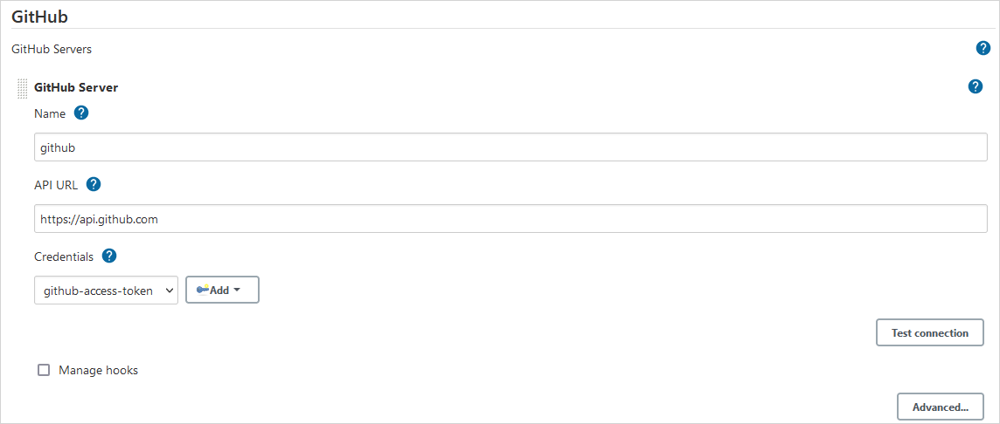

# GitHub Integration

Discover the steps below to apply the GitHub integration correctly:

1. Create access token for GitHub:

  * Click the profile account and navigate to Settings;
  * Go to Developer Settings;
  * Select Personal access token and generate a new one with the following parameters

  

  !!! warning
      Make sure to copy your new personal access token right at this moment because there will not be any ability to see it again.

2. Navigate to *Jenkins -> Manage Jenkins -> Manage plugins*, and click the Available tab and install the following plugins: **GitHub** and **GitHub Pull Request Builder**.

  !!! note
      If the necessary plugins are not available in the list, check out the Installed tab and verify whether they are presented.

3.	Navigate to *Jenkins -> Credentials -> System -> Global credentials -> Add credentials*, and create new credentials with the *Secret text* kind. In the Secret field, provide your GitHub API token, fill in the *ID* field with the *github-access-token* value:

  

4. Generate and add a new SSH key to the GitHub account. To get more detailed information, please inspect the [official GitHub documentation](https://help.github.com/en/github/authenticating-to-github/adding-a-new-ssh-key-to-your-github-account) page.

  !!! note
      Use the same SSH key that was added to the GitServer definition.

5. Add a private part of the SSH key to Jenkins by navigating to *Jenkins -> Credentials -> System -> Global credentials -> Add credentials*; and create new credentials with the *SSH username with private key* kind:

  

6.	Navigate to *Jenkins -> Manage Jenkins -> Configure system -> GitHub* part, and configure the GitHub server:

  

7.	Configure the GitHub Pull Request Builder plugin:

  !!! note
      The **Secret** field is optional, for details, please refer to the official [GitHub pull request builder plugin documentation](https://wiki.jenkins.io/display/JENKINS/GitHub+pull+request+builder+plugin).

  

8. Create a new **Job Provision** by following the [instruction](manage-jenkins-ci-job-provision.md#github-github).

## Related Articles

* [Adjust Import Strategy](import-strategy.md)
* [Adjust Integration With Jira Server](jira-integration.md)
* [Manage Jenkins CI Job Provision](manage-jenkins-ci-job-provision.md)
