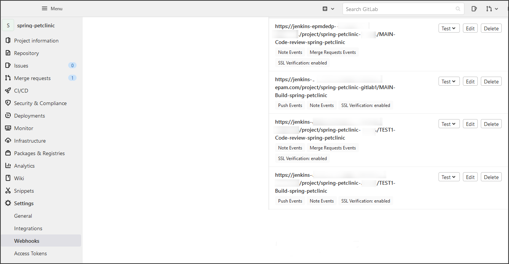
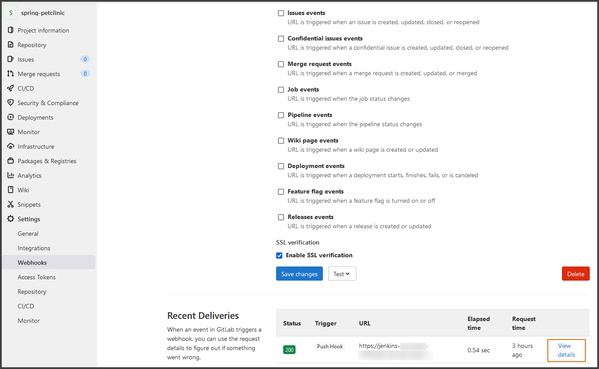
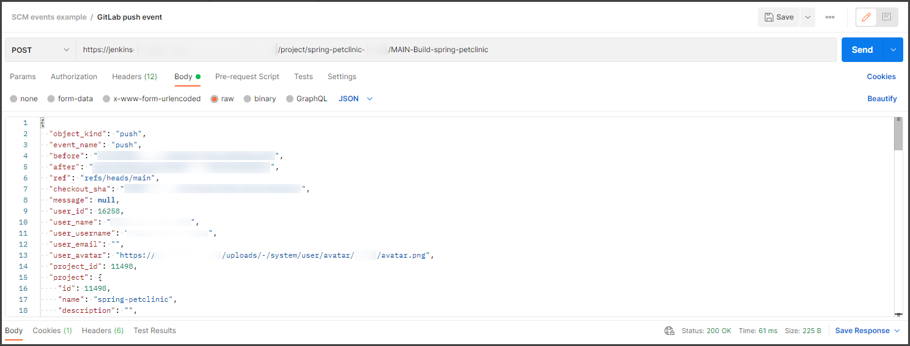
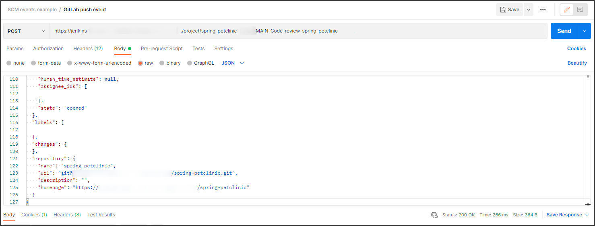

# Debug GitLab Webhooks in Jenkins

A webhook enables third-party services like GitLab to send real-time updates to the application. Updates are triggered by some event or action by the webhook provider (for example, a push to a repository, a Merge Request creation), and pushed to the application via HTTP requests (namely, Jenkins). 
The GitLab Jenkins job provisioner creates a webhook in the GitLab repository during the **Create release** pipeline once the [VCS Import Strategy](import-strategy.md) is enabled and the [GitLab Integration](gitlab-integration.md) is completed.

The Jenkins setup in EDP uses the [GitLab](https://plugins.jenkins.io/gitlab-plugin/) plugin responsible for listening on GitLab webhook Push and Merge Request events.

In case of any sort of issues with webhooks, make sure that:

1. Firewalls are configured to accept incoming traffic from the IP address range that is described [here](https://docs.gitlab.com/ee/user/gitlab_com/#ip-range).

2. The job ran at least once before the hook will work (once an application is created in EDP, the build job should be run automatically in Jenkins).

3. Both webhooks (_Push Events, Note Events_ and _Merge Requests Events, Note Events_) are created on the GitLab side for each branch (GitLab should have separate webhooks for each branch unlike GitHub).
  * Go to the GitLab repository - > Settings -> Webhooks

  

4. Click **Edit** next to each webhook and check if the event delivery is successful. If the webhook is sent, the **Recent Deliveries** list becomes available. Click **View details**.

  

  * The URL payload should be similar to the job URL on Jenkins. For example: 
  https://jenkins-server.com/project/the-project-name/MAIN-Build-the-job is for the Push events and https://jenkins-server.com/project/the-project-name/MAIN-Code-review-the-job is the Merge Request events.
  * The content type should be **application/json** for both events.
  * The *web_url* in the **Request body** should match the repository URL.
  * The event can also be redelivered by clicking the **Resend Request** button.

  !!! Note
      It may be convenient to debug webhooks with tools like Postman. 
      Make sure to add all the headers to Postman from the webhook **Request headers** field and send the payload (Request body) using the appropriate content type. 

   Examples for Push and Merge Request events:

  

     The response in the Jenkins log: 
     `Jan 17, 2022 11:26:34 AM INFO com.dabsquared.gitlabjenkins.webhook.GitLabWebHook getDynamic` 
     `WebHook called with url: /project/the-project-name/MAIN-Build-the-job`
     `Jan 17, 2022 11:26:34 AM INFO com.dabsquared.gitlabjenkins.trigger.handler.AbstractWebHookTriggerHandler handle`
     `the-project-name/MAIN-Build-the-job triggered for push.`

  

     The response in the Jenkins log: 
     `Jan 17, 2022 11:14:58 AM INFO com.dabsquared.gitlabjenkins.webhook.GitLabWebHook getDynamic` 
     `WebHook called with url: /project/the-project-name/MAIN-Code-review-the-job`

5. The repository pushing to Jenkins and the repository(ies) in the pipeline Job have to line up. **GitLab Connection** should be present in the job settings.

6. The settings in **Build Triggers** for the Build job should be as follows:

  

7. The settings in **Build Triggers** for the Code Review job should be as follows:

  

8. It will be convenient to filter through Jenkins log by using Jenkins custom **Log Recorder**.
  * Go to Manage Jenkins -> System Log -> Add new log recorder.
  * The Push and Merge Request events for the GitLab:

    | Logger | Log Level |
    | ------ | --------- |
    | com.dabsquared.gitlabjenkins.webhook.GitLabWebHook | ALL |
    | com.dabsquared.gitlabjenkins.trigger.handler.AbstractWebHookTriggerHandler | ALL |
    | com.dabsquared.gitlabjenkins.trigger.handler.merge.MergeRequestHookTriggerHandlerImpl | ALL |
    | com.dabsquared.gitlabjenkins.util.CommitStatusUpdater | ALL |

### Related Articles

* [Enable VCS Import Strategy](import-strategy.md)
* [Jenkins integration with GitLab](https://docs.gitlab.com/ee/integration/jenkins.html)
* [GitLab Integration](gitlab-integration.md)
* [Manage Jenkins CI Pipeline Job Provision](manage-jenkins-ci-job-provision.md)
* [GitLab plugin](https://plugins.jenkins.io/gitlab-plugin/)
