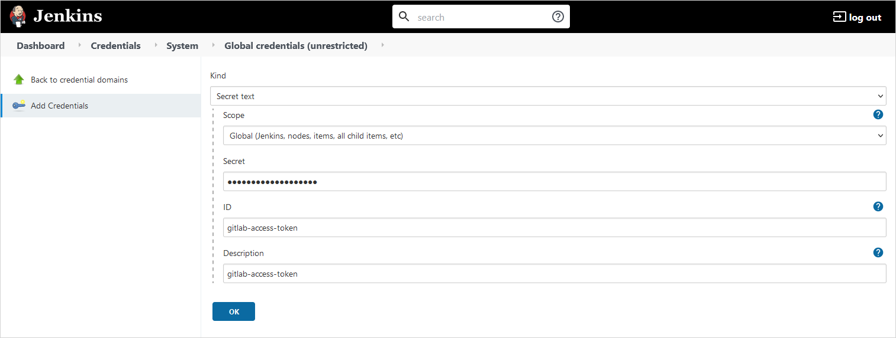
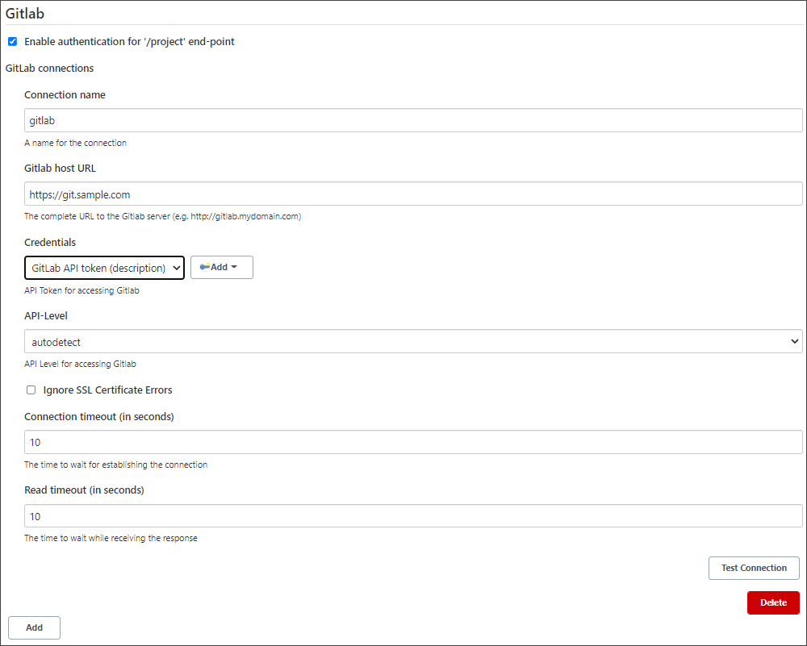
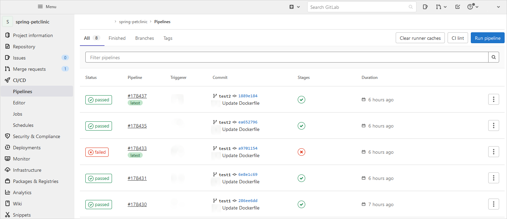

# GitLab Integration

Discover the steps below to apply the GitLab integration correctly.

!!! note
    Before applying the GitLab integration, make sure to enable VCS Import strategy. For details, please refer to the [Enable VCS Import Strategy](import-strategy.md) section.

1. Create a new **Job Provision** by following the [instruction](manage-jenkins-ci-job-provision.md#gitlab-gitlab).The job provisioner will create a job suite for an application added to EDP. It will also create webhooks for the project in GitLab.

!!! note
    The steps below are required in order to automatically create and integrate Jenkins GitLab webhooks.

1. Create access token in **Gitlab**:

  * Log in to **GitLab**;
  * In the top-right corner, click the avatar and select **Settings**;
  * On the **User Settings** menu, select **Access Tokens**;
  * Choose a name and an optional expiry date for the token;
  * In the Scopes block, select the *api* scope for the token;

  !

  * Click the **Create personal access token** button.

  !!! note
      Make sure to save the access token as there will not be any ability to access it once again.

2. Create Jenkins Credential ID by navigating to **Jenkins -> Credentials -> System -> Global Credentials -> Add Credentials**:

  * Select Kind **Secret text**;
  * Select Global scope;
  * Secret - the **Access Token** that was created earlier;
  * ID - the **gitlab-access-token** ID;
  * Description - the description of the current Credential ID;

  !

  !!! warning
      Using the GitLab integration, a webhook is automatically created. After the removal of the application, the webhook stops working but not deleted. If necessary, it must be deleted manually.

  !!! note
      The next step is necessary if it is needed to see the status of Jenkins Merge Requests builds in the GitLab CI/CD Pipelines section.

3. Configure **Gitlab plugin** by navigating to **Manage Jenkins -> Configure System** and fill in the **GitLab plugin** settings:

  * Connection name - gitlab;
  * Gitlab host URL - a host URL to GitLab;
  * Credentials - credentials with **Access Token** to GitLab (**gitlab-access-token**);

  !

  This is how the Merge Requests build statuses look like in the GitLab CI/CD Pipelines section:

  !

### Related Articles

* [Adjust Jira Integration](jira-integration.md)
* [Enable VCS Import Strategy](import-strategy.md)
* [Jenkins integration with GitLab](https://docs.gitlab.com/ee/integration/jenkins.html)
* [Manage Jenkins CI Pipeline Job Provision](manage-jenkins-ci-job-provision.md)
