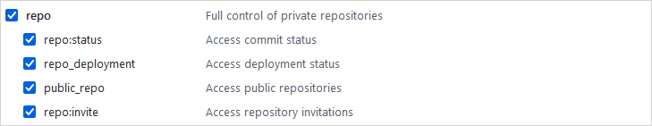
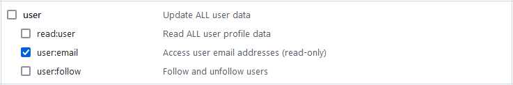
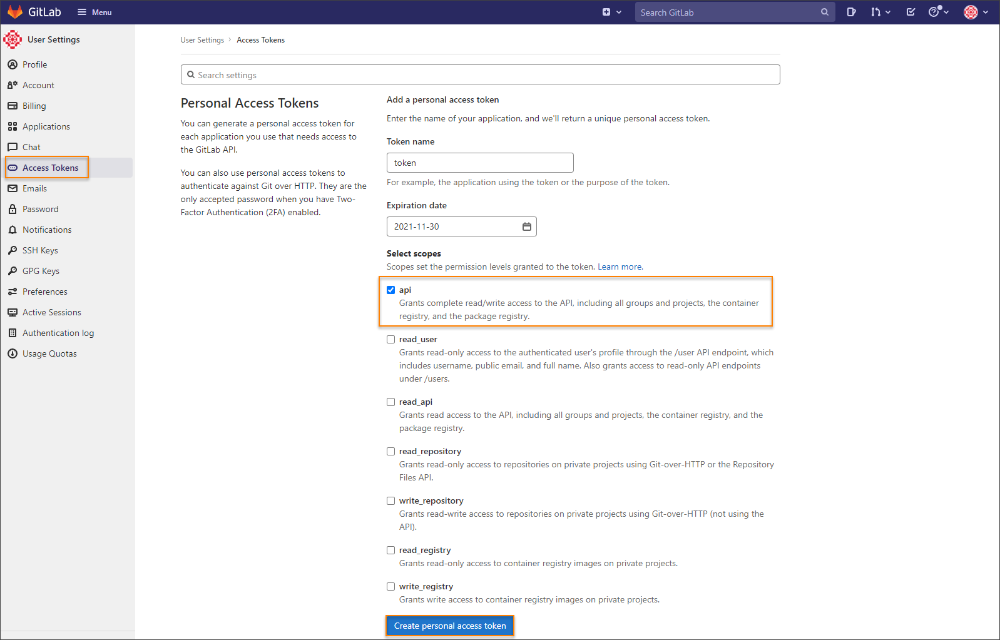
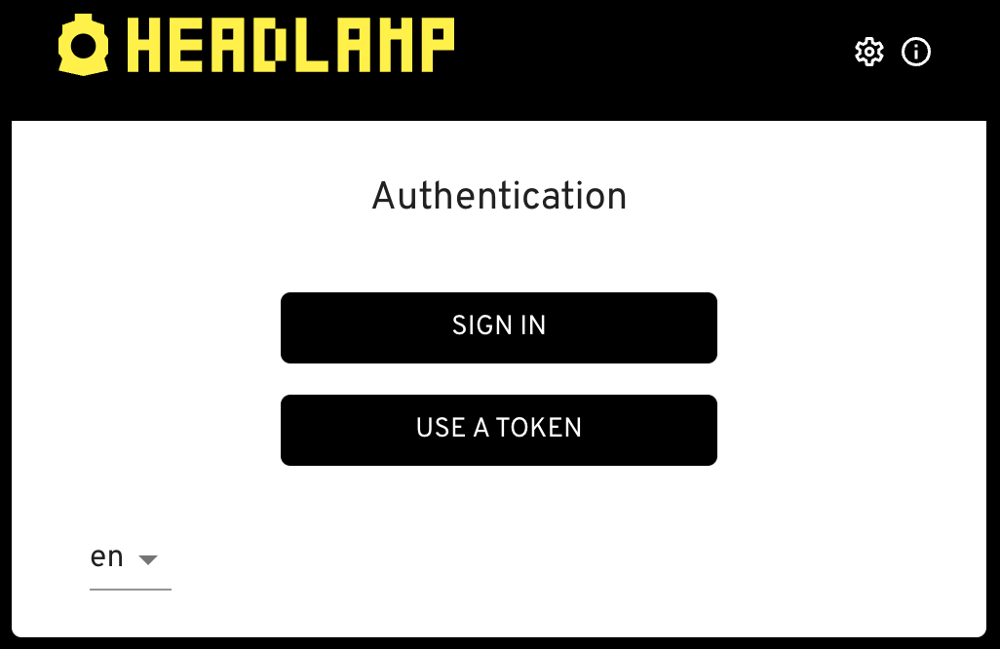
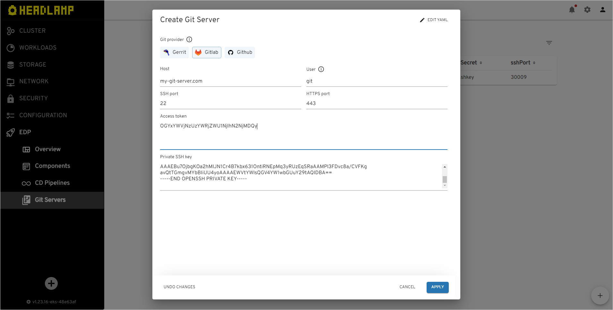
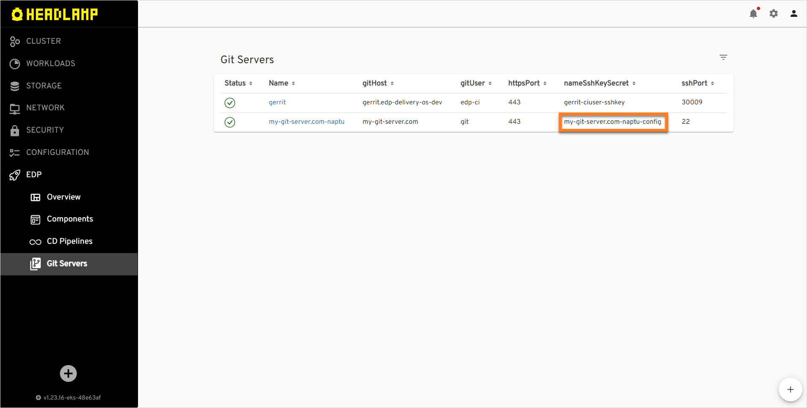
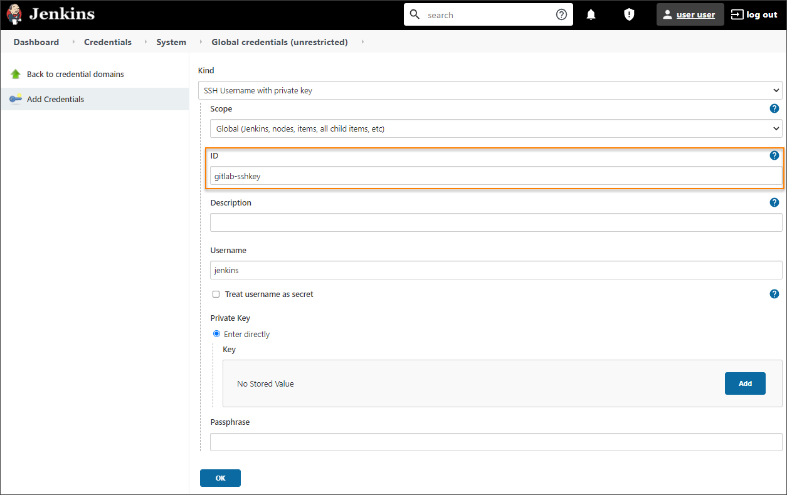

# Enable VCS Import Strategy

Enabling the VCS Import strategy is a prerequisite to integrate EDP with GitLab or GitHub.

## General Steps

In order to use the **Import** strategy, it is required to add both Secret with SSH key and GitServer custom resources
by taking the steps below.

1. Generate an SSH key pair and add a public key to [GitLab](https://docs.gitlab.com/ee/ssh/)
   or [GitHub](https://docs.github.com/en/authentication/connecting-to-github-with-ssh/generating-a-new-ssh-key-and-adding-it-to-the-ssh-agent)
   account.

  ```bash
  ssh-keygen -t ed25519 -C "email@example.com"
  ```

2. Generate access token for [GitLab](https://docs.gitlab.com/ee/user/profile/personal_access_tokens.html)
   or [GitHub](https://docs.github.com/en/authentication/keeping-your-account-and-data-secure/creating-a-personal-access-token)
   account with read/write access to the API. Both personal and repository specific tokens are applicable.

=== "GitHub"

      * Log in to GitHub.
      * Click the profile account and navigate to **Settings** -> **Developer Settings**.
      * Select *Personal access tokens (classic)* and generate a new token with the following parameters:

      !

      !!! note
          The access below is required for the GitHub Pull Request Builder plugin to get Pull Request commits, their status, and author info.

      !
      !

      !!! warning
          Make sure to save a new personal access token because it won`t be displayed later.

=== "GitLab"

      * Log in to GitLab.
      * In the top-right corner, click the avatar and select **Settings**.
      * On the **User Settings** menu, select **Access Tokens**.
      * Choose a name and an optional expiry date for the token.
      * In the **Scopes** block, select the **api** scope for the token.

      !

      * Click the **Create personal access token** button.

      !!! note
          Make sure to save the access token as there will not be any ability to access it once again.

      It is also possible to create a project access token instead of a personal access token. In this case, the GitLab Jenkins plugin will be able to accept payloads from webhooks for the project only:

      * Log in to GitLab and navigate to the project.
      * On the **User Settings** menu, select *Access Tokens*.
      * Choose a name and an optional expiry date for the token.
      * Choose a role: *Owner* or *Maintainer*.
      * In the **Scopes** block, select the *api* scope for the token.

      !

      * Click the **Create project access token** button.

## CI Tool Specific Steps

The further steps depend on the CI tool used.

=== "Tekton CI tool"

    1. Create a secret in the `edp-project` namespace for the Git account with the **id_rsa**, **username**, and **token** fields.
      Take the following template as an example (use github instead of gitlab for GitHub):

      ```yaml
      kubectl create secret generic gitlab -n <edp-project> \
      --from-file=id_rsa=id_rsa \
      --from-literal=username=git \
      --from-literal=token=your_gitlab_access_token
      ```

    2. After completing the steps above, you can get back and continue [installing EDP](../operator-guide/install-edp.md).

=== "Jenkins CI tool"

    1. Create secret in the `<edp-project>` namespace for the Git account with the **id_rsa**, **username**, and **token** fields. We recommend using Headlamp to implement this:

      Open Headlamp URL. Use the Sign-In option:

      !

      In the top right corner, enter the `Cluster settings` and set the `Default namespace`. The `Allowed namespaces` field is optional. All the resources created via Headlamp are created in the `Default namespace` whereas `Allowed namespaces` means the namespaces you are allowed to access in this cluster:

      !

      Log into Headlamp UI, select `EDP` -> `Git Servers` -> `+` to see the `Create Git Server` menu:

      !

      Choose your **Git provider**, insert **Host**, **Access token**, **Private SSH key**. Adjust **SSH port**, **User** and **HTTPS port** if needed and click `Apply`:

      !!! note
          Do not forget to press enter at the very end of the private key to have the last row empty.

      !

      When everything is done, two custom resources will be created in the default namespace: secret and Git server. Headlamp appends random symbols to both the secret and the server to provide names with uniqueness. Also, the attempt to connect to your Git server will be performed. If everything is correct, the Git server status should be green:

      !

      !!! note
          The value of the **nameSshKeySecret** property is the name of the Secret that is indicated in the first step above.

    2. Create the `JenkinsServiceAccount` custom resource with the **credentials** field that corresponds to the **nameSshKeySecret** property above:

      ```yaml
      apiVersion: v2.edp.epam.com/v1
      kind: JenkinsServiceAccount
      metadata:
        name: gitlab # It can also be github.
        namespace: <edp-project>
      spec:
        credentials: <nameSshKeySecret>
        ownerName: ''
        type: ssh
      ```

    3. Double-check that the new SSH credentials called `gitlab`/`github` are created in Jenkins using the SSH key. Navigate to `Jenkins` -> `Manage Jenkins` -> `Manage Credentials` -> `Add Credentials`:

        !

    4. The next step is to connect Jenkins plugins with your repository whether it is [GitHub](../operator-guide/github-integration.md) or [GitLab](../operator-guide/gitlab-integration.md).

    5. The next step is to integrate Jenkins with [GitHub](manage-jenkins-ci-job-provision.md#github-github) or [GitLab](manage-jenkins-ci-job-provision.md#gitlab-gitlab).

## Related Articles

* [Add Git Server](../headlamp-user-guide/add-git-server.md)
* [Add Application](../user-guide/add-application.md)
* [GitHub Integration](github-integration.md)
* [GitLab Integration](gitlab-integration.md)
