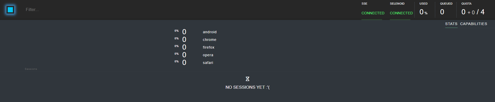
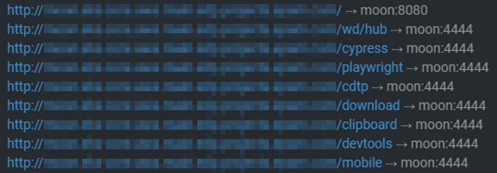
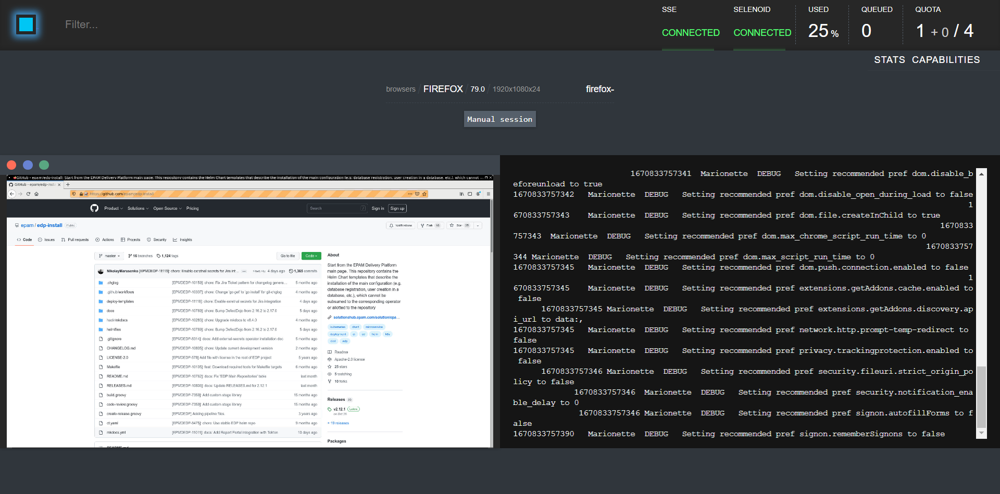

# Install via Helmfile

This article provides the instruction on how to deploy EDP and components in Kubernetes using [Helmfile](https://github.com/helmfile/helmfile) that is intended for deploying Helm charts. Helmfile templates are available in [GitHub repository](https://github.com/epam/edp-install/tree/master/helmfiles).

## Prerequisites

The following tools and plugins must be installed:

* [Kubectl version 1.23.0](https://v1-23.docs.kubernetes.io/releases/download/)
* [Helm version 3.10.0+](https://github.com/helm/helm/releases/tag/v3.10.0)
* [Helmfile version 0.142.0](https://github.com/helmfile/helmfile)
* [Helm diff plugin version 3.5.0](https://github.com/databus23/helm-diff)
* [Helm-git plugin version 0.11.4](https://github.com/aslafy-z/helm-git)

## Helmfile Structure

* The `envs/common.yaml` file contains the specification for environments pattern, list of helm repositories from which it is necessary to fetch the helm charts and additional Helm parameters.
* The `envs/platform.yaml` file contains global parameters that are used in various Helmfiles.
* The `releases/envs/` contains symbol links to environments files.
* The `releases/*.yaml` file contains description of parameters that is used when deploying a Helm chart.
* The `helmfile.yaml` file defines components to be installed by defining a path to Helm releases files.
* The `envs/ci.yaml` file contains stub parameters for CI linter.
* The `test/lint-ci.sh` script for running CI linter with debug loglevel and stub parameters.
* The `resources/*.yaml` file contains additional resources for the OpenShift platform.

## Operate Helmfile

Before applying the Helmfile, please fill in the global parameters in the `envs/platform.yaml` (check the examples in the `envs/ci.yaml`) and `releases/*.yaml` files for every Helm deploy.

Pay attention to the following recommendations while working with the Helmfile:

* To launch Lint, run the `test/lint-ci.sh` script.

* Display the difference between the deployed and environment state (`helm diff`):

      helmfile --environment platform -f helmfile.yaml diff

* Apply the deployment:

      helmfile  --selector component=ingress --environment platform -f helmfile.yaml apply

* Modify the deployment and apply the changes:

      helmfile  --selector component=ingress --environment platform -f helmfile.yaml sync

* To deploy the components according to the label, use the selector to target a subset of releases when running the Helmfile. It can be useful for large Helmfiles with the releases that are logically grouped together. For example, to display the difference only for the `nginx-ingress` file, use the following command:

      helmfile  --selector component=ingress --environment platform -f helmfile.yaml diff

* To destroy the release, run the following command:

      helmfile  --selector component=ingress --environment platform -f helmfile.yaml destroy

## Deploy Components

Using the Helmfile, the following components can be installed:

* [NGINX Ingress Controller](https://github.com/kubernetes/ingress-nginx/tree/master/charts/ingress-nginx)
* [Keycloak](https://github.com/codecentric/helm-charts/tree/master/charts/keycloak)
* [EPAM Delivery Platform](https://github.com/epam/edp-install/tree/master/deploy-templates)
* [Argo CD](https://github.com/argoproj/argo-helm/tree/master/charts/argo-cd)
* [External Secrets Operator](https://github.com/external-secrets/external-secrets/tree/main/deploy/charts/external-secrets)
* [DefectDojo](https://github.com/DefectDojo/django-DefectDojo/tree/master/helm/defectdojo)
* [Moon](https://github.com/aerokube/moon)
* [ReportPortal](https://github.com/reportportal/kubernetes/tree/develop/reportportal)

### Deploy NGINX Ingress Controller

!!! Info
    Skip this step for the OpenShift platform, because it has its own Ingress Controller.

To install NGINX Ingress controller, follow the steps below:

1. In the `releases/nginx-ingress.yaml` file, set the `proxy-real-ip-cidr` parameter according to the value with AWS VPC IPv4 CIDR.

2. Install NGINX Ingress controller:

      helmfile  --selector component=ingress --environment platform -f helmfile.yaml apply

### Deploy Keycloak

Keycloak requires a database deployment, so it has two charts: `releases/keycloak.yaml` and `releases/postgresql-keycloak.yaml`.

To install Keycloak, follow the steps below:

1. Create a `security` namespace:

  !!! Note
      **For the OpenShift users:**<br>
      This namespace is also indicated as `users` in the following custom `SecurityContextConstraints` resources: `resources/keycloak-scc.yaml` and `resources/postgresql-keycloak-scc.yaml`. Change the namespace name when using a custom namespace.

    ```
    kubectl create namespace security
    ```

2. Create PostgreSQL admin secret:

      kubectl -n security create secret generic keycloak-postgresql \
      --from-literal=password=<postgresql_password> \
      --from-literal=postgres-password=<postgresql_postgres_password>

3. In the `envs/platform.yaml` file, set the `dnsWildCard` parameter.

4. Create Keycloak admin secret:

      kubectl -n security create secret generic keycloak-admin-creds \
      --from-literal=username=<keycloak_admin_username> \
      --from-literal=password=<keycloak_admin_password>

5. Install Keycloak:

      helmfile  --selector component=sso --environment platform -f helmfile.yaml apply

### Deploy EPAM Delivery Platform

To install EDP, follow the steps below:

1. Create a `platform` namespace:

      kubectl create namespace platform

2. Create a secret for administrative access to the database:

      kubectl -n platform create secret generic super-admin-db \
        --from-literal=username=<super_admin_db_username> \
        --from-literal=password=<super_admin_db_password>

  !!! warning
      Do not use the **admin** username here since the **admin** is a reserved name.

3. Create a secret for an EDP tenant database user:

      kubectl -n platform create secret generic db-admin-console \
        --from-literal=username=<tenant_db_username> \
        --from-literal=password=<tenant_db_password>

  !!! warning
      Do not use the `admin` username here since the `admin` is a reserved name.

4. For EDP, it is required to have Keycloak access to perform the integration. Create a secret with the user and password provisioned in the step 2 of the [Keycloak Configuration](./install-keycloak.md#configuration) section.

      kubectl -n platform create secret generic keycloak \
        --from-literal=username=<username> \
        --from-literal=password=<password>

5. In the `envs/platform.yaml` file, set the `edpName` and `keycloakEndpoint` parameters.

6. In the `releases/edp-install.yaml` file, check and fill in all values.

7. Install EDP:

      helmfile  --selector component=edp --environment platform -f helmfile.yaml apply

### Deploy Argo CD

Before Argo CD deployment, install the following tools:

* [Keycloak](./install-keycloak.md)
* [EDP](./install-edp.md)

To install Argo CD, follow the steps below:

1. Install Argo CD:

  !!! warning "For the OpenShift users:"
            When using a custom namespace for Argo CD, the `argocd` namespace is also indicated as `users` in the `resources/argocd-scc.yaml` custom `SecurityContextConstraints` resource. Change it there as well.

    ```bash
    helmfile --selector component=argocd --environment platform -f helmfile.yaml apply
    ```

2. Update the `argocd-secret` secret in the Argo CD namespace by providing the correct Keycloak client secret (`oidc.keycloak.clientSecret`) with the value from the `keycloak-client-argocd-secret` secret in EDP namespace. Then restart the deployment:

  ```bash
  ARGOCD_CLIENT=$(kubectl -n platform get secret keycloak-client-argocd-secret  -o jsonpath='{.data.clientSecret}')
  kubectl -n argocd patch secret argocd-secret -p="{\"data\":{\"oidc.keycloak.clientSecret\": \"${ARGOCD_CLIENT}\"}}" -v=1
  kubectl -n argocd rollout restart deployment argo-argocd-server
  ```

### Deploy External Secrets Operator

To install External Secrets Operator, follow the steps below:

  ```bash
  helmfile  --selector component=secrets --environment platform -f helmfile.yaml apply
  ```

### Deploy DefectDojo

!!! info
    It is also possible to install DefectDojo via Helm Chart. For details, please refer to the [Install DefectDojo](./install-defectdojo.md) page.

To install DefectDojo via Helmfile, follow the steps below:

1. Create a DefectDojo namespace:

  !!! warning "For the OpenShift users:"
      This namespace is also indicated as `users` in the `resources/defectdojo-scc.yaml` custom `SecurityContextConstraints` resource.
      Change it when using a custom namespace. Also, change the namespace in the `resources/defectdojo-route.yaml` file.

  ```bash
  kubectl create namespace defectdojo
  ```

2. Modify the `host` in `resources/defectdojo-route.yaml` (only for OpenShift).

3. Create a PostgreSQL admin secret:

  ```bash
  kubectl -n defectdojo create secret generic defectdojo-postgresql-specific \
  --from-literal=postgresql-password=<postgresql_password> \
  --from-literal=postgresql-postgres-password=<postgresql_postgres_password>
  ```

  !!! note
      The `postgresql_password` and `postgresql_postgres_password` passwords must be 16 characters long.

4. Create a RabbitMQ admin secret:

  ```bash
  kubectl -n defectdojo create secret generic defectdojo-rabbitmq-specific \
  --from-literal=rabbitmq-password=<rabbitmq_password> \
  --from-literal=rabbitmq-erlang-cookie=<rabbitmq_erlang_cookie>
  ```

  !!! note
      The `rabbitmq_password` password must be 10 characters long.

      The `rabbitmq_erlang_cookie` password must be 32 characters long.

5. Create a DefectDojo admin secret:

  ```bash
  kubectl -n defectdojo create secret generic defectdojo \
  --from-literal=DD_ADMIN_PASSWORD=<dd_admin_password> \
  --from-literal=DD_SECRET_KEY=<dd_secret_key> \
  --from-literal=DD_CREDENTIAL_AES_256_KEY=<dd_credential_aes_256_key> \
  --from-literal=METRICS_HTTP_AUTH_PASSWORD=<metric_http_auth_password>
  ```

  !!! note
      The `dd_admin_password` password must be 22 characters long.

      The `dd_secret_key` password must be 128 characters long.

      The `dd_credential_aes_256_key` password must be 128 characters long.

      The `metric_http_auth_password` password must be 32 characters long.

6. In the `envs/platform.yaml` file, set the `dnsWildCard` parameter.

7. Install DefectDojo:

  ```bash
  helmfile  --selector component=defectdojo --environment platform -f helmfile.yaml apply
  ```

### Deploy ReportPortal

!!! info
    It is also possible to install ReportPortal via Helm Chart. For details, please refer to the [Install ReportPortal](./install-reportportal.md) page.

ReportPortal requires third-party deployments: RabbitMQ, ElasticSearch, PostgreSQL, MinIO.

To install third-party resources, follow the steps below:

1. Create a RabbitMQ admin secret:

  ```bash
  kubectl -n platform create secret generic reportportal-rabbitmq-creds \
  --from-literal=rabbitmq-password=<rabbitmq_password> \
  --from-literal=rabbitmq-erlang-cookie=<rabbitmq_erlang_cookie>
  ```

  !!! warning
      The `rabbitmq_password` password must be 10 characters long.

      The `rabbitmq_erlang_cookie` password must be 32 characters long.

2. Create a PostgreSQL admin secret:

  ```bash
  kubectl -n platform create secret generic reportportal-postgresql-creds \
  --from-literal=postgresql-password=<postgresql_password> \
  --from-literal=postgresql-postgres-password=<postgresql_postgres_password>
  ```

  !!! warning
      The `postgresql_password` and `postgresql_postgres_password` passwords must be 16 characters long.

3. Create a MinIO admin secret:

  ```bash
  kubectl -n platform create secret generic reportportal-minio-creds \
  --from-literal=root-password=<root_password> \
  --from-literal=root-user=<root_user>
  ```

4. In the `envs/platform.yaml` file, set the `dnsWildCard` and `edpName` parameters.

  !!! warning "For the OpenShift users:"
      The namespace is also indicated as `users` in the following custom `SecurityContextConstraints`
      resources: `resources/report-portal-elasticsearch-scc.yaml` and `resources/report-portal-third-party-resources-scc.yaml`.
      Change the namespace name when using a custom namespace.

5. Install third-party resources:

  ```bash
  helmfile --selector component=report-portal-third-party-resources --environment platform -f helmfile.yaml apply
  ```

6. After the rabbitmq pod gets the status Running, you need to configure the RabbitMQ memory threshold

  ```bash
  kubectl -n platform exec -it rabbitmq-0 -- rabbitmqctl set_vm_memory_high_watermark 0.8
  ```

To install ReportPortal via Helmfile, follow the steps below:

!!! warning "For the OpenShift users:"
    1. The namespace is also indicated as `users` in the `resources/report-portal-reportportal-scc.yaml` custom `SecurityContextConstraints` resource.
    Change it when using a custom namespace.<br>
    2. Change the namespace in the following files: `resources/report-portal-gateway/gateway-config-cm`,
    `resources/report-portal-gateway/gateway-deployment`, `resources/report-portal-gateway/gateway-route`, and
    `resources/report-portal-gateway/gateway-service`.<br>
    3. Modify the `host` in `resources/report-portal-gateway/gateway-route`

  ```bash
  helmfile --selector component=report-portal --environment platform -f helmfile.yaml apply
  ```

!!! note
    For user access: default/1q2w3e<br>
    For admin access: superadmin/erebus<br>
    Please refer to the [ReportPortal.io](https://reportportal.io/installation) page for details.


### Deploy Moon
[Moon](https://github.com/aerokube/moon) is a browser automation solution compatible with Selenium, Cypress, Playwright, and Puppeteer using Kubernetes or Openshift to launch browsers.
!!! note
      Aerokube/Moon does not require third-party deployments.

Follow the steps below to deploy Moon:

1. Use the following command to install Moon:

      ```bash
      helmfile --selector component=moon --environment platform -f helmfile.yaml apply
      ```

2. After the installation, open the Ingress Dashboard and check that `SELENOID` and `SSE` have the `CONNECTED` status.

  !

3. In Moon, use the following command with the Ingress rule, for example, `wd/hub`:

      ```bash
          curl -X POST 'http://<INGRESS_LINK>/wd/hub/session' -d '{
                      "desiredCapabilities":{
                          "browserName":"firefox",
                          "version": "79.0",
                          "platform":"ANY",
                          "enableVNC": true,
                          "name": "edp",
                          "sessionTimeout": "480s"
                      }
                  }'
      ```

  See below the list of Moon Dashboard Ingress rules:

  !

  After using the command above, the container will start, and the VNC viewer will be displayed on the Moon Dashboard:

  !

## Related Articles
* [Install EDP](install-edp.md)
* [Install NGINX Ingress Controller](install-ingress-nginx.md)
* [Install Keycloak](install-keycloak.md)
* [Install DefectDojo](install-defectdojo.md)
* [Install ReportPortal](install-reportportal.md)
* [Install Argo CD](install-argocd.md)