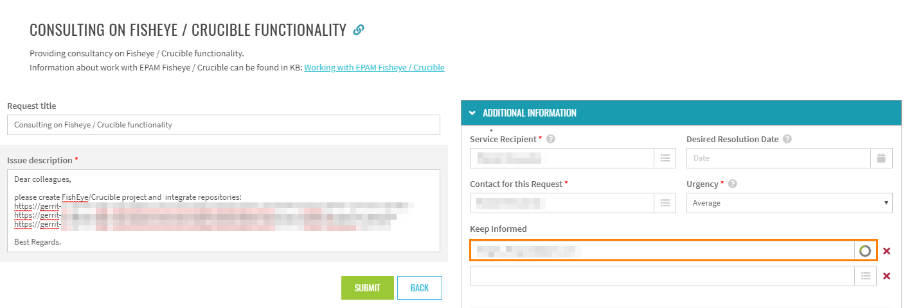
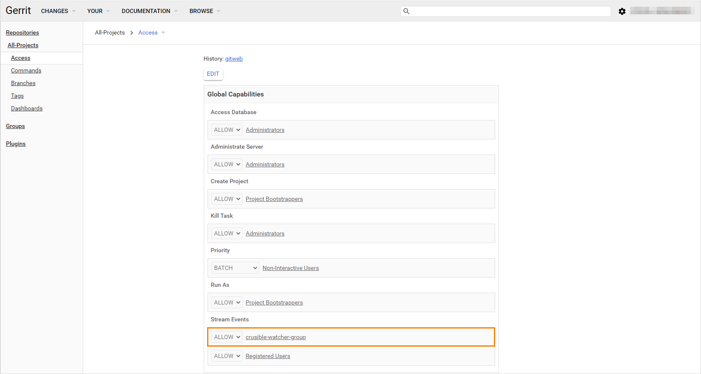

# Adjust VCS Integration With Jira

In order to adjust the Version Control System integration with Jira Server, first make sure you have the following prerequisites:

* VCS Server
* Jira
* Crucible

When checked the prerequisites, follow the steps below to proceed with the integration:

1. Integrate every project in VCS Server with every project in [Crucible](https://crucible.epam.com/) by creating a corresponding request in [EPAM Support Portal](https://support.epam.com/esp/ess.do?orderitem=caConsultancyinFisheyeCruciblefunctionality).
Add the repositories links and fill in the *Keep Informed* field as this request must be approved.

  

2. Provide additional details to the support team. If the VCS is Gerrit, inspect the sample below of its integration:

  2.1 Create a new "crucible-<project_name>" user in Gerrit with SSH key and add a new user to the "Non-Interactive Users" Gerrit group;

  2.2 Create a new group in Gerrit "crucible-watcher-group" and add the "crucible-<project_name>" user;

  2.3 Provide access to All-Projects for the "crucible-watcher-group" group:

  

  

3. To link commits with Jira ticket, being in Gerrit, enter a Jira ticket ID in a commit message using the specific format:

  **[PROJECT-CODE-1234]: commit message**

  where PROJECT-CODE is a specific code of a project, 1234 is an ID number, and a commit message.

4. As a result, all Gerrit commits will be displayed on [Crucible](https://crucible.epam.com/):

  

## Related Articles

* [Adjust Jira Integration](jira-integration.md)
