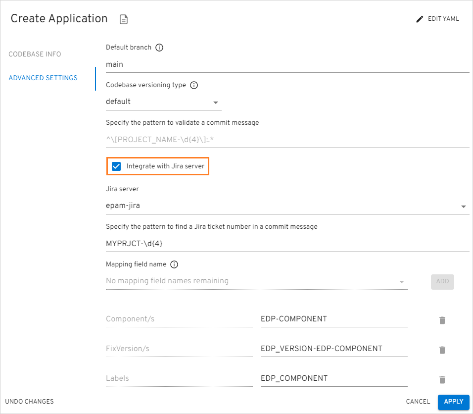

# Adjust Jira Integration

This documentation guide provides step-by-step instructions for enabling the Jira integration option in the EDP Portal UI for EPAM Delivery Platform. Jira integration allows including useful metadata in Jira tickets.

## Overview

Integrating Jira can provide a number of benefits, such as increased visibility and traceability, automatic linking code changes to relevant Jira issues, streamlining the management and tracking of development progress.

By linking CI pipelines to Jira issues, teams can get a better understanding of the status of their work and how it relates to the overall development process. This can help to improve communication and collaboration, and ultimately lead to faster and more efficient delivery of software.

Enabling Jira integration allows for the automatic population of three fields in Jira tickets: Fix Versions, Components, and Labels. Each of these fields provides distinct benefits:

* **Fix Versions**: helps track progress against release schedules;
* **Components**: allows grouping related issues together;
* **Labels**: enables identification of specific types of work.

Teams can utilize these fields to enhance their work prioritization, identify dependencies, improve collaboration, and ultimately achieve faster software delivery.

## Integration Procedure

In order to adjust the Jira server integration, first add JiraServer CR by performing the following:

1. Create the secret in the edp namespace for Jira Server account. Fill in the **username** and **password** fields with your own values:

  === "External Secret Operator"

      By default, EDP allows to get a value from the [SecretStore](./external-secrets-operator-integration.md#step 2), in which the value of `jira-user`:

      ```json title="/edp/deploy-secrets"
      {
        "jira-user": { "username": "usernameInBase64", "password": "passwordInBase64" }
      }
      ```

  === "Manually"

      ```yaml
      apiVersion: v1
      data:
        password: passwordInBase64
        username: usernameInBase64
      kind: Secret
      metadata:
        name: jira-user
      type: kubernetes.io/basic-auth
      ```

2. Create JiraServer CR in the OpenShift/Kubernetes namespace with the **apiUrl**, **credentialName** and **rootUrl** fields:

      apiVersion: v2.edp.epam.com/v1
      kind: JiraServer
      metadata:
        name: jira-server
      spec:
        apiUrl: 'https://jira-api.example.com'
        credentialName: jira-user
        rootUrl: 'https://jira.example.com'

  !!! note
      The value of the **credentialName** property is the name of the Secret, which is indicated in the first point above.

3. In the EDP Portal UI, navigate to the **Advanced Settings** menu to check that the **Integrate with Jira server** check box appeared:

    !

  !!! note

      There are four predefined variables with the respective values that can be specified singly or as a combination:

      **EDP_COMPONENT** – returns application-name<br>
      **EDP_VERSION** – returns 0.0.0-SNAPSHOT or 0.0.0-RC<br>
      **EDP_SEM_VERSION** – returns 0.0.0<br>
      **EDP_GITTAG** – returns build/0.0.0-SNAPSHOT.2 or build/0.0.0-RC.2<br>

      There are no character restrictions when combining the variables, combination samples:<br>
      EDP_SEM_VERSION-EDP_COMPONENT or <br>EDP_COMPONENT-hello-world/EDP_VERSION, etc.

    As a result of successful Jira integration, the additional information will be added to tickets.

## Related Articles

* [Adjust VCS Integration With Jira](jira-gerrit-integration.md)
* [Add Application](../user-guide/add-application.md)
