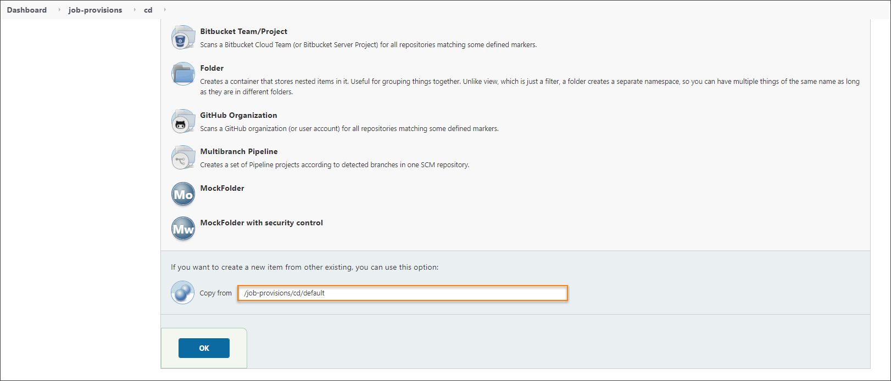

# Manage Jenkins CD Pipeline Job Provisioner

The Jenkins CD job provisioner (or seed-job) is used to create and manage the cd-pipeline folder, and its [Deploy pipelines](../user-guide/pipeline-stages.md).
There is a special **job-provisions/cd** folder in Jenkins for these provisioners. Explore the steps for managing different provisioner types below.

## Default

During the EDP deployment, a default provisioner is created to deploy application with [container and custom](../user-guide/add-cd-pipeline.md) deployment type.

1. Find the configuration in **job-provisions/cd/default**.

2. Default template is presented below:

   <details>
   <Summary><b>View: Default template</b></Summary>

```java
/* Copyright 2022 EPAM Systems.

Licensed under the Apache License, Version 2.0 (the "License");
you may not use this file except in compliance with the License.
You may obtain a copy of the License at
http://www.apache.org/licenses/LICENSE-2.0

Unless required by applicable law or agreed to in writing, software
distributed under the License is distributed on an "AS IS" BASIS,
WITHOUT WARRANTIES OR CONDITIONS OF ANY KIND, either express or implied.

See the License for the specific language governing permissions and
limitations under the License. */

import groovy.json.*
import jenkins.model.Jenkins

Jenkins jenkins = Jenkins.instance

def pipelineName = "${PIPELINE_NAME}-cd-pipeline"
def stageName = "${STAGE_NAME}"
def qgStages = "${QG_STAGES}"
def gitServerCrVersion = "${GIT_SERVER_CR_VERSION}"
def gitCredentialsId = "${GIT_CREDENTIALS_ID}"
def sourceType = "${SOURCE_TYPE}"
def libraryURL = "${LIBRARY_URL}"
def libraryBranch = "${LIBRARY_BRANCH}"
def isAutoDeploy = "${AUTODEPLOY}"
def scriptPath = "Jenkinsfile"
def containerDeploymentType = "container"
def deploymentType = "${DEPLOYMENT_TYPE}"
def codebaseFolder = jenkins.getItem(pipelineName)

def autoDeploy = '{"name":"auto-deploy-input","step_name":"auto-deploy-input"}'
def manualDeploy = '{"name":"manual-deploy-input","step_name":"manual-deploy-input"}'
def runType = isAutoDeploy.toBoolean() ? autoDeploy : manualDeploy

def stages = buildStages(deploymentType, containerDeploymentType, qgStages, runType)

if (codebaseFolder == null) {
    folder(pipelineName)
}

if (deploymentType == containerDeploymentType) {
    createContainerizedCdPipeline(pipelineName, stageName, stages, scriptPath, sourceType,
            libraryURL, libraryBranch, gitCredentialsId, gitServerCrVersion,
            isAutoDeploy)
} else {
    createCustomCdPipeline(pipelineName, stageName)
}

def buildStages(deploymentType, containerDeploymentType, qgStages, runType) {
    return deploymentType == containerDeploymentType
            ? '[{"name":"init","step_name":"init"},' + runType + ',{"name":"deploy","step_name":"deploy"},' + qgStages + ',{"name":"promote-images","step_name":"promote-images"}]'
            : ''
}

def createContainerizedCdPipeline(pipelineName, stageName, stages, pipelineScript, sourceType, libraryURL, libraryBranch, libraryCredId, gitServerCrVersion, isAutoDeploy) {
    pipelineJob("${pipelineName}/${stageName}") {
        if (sourceType == "library") {
            definition {
                cpsScm {
                    scm {
                        git {
                            remote {
                                url(libraryURL)
                                credentials(libraryCredId)
                            }
                            branches("${libraryBranch}")
                            scriptPath("${pipelineScript}")
                        }
                    }
                }
            }
        } else {
            definition {
                cps {
                    script("@Library(['edp-library-stages', 'edp-library-pipelines']) _ \n\nDeploy()")
                    sandbox(true)
                }
            }
        }
        properties {
            disableConcurrentBuilds()
            logRotator {
                numToKeep(10)
                daysToKeep(7)
            }
        }
        parameters {
            stringParam("GIT_SERVER_CR_VERSION", "${gitServerCrVersion}", "Version of GitServer CR Resource")
            stringParam("STAGES", "${stages}", "Consequence of stages in JSON format to be run during execution")

            if (isAutoDeploy?.trim() && isAutoDeploy.toBoolean()) {
                stringParam("CODEBASE_VERSION", null, "Codebase versions to deploy.")
            }
        }
    }
}

def createCustomCdPipeline(pipelineName, stageName) {
    pipelineJob("${pipelineName}/${stageName}") {
        properties {
            disableConcurrentBuilds()
            logRotator {
                numToKeep(10)
                daysToKeep(7)
            }
        }
    }
}
```
   </details>

## Custom

In some cases, it is necessary to modify or update the job provisioner logic. For example, when [adding a new stage](../user-guide/customize-cd-pipeline.md)
requires a custom job provisioner created on the basis of an existing one out of the box.
Take the steps below to add a custom job provision.

1. Navigate to the Jenkins main page and open the *job-provisions/cd* folder, click **New Item** and type the name of job provisions, for example - custom.

    !

  Scroll down to the **Copy from** field, enter "/job-provisions/cd/default", and click OK:
    !

2. Update the required parameters in the new provisioner. For example, if it is necessary to implement a new stage **clean**, add the following code to the provisioner:

         def buildStages(deploymentType, containerDeploymentType, qgStages) {
             return deploymentType == containerDeploymentType
             ? '[{"name":"init","step_name":"init"},{"name":"clean","step_name":"clean"},{"name":"deploy","step_name":"deploy"},' + qgStages + ',{"name":"promote-images-ecr","step_name":"promote-images"}]'
             : ''
         }

  !!! note
      Make sure the support for the above mentioned logic is implemented. Please refer to the [How to Redefine or Extend the EDP Pipeline Stages Library](https://epam.github.io/edp-install/user-guide/pipeline-framework/#13-how-to-redefine-or-extend-the-edp-pipeline-stages-library) section of the guide.

  After the steps above are performed, the new custom job-provision will be available in **Adding Stage** during the CD pipeline creation in Admin Console.

  !
