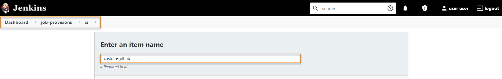
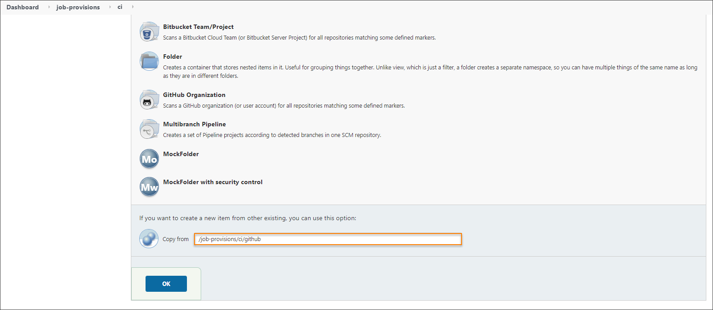
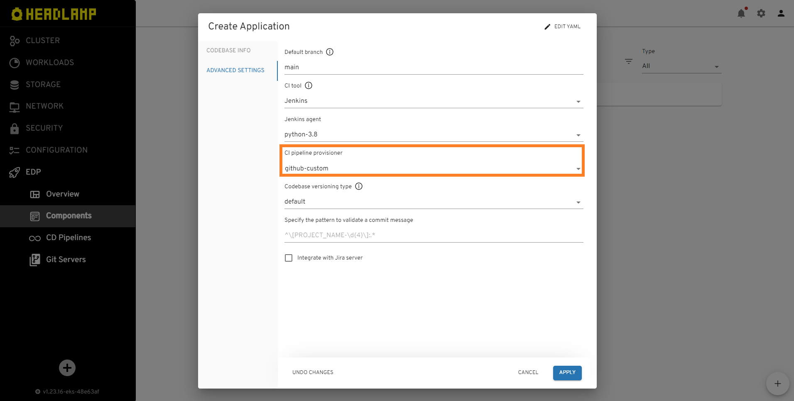
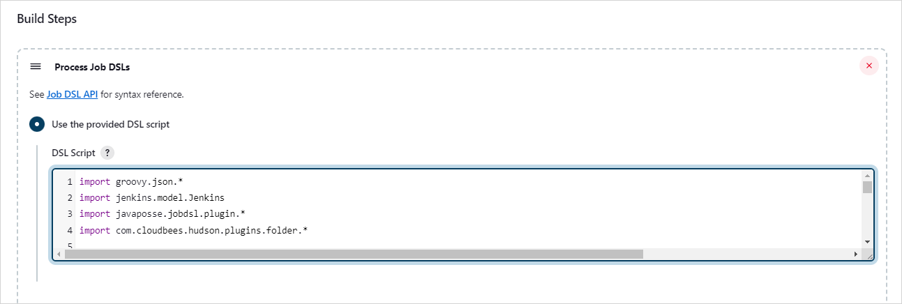

# Manage Jenkins CI Pipeline Job Provisioner

The Jenkins CI job provisioner (or seed-job) is used to create and manage the application folder, and its [Code Review, Build and Create Release pipelines](../user-guide/pipeline-stages.md).
Depending on the version control system, different job provisioners are used. EDP supports integration with the following version control systems:

- Gerrit (default)
- GitHub (github)
- GitLab (gitlab)

By default, the [Jenkins operator](https://github.com/epam/edp-jenkins-operator/tree/master) creates a pipeline for [several types of application and libraries](../features.md).
There is a special **job-provisions/ci** folder in Jenkins for these provisioners.
During the EDP deployment, a default provisioner is created for integration with [Gerrit](https://www.gerritcodereview.com/) version control system.
To configure integration with other version control systems, you need to add the required job provisioners to **job-provisions/ci** folder in Jenkins.

## Custom (custom-default/github/gitlab)

In some cases it is necessary to modify or update the job provisioner logic, for example when an [added other code language](./add-other-code-language.md)
needs to create a custom job provisioner on the basis of an existing one out of the box.
Take the steps below to add a custom job provision:

1. Navigate to the Jenkins main page and open the *job-provisions/ci* folder, click **New Item** and type the name of job-provisions, for example - custom-github.

    

    Scroll down to the **Copy from** field and enter "/job-provisions/ci/github", and click OK:
    

2. Update the required parameters in the new provisioner. For example, if it is necessary to implement a new build tool **docker**, several parameters are to be updated. Add the following stages to the docker
Code Review and Build pipelines for **docker** application:

        stages['Code-review-application-docker'] = '[{"name": "checkout"},{"name": "lint"},{"name": "build"}]'
        ...
        stages['Build-application-docker'] = '[{"name": "checkout"},{"name": "get-version"},{"name": "lint"},{"name": "build"},{"name": "push"},{"name": "git-tag"}]'
        ...
        def getStageKeyName(buildTool) {
            ...
            if (buildTool.toString().equalsIgnoreCase('docker')) {
            return "Code-review-application-docker"
            }
            ...
        }

  !!! note
      Make sure the support for the above mentioned logic is implemented. Please refer to the [How to Redefine or Extend the EDP Pipeline Stages Library](https://epam.github.io/edp-install/user-guide/pipeline-framework/#13-how-to-redefine-or-extend-the-edp-pipeline-stages-library) section of the guide.

  !!! note
      The default template should be changed if there is another creation logic for the Code Review, Build and Create Release pipelines.
      Furthermore, all pipeline types should have the necessary stages as well.

  After the steps above are performed, the new custom job provision will be available in **Advanced Settings** during the application creation in Admin Console.

  

## Gerrit (default)

During the EDP deployment, a default provisioner is created for integration with [Gerrit](https://www.gerritcodereview.com/) version control system.

1. Find the configuration in **job-provisions/ci/default**.

2. Default template is presented below:

   <details>
   <Summary><b>View: Default template</b></Summary>

```java
/* Copyright 2021 EPAM Systems.

Licensed under the Apache License, Version 2.0 (the "License");
you may not use this file except in compliance with the License.
You may obtain a copy of the License at
http://www.apache.org/licenses/LICENSE-2.0

Unless required by applicable law or agreed to in writing, software
distributed under the License is distributed on an "AS IS" BASIS,
WITHOUT WARRANTIES OR CONDITIONS OF ANY KIND, either express or implied.

See the License for the specific language governing permissions and
limitations under the License. */

import groovy.json.*
import jenkins.model.Jenkins
import hudson.model.*

Jenkins jenkins = Jenkins.instance
def stages = [:]
def jiraIntegrationEnabled = Boolean.parseBoolean("${JIRA_INTEGRATION_ENABLED}" as String)
def commitValidateStage = jiraIntegrationEnabled ? ',{"name": "commit-validate"}' : ''
def createJIMStage = jiraIntegrationEnabled ? ',{"name": "create-jira-issue-metadata"}' : ''
def buildTool = "${BUILD_TOOL}"
def goBuildStage = buildTool.toString() == "go" ? ',{"name": "build"}' : ',{"name": "compile"}'

stages['Code-review-application'] = '[{"name": "gerrit-checkout"}' + "${commitValidateStage}" + goBuildStage +
 ',{"name": "tests"},[{"name": "sonar"},{"name": "dockerfile-lint"},{"name": "helm-lint"}]]'
stages['Code-review-library'] = '[{"name": "gerrit-checkout"}' + "${commitValidateStage}" +
 ',{"name": "compile"},{"name": "tests"},' +
        '{"name": "sonar"}]'
stages['Code-review-autotests'] = '[{"name": "gerrit-checkout"},{"name": "get-version"}' + "${commitValidateStage}" +
 ',{"name": "tests"},{"name": "sonar"}' + "${createJIMStage}" + ']'
stages['Code-review-default'] = '[{"name": "gerrit-checkout"}' + "${commitValidateStage}" + ']'
stages['Code-review-library-terraform'] = '[{"name": "gerrit-checkout"}' + "${commitValidateStage}" +
 ',{"name": "terraform-lint"}]'
stages['Code-review-library-opa'] = '[{"name": "gerrit-checkout"}' + "${commitValidateStage}" +
 ',{"name": "tests"}]'
stages['Code-review-library-codenarc'] = '[{"name": "gerrit-checkout"}' + "${commitValidateStage}" +
 ',{"name": "sonar"},{"name": "build"}]'

stages['Build-library-maven'] = '[{"name": "checkout"},{"name": "get-version"},{"name": "compile"},' +
        '{"name": "tests"},{"name": "sonar"},{"name": "build"},{"name": "push"}' + "${createJIMStage}" + ',{"name": "git-tag"}]'
stages['Build-library-npm'] = stages['Build-library-maven']
stages['Build-library-gradle'] = stages['Build-library-maven']
stages['Build-library-dotnet'] = '[{"name": "checkout"},{"name": "get-version"},{"name": "compile"},' +
        '{"name": "tests"},{"name": "sonar"},{"name": "push"}' + "${createJIMStage}" + ',{"name": "git-tag"}]'
stages['Build-library-python'] = '[{"name": "checkout"},{"name": "get-version"},{"name": "compile"},' +
        '{"name": "tests"},{"name": "sonar"},{"name": "push"}' + "${createJIMStage}" + ',{"name": "git-tag"}]'
stages['Build-library-terraform'] = '[{"name": "checkout"},{"name": "get-version"},{"name": "terraform-lint"}' +
 ',{"name": "terraform-plan"},{"name": "terraform-apply"}' + "${createJIMStage}" + ',{"name": "git-tag"}]'
stages['Build-library-opa'] = '[{"name": "checkout"},{"name": "get-version"}' +
 ',{"name": "tests"}' + "${createJIMStage}" + ',{"name": "git-tag"}]'
stages['Build-library-codenarc'] = '[{"name": "checkout"},{"name": "get-version"},{"name": "sonar"},{"name": "build"}' +
    "${createJIMStage}" + ',{"name": "git-tag"}]'


stages['Build-application-maven'] = '[{"name": "checkout"},{"name": "get-version"},{"name": "compile"},' +
        '{"name": "tests"},[{"name": "sonar"}],{"name": "build"},{"name": "build-image-kaniko"},' +
        '{"name": "push"}' + "${createJIMStage}" + ',{"name": "git-tag"}]'
stages['Build-application-npm'] = stages['Build-application-maven']
stages['Build-application-gradle'] = stages['Build-application-maven']
stages['Build-application-dotnet'] = '[{"name": "checkout"},{"name": "get-version"},{"name": "compile"},' +
        '{"name": "tests"},[{"name": "sonar"}],{"name": "build-image-kaniko"},' +
        '{"name": "push"}' + "${createJIMStage}" + ',{"name": "git-tag"}]'
stages['Build-application-go'] = '[{"name": "checkout"},{"name": "get-version"},{"name": "tests"},{"name": "sonar"},' +
                                '{"name": "build"},{"name": "build-image-kaniko"}' +
                                "${createJIMStage}" + ',{"name": "git-tag"}]'
stages['Build-application-python'] = '[{"name": "checkout"},{"name": "get-version"},{"name": "compile"},' +
                                '{"name": "tests"},{"name": "sonar"},' +
                                '{"name": "build-image-kaniko"},{"name": "push"}' + "${createJIMStage}" +
                                ',{"name": "git-tag"}]'

stages['Create-release'] = '[{"name": "checkout"},{"name": "create-branch"},{"name": "trigger-job"}]'

def defaultBuild = '[{"name": "checkout"}' + "${createJIMStage}" + ']'

def codebaseName = "${NAME}"
def gitServerCrName = "${GIT_SERVER_CR_NAME}"
def gitServerCrVersion = "${GIT_SERVER_CR_VERSION}"
def gitCredentialsId = "${GIT_CREDENTIALS_ID ? GIT_CREDENTIALS_ID : 'gerrit-ciuser-sshkey'}"
def repositoryPath = "${REPOSITORY_PATH}"
def defaultBranch = "${DEFAULT_BRANCH}"

def codebaseFolder = jenkins.getItem(codebaseName)
if (codebaseFolder == null) {
    folder(codebaseName)
}

createListView(codebaseName, "Releases")
createReleasePipeline("Create-release-${codebaseName}", codebaseName, stages["Create-release"], "create-release.groovy",
        repositoryPath, gitCredentialsId, gitServerCrName, gitServerCrVersion, jiraIntegrationEnabled, defaultBranch)

if (buildTool.toString().equalsIgnoreCase('none')) {
    return true
}

if (BRANCH) {
    def branch = "${BRANCH}"
    def formattedBranch = "${branch.toUpperCase().replaceAll(/\\//, "-")}"
    createListView(codebaseName, formattedBranch)

    def type = "${TYPE}"
    def crKey = getStageKeyName(buildTool)
    createCiPipeline("Code-review-${codebaseName}", codebaseName, stages[crKey], "code-review.groovy",
            repositoryPath, gitCredentialsId, branch, gitServerCrName, gitServerCrVersion)

    def buildKey = "Build-${type}-${buildTool.toLowerCase()}".toString()
    if (type.equalsIgnoreCase('application') || type.equalsIgnoreCase('library')) {
        def jobExists = false
        if("${formattedBranch}-Build-${codebaseName}".toString() in Jenkins.instance.getAllItems().collect{it.name})
            jobExists = true

        createCiPipeline("Build-${codebaseName}", codebaseName, stages.get(buildKey, defaultBuild), "build.groovy",
                repositoryPath, gitCredentialsId, branch, gitServerCrName, gitServerCrVersion)

        if(!jobExists)
          queue("${codebaseName}/${formattedBranch}-Build-${codebaseName}")
    }
}

def createCiPipeline(pipelineName, codebaseName, codebaseStages, pipelineScript, repository, credId, watchBranch, gitServerCrName, gitServerCrVersion) {
    pipelineJob("${codebaseName}/${watchBranch.toUpperCase().replaceAll(/\\//, "-")}-${pipelineName}") {
        logRotator {
            numToKeep(10)
            daysToKeep(7)
        }
        triggers {
            gerrit {
                events {
                    if (pipelineName.contains("Build"))
                        changeMerged()
                    else
                        patchsetCreated()
                }
                project("plain:${codebaseName}", ["plain:${watchBranch}"])
            }
        }
        definition {
            cpsScm {
                scm {
                    git {
                        remote {
                            url(repository)
                            credentials(credId)
                        }
                        branches("${watchBranch}")
                        scriptPath("${pipelineScript}")
                    }
                }
                parameters {
                    stringParam("GIT_SERVER_CR_NAME", "${gitServerCrName}", "Name of Git Server CR to generate link to Git server")
                    stringParam("GIT_SERVER_CR_VERSION", "${gitServerCrVersion}", "Version of GitServer CR Resource")
                    stringParam("STAGES", "${codebaseStages}", "Consequence of stages in JSON format to be run during execution")
                    stringParam("GERRIT_PROJECT_NAME", "${codebaseName}", "Gerrit project name(Codebase name) to be build")
                    stringParam("BRANCH", "${watchBranch}", "Branch to build artifact from")
                }
            }
        }
    }
}

def getStageKeyName(buildTool) {
    if (buildTool.toString().equalsIgnoreCase('terraform')) {
        return "Code-review-library-terraform"
    }
    if (buildTool.toString().equalsIgnoreCase('opa')) {
        return "Code-review-library-opa"
    }
    if (buildTool.toString().equalsIgnoreCase('codenarc')) {
        return "Code-review-library-codenarc"
    }
    def buildToolsOutOfTheBox = ["maven","npm","gradle","dotnet","none","go","python"]
    def supBuildTool = buildToolsOutOfTheBox.contains(buildTool.toString())
    return supBuildTool ? "Code-review-${TYPE}" : "Code-review-default"
}

def createReleasePipeline(pipelineName, codebaseName, codebaseStages, pipelineScript, repository, credId,
 gitServerCrName, gitServerCrVersion, jiraIntegrationEnabled, defaultBranch) {
    pipelineJob("${codebaseName}/${pipelineName}") {
        logRotator {
            numToKeep(14)
            daysToKeep(30)
        }
        definition {
            cpsScm {
                scm {
                    git {
                        remote {
                            url(repository)
                            credentials(credId)
                        }
                        branches("${defaultBranch}")
                        scriptPath("${pipelineScript}")
                    }
                }
                parameters {
                    stringParam("STAGES", "${codebaseStages}", "")
                    if (pipelineName.contains("Create-release")) {
                        stringParam("JIRA_INTEGRATION_ENABLED", "${jiraIntegrationEnabled}", "Is Jira integration enabled")
                        stringParam("GERRIT_PROJECT", "${codebaseName}", "")
                        stringParam("RELEASE_NAME", "", "Name of the release(branch to be created)")
                        stringParam("COMMIT_ID", "", "Commit ID that will be used to create branch from for new release. If empty, DEFAULT_BRANCH will be used")
                        stringParam("GIT_SERVER_CR_NAME", "${gitServerCrName}", "Name of Git Server CR to generate link to Git server")
                        stringParam("GIT_SERVER_CR_VERSION", "${gitServerCrVersion}", "Version of GitServer CR Resource")
                        stringParam("REPOSITORY_PATH", "${repository}", "Full repository path")
                        stringParam("DEFAULT_BRANCH", "${defaultBranch}", "Default repository branch")
                    }
                }
            }
        }
    }
}

def createListView(codebaseName, branchName) {
    listView("${codebaseName}/${branchName}") {
        if (branchName.toLowerCase() == "releases") {
            jobFilters {
                regex {
                    matchType(MatchType.INCLUDE_MATCHED)
                    matchValue(RegexMatchValue.NAME)
                    regex("^Create-release.*")
                }
            }
        } else {
            jobFilters {
                regex {
                    matchType(MatchType.INCLUDE_MATCHED)
                    matchValue(RegexMatchValue.NAME)
                    regex("^${branchName}-(Code-review|Build).*")
                }
            }
        }
        columns {
            status()
            weather()
            name()
            lastSuccess()
            lastFailure()
            lastDuration()
            buildButton()
        }
    }
}
```
   </details>

  **Job Provision Pipeline Parameters**

  The job-provisions pipeline consists of the following parameters:

* NAME - the application name;

* TYPE - the codebase type (the application / library / autotest);

* BUILD_TOOL - a tool that is used to build the application;

* BRANCH - a branch name;

* GIT_SERVER_CR_NAME - the name of the application Git server custom resource;

* GIT_SERVER_CR_VERSION - the version of the application Git server custom resource;

* GIT_CREDENTIALS_ID - the secret name where Git server credentials are stored (default 'gerrit-ciuser-sshkey');

* REPOSITORY_PATH - the full repository path;

* JIRA_INTEGRATION_ENABLED - the Jira integration is enabled or not;

* DEFAULT_BRANCH - the default repository branch.

## GitHub (github)

To create a new job provision for work with GitHub, take the following steps:

1. Navigate to the Jenkins main page and open the *job-provisions/ci* folder.

2. Click *New Item* and type the name of job-provisions - **github**.

3. Select the *Freestyle project* option and click OK.

4. Select the *Discard old builds* check box and configure a few parameters:

   Strategy: Log Rotation

   Days to keep builds: 10

   Max # of builds to keep: 10

5. Select the *This project is parameterized* check box and add a few input parameters:

  * NAME;

  * TYPE;

  * BUILD_TOOL;

  * BRANCH;

  * GIT_SERVER_CR_NAME;

  * GIT_SERVER_CR_VERSION;

  * GIT_CREDENTIALS_ID;

  * REPOSITORY_PATH;

  * JIRA_INTEGRATION_ENABLED;

  * PLATFORM_TYPE;

  * DEFAULT_BRANCH.

5. Check the *Execute concurrent builds if necessary* option.

6. Check the *Restrict where this project can be run* option.

7. Fill in the *Label Expression* field by typing *master* to ensure job runs on Jenkins Master.

8. In the *Build* section, perform the following:

  * Select *DSL Script*;

  * Select the *Use the provided DSL script* check box:

  

9. As soon as all the steps above are performed, insert the code:

   <details>
   <Summary><b>View: Template</b></Summary>

```
import groovy.json.*
import jenkins.model.Jenkins
import javaposse.jobdsl.plugin.*
import com.cloudbees.hudson.plugins.folder.*

Jenkins jenkins = Jenkins.instance
def stages = [:]
def jiraIntegrationEnabled = Boolean.parseBoolean("${JIRA_INTEGRATION_ENABLED}" as String)
def commitValidateStage = jiraIntegrationEnabled ? ',{"name": "commit-validate"}' : ''
def createJIMStage = jiraIntegrationEnabled ? ',{"name": "create-jira-issue-metadata"}' : ''
def platformType = "${PLATFORM_TYPE}"
def buildStage = platformType == "kubernetes" ? ',{"name": "build-image-kaniko"}' : ',{"name": "build-image-from-dockerfile"}'
def buildTool = "${BUILD_TOOL}"
def goBuildStage = buildTool.toString() == "go" ? ',{"name": "build"}' : ',{"name": "compile"}'

stages['Code-review-application'] = '[{"name": "checkout"}' + "${commitValidateStage}" + goBuildStage +
        ',{"name": "tests"},[{"name": "sonar"},{"name": "dockerfile-lint"},{"name": "helm-lint"}]]'
stages['Code-review-library'] = '[{"name": "checkout"}' + "${commitValidateStage}" +
        ',{"name": "compile"},{"name": "tests"},' +
        '{"name": "sonar"}]'
stages['Code-review-autotests'] = '[{"name": "checkout"},{"name": "get-version"}' + "${commitValidateStage}" +
        ',{"name": "tests"},{"name": "sonar"}' + "${createJIMStage}" + ']'
stages['Code-review-default'] = '[{"name": "checkout"}' + "${commitValidateStage}" + ']'
stages['Code-review-library-terraform'] = '[{"name": "checkout"}' + "${commitValidateStage}" +
        ',{"name": "terraform-lint"}]'
stages['Code-review-library-opa'] = '[{"name": "checkout"}' + "${commitValidateStage}" +
        ',{"name": "tests"}]'
stages['Code-review-library-codenarc'] = '[{"name": "checkout"}' + "${commitValidateStage}" +
        ',{"name": "sonar"},{"name": "build"}]'

stages['Build-library-maven'] = '[{"name": "checkout"},{"name": "get-version"},{"name": "compile"},' +
        '{"name": "tests"},{"name": "sonar"},{"name": "build"},{"name": "push"}' + "${createJIMStage}" + ',{"name": "git-tag"}]'
stages['Build-library-npm'] = stages['Build-library-maven']
stages['Build-library-gradle'] = stages['Build-library-maven']
stages['Build-library-dotnet'] = '[{"name": "checkout"},{"name": "get-version"},{"name": "compile"},' +
        '{"name": "tests"},{"name": "sonar"},{"name": "push"}' + "${createJIMStage}" + ',{"name": "git-tag"}]'
stages['Build-library-python'] = '[{"name": "checkout"},{"name": "get-version"},{"name": "compile"},' +
        '{"name": "tests"},{"name": "sonar"},{"name": "push"}' + "${createJIMStage}" + ',{"name": "git-tag"}]'
stages['Build-library-terraform'] = '[{"name": "checkout"},{"name": "get-version"},{"name": "terraform-lint"}' +
        ',{"name": "terraform-plan"},{"name": "terraform-apply"}' + "${createJIMStage}" + ',{"name": "git-tag"}]'
stages['Build-library-opa'] = '[{"name": "checkout"},{"name": "get-version"}' +
        ',{"name": "tests"}' + "${createJIMStage}" + ',{"name": "git-tag"}]'
stages['Build-library-codenarc'] = '[{"name": "checkout"},{"name": "get-version"},{"name": "sonar"},{"name": "build"}' +
        "${createJIMStage}" + ',{"name": "git-tag"}]'

stages['Build-application-maven'] = '[{"name": "checkout"},{"name": "get-version"},{"name": "compile"},' +
        '{"name": "tests"},{"name": "sonar"},{"name": "build"}' + "${buildStage}" +
        ',{"name": "push"}' + "${createJIMStage}" + ',{"name": "git-tag"}]'
stages['Build-application-npm'] = stages['Build-application-maven']
stages['Build-application-gradle'] = stages['Build-application-maven']
stages['Build-application-dotnet'] = '[{"name": "checkout"},{"name": "get-version"},{"name": "compile"},' +
        '{"name": "tests"},{"name": "sonar"}' + "${buildStage}" +
        ',{"name": "push"}' + "${createJIMStage}" + ',{"name": "git-tag"}]'
stages['Build-application-go'] = '[{"name": "checkout"},{"name": "get-version"},{"name": "tests"},{"name": "sonar"},' +
                                    '{"name": "build"}' + "${buildStage}" + "${createJIMStage}" + ',{"name": "git-tag"}]'
stages['Build-application-python'] = '[{"name": "checkout"},{"name": "get-version"},{"name": "compile"},{"name": "tests"},{"name": "sonar"}' +
                                    "${buildStage}" + ',{"name":"push"}' + "${createJIMStage}" + ',{"name": "git-tag"}]'

stages['Create-release'] = '[{"name": "checkout"},{"name": "create-branch"},{"name": "trigger-job"}]'

def buildToolsOutOfTheBox = ["maven","npm","gradle","dotnet","none","go","python"]
def defaultStages = '[{"name": "checkout"}' + "${createJIMStage}" + ']'

def codebaseName = "${NAME}"
def gitServerCrName = "${GIT_SERVER_CR_NAME}"
def gitServerCrVersion = "${GIT_SERVER_CR_VERSION}"
def gitCredentialsId = "${GIT_CREDENTIALS_ID ? GIT_CREDENTIALS_ID : 'gerrit-ciuser-sshkey'}"
def repositoryPath = "${REPOSITORY_PATH.replaceAll(~/:\d+\\//,"/")}"
def githubRepository = "https://${repositoryPath.split("@")[1]}"
def defaultBranch = "${DEFAULT_BRANCH}"

def codebaseFolder = jenkins.getItem(codebaseName)
if (codebaseFolder == null) {
    folder(codebaseName)
}

createListView(codebaseName, "Releases")
createReleasePipeline("Create-release-${codebaseName}", codebaseName, stages["Create-release"], "create-release.groovy",
        repositoryPath, gitCredentialsId, gitServerCrName, gitServerCrVersion, jiraIntegrationEnabled, platformType, defaultBranch)

if (buildTool.toString().equalsIgnoreCase('none')) {
    return true
}

if (BRANCH) {
    def branch = "${BRANCH}"
    def formattedBranch = "${branch.toUpperCase().replaceAll(/\\//, "-")}"
    createListView(codebaseName, formattedBranch)

    def type = "${TYPE}"
	def supBuildTool = buildToolsOutOfTheBox.contains(buildTool.toString())
    def crKey = getStageKeyName(buildTool)
    createCodeReviewPipeline("Code-review-${codebaseName}", codebaseName, stages.get(crKey, defaultStages), "code-review.groovy",
            repositoryPath, gitCredentialsId, defaultBranch, gitServerCrName, gitServerCrVersion, githubRepository)
    registerWebHook(repositoryPath)


	def buildKey = "Build-${type}-${buildTool.toLowerCase()}".toString()

    if (type.equalsIgnoreCase('application') || type.equalsIgnoreCase('library')) {
		def jobExists = false
		if("${formattedBranch}-Build-${codebaseName}".toString() in Jenkins.instance.getAllItems().collect{it.name})
            jobExists = true
        createBuildPipeline("Build-${codebaseName}", codebaseName, stages.get(buildKey, defaultStages), "build.groovy",
                repositoryPath, gitCredentialsId, branch, gitServerCrName, gitServerCrVersion, githubRepository)
        registerWebHook(repositoryPath, 'build')

		if(!jobExists)
          queue("${codebaseName}/${formattedBranch}-Build-${codebaseName}")
    }
}

def getStageKeyName(buildTool) {
    if (buildTool.toString().equalsIgnoreCase('terraform')) {
        return "Code-review-library-terraform"
    }
    if (buildTool.toString().equalsIgnoreCase('opa')) {
        return "Code-review-library-opa"
    }
    if (buildTool.toString().equalsIgnoreCase('codenarc')) {
        return "Code-review-library-codenarc"
    }
    def buildToolsOutOfTheBox = ["maven","npm","gradle","dotnet","none","go","python"]
    def supBuildTool = buildToolsOutOfTheBox.contains(buildTool.toString())
    return supBuildTool ? "Code-review-${TYPE}" : "Code-review-default"
}

def createCodeReviewPipeline(pipelineName, codebaseName, codebaseStages, pipelineScript, repository, credId, defaultBranch, gitServerCrName, gitServerCrVersion, githubRepository) {
    pipelineJob("${codebaseName}/${defaultBranch.toUpperCase().replaceAll(/\\//, "-")}-${pipelineName}") {
        logRotator {
            numToKeep(10)
            daysToKeep(7)
        }
        definition {
            cpsScm {
                scm {
                    git {
                        remote {
                            url(repository)
                            credentials(credId)
                            refspec("+refs/pull/*:refs/remotes/origin/pr/*")
                        }
                        branches("\${ghprbActualCommit}")
                        scriptPath("${pipelineScript}")
                    }
                }
                parameters {
                    stringParam("GIT_SERVER_CR_NAME", "${gitServerCrName}", "Name of Git Server CR to generate link to Git server")
                    stringParam("GIT_SERVER_CR_VERSION", "${gitServerCrVersion}", "Version of GitServer CR Resource")
                    stringParam("STAGES", "${codebaseStages}", "Consequence of stages in JSON format to be run during execution")
                    stringParam("GERRIT_PROJECT_NAME", "${codebaseName}", "Gerrit project name(Codebase name) to be build")
                    if (pipelineName.contains("Build"))
                        stringParam("BRANCH", "${defaultBranch}", "Branch to build artifact from")
                    else
                        stringParam("BRANCH", "\${ghprbActualCommit}", "Branch to build artifact from")
                }
            }
        }
        triggers {
            githubPullRequest {
                cron('')
                onlyTriggerPhrase(false)
                useGitHubHooks(true)
                permitAll(true)
                autoCloseFailedPullRequests(false)
                displayBuildErrorsOnDownstreamBuilds(false)
                whiteListTargetBranches([defaultBranch.toString()])
                extensions {
                    commitStatus {
                        context('Jenkins Code-Review')
                        triggeredStatus('Build is Triggered')
                        startedStatus('Build is Started')
                        addTestResults(true)
                        completedStatus('SUCCESS', 'Verified')
                        completedStatus('FAILURE', 'Failed')
                        completedStatus('PENDING', 'Penging')
                        completedStatus('ERROR', 'Error')
                    }
                }
            }
        }
        properties {
            githubProjectProperty {
                projectUrlStr("${githubRepository}")
            }
        }
    }
}

def createBuildPipeline(pipelineName, codebaseName, codebaseStages, pipelineScript, repository, credId, defaultBranch, gitServerCrName, gitServerCrVersion, githubRepository) {
    pipelineJob("${codebaseName}/${defaultBranch.toUpperCase().replaceAll(/\\//, "-")}-${pipelineName}") {
        logRotator {
            numToKeep(10)
            daysToKeep(7)
        }
        definition {
            cpsScm {
                scm {
                    git {
                        remote {
                            url(repository)
                            credentials(credId)
                        }
                        branches("${defaultBranch}")
                        scriptPath("${pipelineScript}")
                    }
                }
                parameters {
                    stringParam("GIT_SERVER_CR_NAME", "${gitServerCrName}", "Name of Git Server CR to generate link to Git server")
                    stringParam("GIT_SERVER_CR_VERSION", "${gitServerCrVersion}", "Version of GitServer CR Resource")
                    stringParam("STAGES", "${codebaseStages}", "Consequence of stages in JSON format to be run during execution")
                    stringParam("GERRIT_PROJECT_NAME", "${codebaseName}", "Gerrit project name(Codebase name) to be build")
                    stringParam("BRANCH", "${defaultBranch}", "Branch to run from")
                }
            }
        }
        triggers {
            gitHubPushTrigger()
        }
        properties {
            githubProjectProperty {
                projectUrlStr("${githubRepository}")
            }
        }
    }
}


def createListView(codebaseName, branchName) {
    listView("${codebaseName}/${branchName}") {
        if (branchName.toLowerCase() == "releases") {
            jobFilters {
                regex {
                    matchType(MatchType.INCLUDE_MATCHED)
                    matchValue(RegexMatchValue.NAME)
                    regex("^Create-release.*")
                }
            }
        } else {
            jobFilters {
                regex {
                    matchType(MatchType.INCLUDE_MATCHED)
                    matchValue(RegexMatchValue.NAME)
                    regex("^${branchName}-(Code-review|Build).*")
                }
            }
        }
        columns {
            status()
            weather()
            name()
            lastSuccess()
            lastFailure()
            lastDuration()
            buildButton()
        }
    }
}

def createReleasePipeline(pipelineName, codebaseName, codebaseStages, pipelineScript, repository, credId,
 gitServerCrName, gitServerCrVersion, jiraIntegrationEnabled, platformType, defaultBranch) {
    pipelineJob("${codebaseName}/${pipelineName}") {
        logRotator {
            numToKeep(14)
            daysToKeep(30)
        }
        definition {
            cpsScm {
                scm {
                    git {
                        remote {
                            url(repository)
                            credentials(credId)
                        }
                        branches("${defaultBranch}")
                        scriptPath("${pipelineScript}")
                    }
                }
                parameters {
                    stringParam("STAGES", "${codebaseStages}", "")
                    if (pipelineName.contains("Create-release")) {
                        stringParam("JIRA_INTEGRATION_ENABLED", "${jiraIntegrationEnabled}", "Is Jira integration enabled")
                        stringParam("PLATFORM_TYPE", "${platformType}", "Platform type")
                        stringParam("GERRIT_PROJECT", "${codebaseName}", "")
                        stringParam("RELEASE_NAME", "", "Name of the release(branch to be created)")
                        stringParam("COMMIT_ID", "", "Commit ID that will be used to create branch from for new release. If empty, DEFAULT_BRANCH will be used")
                        stringParam("GIT_SERVER_CR_NAME", "${gitServerCrName}", "Name of Git Server CR to generate link to Git server")
                        stringParam("GIT_SERVER_CR_VERSION", "${gitServerCrVersion}", "Version of GitServer CR Resource")
                        stringParam("REPOSITORY_PATH", "${repository}", "Full repository path")
                        stringParam("DEFAULT_BRANCH", "${defaultBranch}", "Default repository branch")
                    }
                }
            }
        }
    }
}

def registerWebHook(repositoryPath, type = 'code-review') {
    def url = repositoryPath.split('@')[1].split('/')[0]
    def owner = repositoryPath.split('@')[1].split('/')[1]
    def repo = repositoryPath.split('@')[1].split('/')[2]
    def apiUrl = 'https://api.' + url + '/repos/' + owner + '/' + repo + '/hooks'
    def webhookUrl = ''
    def webhookConfig = [:]
    def config = [:]
    def events = []

    if (type.equalsIgnoreCase('build')) {
        webhookUrl = System.getenv('JENKINS_UI_URL') + "/github-webhook/"
        events = ["push"]
        config["url"] = webhookUrl
        config["content_type"] = "json"
        config["insecure_ssl"] = 0
        webhookConfig["name"] = "web"
        webhookConfig["config"] = config
        webhookConfig["events"] = events
        webhookConfig["active"] = true

    } else {
        webhookUrl = System.getenv('JENKINS_UI_URL') + "/ghprbhook/"
        events = ["issue_comment","pull_request"]
        config["url"] = webhookUrl
        config["content_type"] = "form"
        config["insecure_ssl"] = 0
        webhookConfig["name"] = "web"
        webhookConfig["config"] = config
        webhookConfig["events"] = events
        webhookConfig["active"] = true
    }

    def requestBody = JsonOutput.toJson(webhookConfig)
    def http = new URL(apiUrl).openConnection() as HttpURLConnection
    http.setRequestMethod('POST')
    http.setDoOutput(true)
    println(apiUrl)
    http.setRequestProperty("Accept", 'application/json')
    http.setRequestProperty("Content-Type", 'application/json')
    http.setRequestProperty("Authorization", "token ${getSecretValue('github-access-token')}")
    http.outputStream.write(requestBody.getBytes("UTF-8"))
    http.connect()
    println(http.responseCode)

    if (http.responseCode == 201) {
        response = new JsonSlurper().parseText(http.inputStream.getText('UTF-8'))
    } else {
        response = new JsonSlurper().parseText(http.errorStream.getText('UTF-8'))
    }

    println "response: ${response}"
}

def getSecretValue(name) {
    def creds = com.cloudbees.plugins.credentials.CredentialsProvider.lookupCredentials(
            com.cloudbees.plugins.credentials.common.StandardCredentials.class,
            Jenkins.instance,
            null,
            null
    )

    def secret = creds.find { it.properties['id'] == name }
    return secret != null ? secret['secret'] : null
}

```
   </details>

  After the steps above are performed, the new custom job-provision will be available in **Advanced Settings** during the application creation in Admin Console.

  

## GitLab (gitlab)

To create a new job provision for work with GitLab, take the following steps:

1. Navigate to the Jenkins main page and open the *job-provisions/ci* folder.

2. Click *New Item* and type the name of job-provisions - **gitlab**.

3. Select the *Freestyle project* option and click OK.

4. Select the *Discard old builds* check box and configure a few parameters:

   Strategy: Log Rotation

   Days to keep builds: 10

   Max # of builds to keep: 10

5. Select the *This project is parameterized* check box and add a few input parameters as the following strings:

  * NAME;

  * TYPE;

  * BUILD_TOOL;

  * BRANCH;

  * GIT_SERVER_CR_NAME;

  * GIT_SERVER_CR_VERSION;

  * GIT_SERVER;

  * GIT_SSH_PORT;

  * GIT_USERNAME;

  * GIT_CREDENTIALS_ID;

  * REPOSITORY_PATH;

  * JIRA_INTEGRATION_ENABLED;

  * PLATFORM_TYPE;

  * DEFAULT_BRANCH;

5. Check the *Execute concurrent builds if necessary* option.

6. Check the *Restrict where this project can be run* option.

7. Fill in the *Label Expression* field by typing *master* to ensure job runs on Jenkins Master.

8. In the **Build** section, perform the following:

  * Select *DSL Script*;

  * Select the *Use the provided DSL script* check box:

  

9. As soon as all the steps above are performed, insert the code:

   <details>
   <Summary><b>View: Template</b></Summary>

```
import groovy.json.*
import jenkins.model.Jenkins

Jenkins jenkins = Jenkins.instance
def stages = [:]
def jiraIntegrationEnabled = Boolean.parseBoolean("${JIRA_INTEGRATION_ENABLED}" as String)
def commitValidateStage = jiraIntegrationEnabled ? ',{"name": "commit-validate"}' : ''
def createJIMStage = jiraIntegrationEnabled ? ',{"name": "create-jira-issue-metadata"}' : ''
def platformType = "${PLATFORM_TYPE}"
def buildTool = "${BUILD_TOOL}"
def buildImageStage = platformType == "kubernetes" ? ',{"name": "build-image-kaniko"},' : ',{"name": "build-image-from-dockerfile"},'
def goBuildImageStage = platformType == "kubernetes" ? ',{"name": "build-image-kaniko"}' : ',{"name": "build-image-from-dockerfile"}'
def goBuildStage = buildTool.toString() == "go" ? ',{"name": "build"}' : ',{"name": "compile"}'

stages['Code-review-application'] = '[{"name": "checkout"}' + "${commitValidateStage}" + goBuildStage +
        ',{"name": "tests"},[{"name": "sonar"},{"name": "dockerfile-lint"},{"name": "helm-lint"}]]'
stages['Code-review-library'] = '[{"name": "checkout"}' + "${commitValidateStage}" +
        ',{"name": "compile"},{"name": "tests"},' +
        '{"name": "sonar"}]'
stages['Code-review-autotests'] = '[{"name": "checkout"},{"name": "get-version"}' + "${commitValidateStage}" +
        ',{"name": "tests"},{"name": "sonar"}' + "${createJIMStage}" + ']'
stages['Code-review-default'] = '[{"name": "checkout"}' + "${commitValidateStage}" + ']'
stages['Code-review-library-terraform'] = '[{"name": "checkout"}' + "${commitValidateStage}" +
        ',{"name": "terraform-lint"}]'
stages['Code-review-library-opa'] = '[{"name": "checkout"}' + "${commitValidateStage}" +
        ',{"name": "tests"}]'
stages['Code-review-library-codenarc'] = '[{"name": "checkout"}' + "${commitValidateStage}" +
        ',{"name": "sonar"},{"name": "build"}]'

stages['Build-library-maven'] = '[{"name": "checkout"},{"name": "get-version"},{"name": "compile"},' +
        '{"name": "tests"},{"name": "sonar"},{"name": "build"},{"name": "push"}' + "${createJIMStage}" + ',{"name": "git-tag"}]'
stages['Build-library-npm'] = stages['Build-library-maven']
stages['Build-library-gradle'] = stages['Build-library-maven']
stages['Build-library-dotnet'] = '[{"name": "checkout"},{"name": "get-version"},{"name": "compile"},' +
        '{"name": "tests"},{"name": "sonar"},{"name": "push"}' + "${createJIMStage}" + ',{"name": "git-tag"}]'
stages['Build-library-python'] = '[{"name": "checkout"},{"name": "get-version"},{"name": "compile"},' +
        '{"name": "tests"},{"name": "sonar"},{"name": "push"}' + "${createJIMStage}" + ',{"name": "git-tag"}]'
stages['Build-library-terraform'] = '[{"name": "checkout"},{"name": "get-version"},{"name": "terraform-lint"}' +
        ',{"name": "terraform-plan"},{"name": "terraform-apply"}' + "${createJIMStage}" + ',{"name": "git-tag"}]'
stages['Build-library-opa'] = '[{"name": "checkout"},{"name": "get-version"}' +
        ',{"name": "tests"}' + "${createJIMStage}" + ',{"name": "git-tag"}]'
stages['Build-library-codenarc'] = '[{"name": "checkout"},{"name": "get-version"},{"name": "sonar"},{"name": "build"}' +
        "${createJIMStage}" + ',{"name": "git-tag"}]'

stages['Build-application-maven'] = '[{"name": "checkout"},{"name": "get-version"},{"name": "compile"},' +
        '{"name": "tests"},{"name": "sonar"},{"name": "build"}' + "${buildImageStage}" +
        '{"name": "push"}' + "${createJIMStage}" + ',{"name": "git-tag"}]'
stages['Build-application-python'] = '[{"name": "checkout"},{"name": "get-version"},{"name": "compile"},{"name": "tests"},{"name": "sonar"}' +
        "${buildImageStage}" + '{"name":"push"}' + "${createJIMStage}" + ',{"name": "git-tag"}]'
stages['Build-application-npm'] = stages['Build-application-maven']
stages['Build-application-gradle'] = stages['Build-application-maven']
stages['Build-application-dotnet'] = '[{"name": "checkout"},{"name": "get-version"},{"name": "compile"},' +
        '{"name": "tests"},{"name": "sonar"}' + "${buildImageStage}" +
        '{"name": "push"}' + "${createJIMStage}" + ',{"name": "git-tag"}]'
stages['Build-application-terraform'] = '[{"name": "checkout"},{"name": "tool-init"},' +
        '{"name": "lint"},{"name": "git-tag"}]'
stages['Build-application-helm'] = '[{"name": "checkout"},{"name": "lint"}]'
stages['Build-application-docker'] = '[{"name": "checkout"},{"name": "lint"}]'
stages['Build-application-go'] = '[{"name": "checkout"},{"name": "get-version"},{"name": "tests"},{"name": "sonar"},' +
                                '{"name": "build"}' + "${goBuildImageStage}" + "${createJIMStage}" + ',{"name": "git-tag"}]'
stages['Create-release'] = '[{"name": "checkout"},{"name": "create-branch"},{"name": "trigger-job"}]'

def defaultStages = '[{"name": "checkout"}' + "${createJIMStage}" + ']'


def codebaseName = "${NAME}"
def gitServerCrName = "${GIT_SERVER_CR_NAME}"
def gitServerCrVersion = "${GIT_SERVER_CR_VERSION}"
def gitServer = "${GIT_SERVER ? GIT_SERVER : 'gerrit'}"
def gitSshPort = "${GIT_SSH_PORT ? GIT_SSH_PORT : '29418'}"
def gitUsername = "${GIT_USERNAME ? GIT_USERNAME : 'jenkins'}"
def gitCredentialsId = "${GIT_CREDENTIALS_ID ? GIT_CREDENTIALS_ID : 'gerrit-ciuser-sshkey'}"
def defaultRepoPath = "ssh://${gitUsername}@${gitServer}:${gitSshPort}/${codebaseName}"
def repositoryPath = "${REPOSITORY_PATH ? REPOSITORY_PATH : defaultRepoPath}"
def defaultBranch = "${DEFAULT_BRANCH}"

def codebaseFolder = jenkins.getItem(codebaseName)
if (codebaseFolder == null) {
    folder(codebaseName)
}

createListView(codebaseName, "Releases")
createReleasePipeline("Create-release-${codebaseName}", codebaseName, stages["Create-release"], "create-release.groovy",
        repositoryPath, gitCredentialsId, gitServerCrName, gitServerCrVersion, jiraIntegrationEnabled, platformType, defaultBranch)

if (BRANCH) {
    def branch = "${BRANCH}"
    def formattedBranch = "${branch.toUpperCase().replaceAll(/\\//, "-")}"
    createListView(codebaseName, formattedBranch)

    def type = "${TYPE}"
    def crKey = getStageKeyName(buildTool)
    createCiPipeline("Code-review-${codebaseName}", codebaseName, stages.get(crKey, defaultStages), "code-review.groovy",
        repositoryPath, gitCredentialsId, branch, gitServerCrName, gitServerCrVersion)

    def buildKey = "Build-${type}-${buildTool.toLowerCase()}".toString()

    if (type.equalsIgnoreCase('application') || type.equalsIgnoreCase('library')) {
        def jobExists = false
        if("${formattedBranch}-Build-${codebaseName}".toString() in Jenkins.instance.getAllItems().collect{it.name}) {
           jobExists = true
        }
        createCiPipeline("Build-${codebaseName}", codebaseName, stages.get(buildKey, defaultStages), "build.groovy",
                repositoryPath, gitCredentialsId, branch, gitServerCrName, gitServerCrVersion)
       if(!jobExists) {
         queue("${codebaseName}/${formattedBranch}-Build-${codebaseName}")
       }
    }
}


def createCiPipeline(pipelineName, codebaseName, codebaseStages, pipelineScript, repository, credId, defaultBranch, gitServerCrName, gitServerCrVersion) {
def jobName = "${defaultBranch.toUpperCase().replaceAll(/\\//, "-")}-${pipelineName}"
def existingJob = Jenkins.getInstance().getItemByFullName("${codebaseName}/${jobName}")
def webhookToken = null
if (existingJob) {
    def triggersMap = existingJob.getTriggers()
    triggersMap.each { key, value ->
        webhookToken = value.getSecretToken()
    }
} else {
    def random = new byte[16]
    new java.security.SecureRandom().nextBytes(random)
    webhookToken = random.encodeHex().toString()
}
pipelineJob("${codebaseName}/${jobName}") {
    logRotator {
        numToKeep(10)
        daysToKeep(7)
    }
    properties {
        gitLabConnection {
            gitLabConnection('gitlab')
        }
    }
    definition {
        cpsScm {
            scm {
                git {
                    remote {
                        url(repository)
                        credentials(credId)
                    }
                    branches(pipelineName.contains("Build") ? "${defaultBranch}" : "\${gitlabMergeRequestLastCommit}")
                    scriptPath("${pipelineScript}")
                }
            }
            parameters {
                stringParam("GIT_SERVER_CR_NAME", "${gitServerCrName}", "Name of Git Server CR to generate link to Git server")
                stringParam("GIT_SERVER_CR_VERSION", "${gitServerCrVersion}", "Version of GitServer CR Resource")
                stringParam("STAGES", "${codebaseStages}", "Consequence of stages in JSON format to be run during execution")
                stringParam("GERRIT_PROJECT_NAME", "${codebaseName}", "Gerrit project name(Codebase name) to be build")
                if (pipelineName.contains("Build"))
                    stringParam("BRANCH", "${defaultBranch}", "Branch to build artifact from")
                else
                    stringParam("BRANCH", "\${gitlabMergeRequestLastCommit}", "Branch to build artifact from")
            }
        }
    }
    triggers {
        gitlabPush {
            buildOnMergeRequestEvents(pipelineName.contains("Build") ? false : true)
            buildOnPushEvents(pipelineName.contains("Build") ? true : false)
            enableCiSkip(false)
            setBuildDescription(true)
            rebuildOpenMergeRequest(pipelineName.contains("Build") ? 'never' : 'source')
            commentTrigger("Build it please")
            skipWorkInProgressMergeRequest(true)
            targetBranchRegex("${defaultBranch}")
        }
    }
    configure {
        it / triggers / 'com.dabsquared.gitlabjenkins.GitLabPushTrigger' << secretToken(webhookToken)
        it / triggers / 'com.dabsquared.gitlabjenkins.GitLabPushTrigger' << triggerOnApprovedMergeRequest(pipelineName.contains("Build") ? false : true)
        it / triggers / 'com.dabsquared.gitlabjenkins.GitLabPushTrigger' << pendingBuildName(pipelineName.contains("Build") ? "" : "Jenkins")
    }
}
registerWebHook(repository, codebaseName, jobName, webhookToken)
}

def getStageKeyName(buildTool) {
    if (buildTool.toString().equalsIgnoreCase('terraform')) {
        return "Code-review-library-terraform"
    }
    if (buildTool.toString().equalsIgnoreCase('opa')) {
        return "Code-review-library-opa"
    }
    if (buildTool.toString().equalsIgnoreCase('codenarc')) {
        return "Code-review-library-codenarc"
    }
    def buildToolsOutOfTheBox = ["maven","npm","gradle","dotnet","none","go","python"]
    def supBuildTool = buildToolsOutOfTheBox.contains(buildTool.toString())
    return supBuildTool ? "Code-review-${TYPE}" : "Code-review-default"
}

def createReleasePipeline(pipelineName, codebaseName, codebaseStages, pipelineScript, repository, credId,
gitServerCrName, gitServerCrVersion, jiraIntegrationEnabled, platformType, defaultBranch) {
    pipelineJob("${codebaseName}/${pipelineName}") {
        logRotator {
            numToKeep(14)
            daysToKeep(30)
        }
        definition {
            cpsScm {
                scm {
                    git {
                        remote {
                            url(repository)
                            credentials(credId)
                        }
                        branches("${defaultBranch}")
                        scriptPath("${pipelineScript}")
                    }
                }
                parameters {
                    stringParam("STAGES", "${codebaseStages}", "")
                    if (pipelineName.contains("Create-release")) {
                        stringParam("JIRA_INTEGRATION_ENABLED", "${jiraIntegrationEnabled}", "Is Jira integration enabled")
                        stringParam("PLATFORM_TYPE", "${platformType}", "Platform type")
                        stringParam("GERRIT_PROJECT", "${codebaseName}", "")
                        stringParam("RELEASE_NAME", "", "Name of the release(branch to be created)")
                        stringParam("COMMIT_ID", "", "Commit ID that will be used to create branch from for new release. If empty, DEFAULT_BRANCH will be used")
                        stringParam("GIT_SERVER_CR_NAME", "${gitServerCrName}", "Name of Git Server CR to generate link to Git server")
                        stringParam("GIT_SERVER_CR_VERSION", "${gitServerCrVersion}", "Version of GitServer CR Resource")
                        stringParam("REPOSITORY_PATH", "${repository}", "Full repository path")
                        stringParam("DEFAULT_BRANCH", "${defaultBranch}", "Default repository branch")
                    }
                }
            }
        }
    }
}

def createListView(codebaseName, branchName) {
    listView("${codebaseName}/${branchName}") {
        if (branchName.toLowerCase() == "releases") {
            jobFilters {
                regex {
                    matchType(MatchType.INCLUDE_MATCHED)
                    matchValue(RegexMatchValue.NAME)
                    regex("^Create-release.*")
                }
            }
        } else {
            jobFilters {
                regex {
                    matchType(MatchType.INCLUDE_MATCHED)
                    matchValue(RegexMatchValue.NAME)
                    regex("^${branchName}-(Code-review|Build).*")
                }
            }
        }
        columns {
            status()
            weather()
            name()
            lastSuccess()
            lastFailure()
            lastDuration()
            buildButton()
        }
    }
}

def registerWebHook(repositoryPath, codebaseName, jobName, webhookToken) {
    def apiUrl = 'https://' + repositoryPath.replaceAll("ssh://", "").split('@')[1].replace('/', "%2F").replaceAll(~/:\d+%2F/, '/api/v4/projects/') + '/hooks'
    def jobWebhookUrl = "${System.getenv('JENKINS_UI_URL')}/project/${codebaseName}/${jobName}"
    def gitlabToken = getSecretValue('gitlab-access-token')

    if (checkWebHookExist(apiUrl, jobWebhookUrl, gitlabToken)) {
        println("[JENKINS][DEBUG] Webhook for job ${jobName} is already exist\r\n")
        return
    }

    println("[JENKINS][DEBUG] Creating webhook for job ${jobName}")
    def webhookConfig = [:]
    webhookConfig["url"] = jobWebhookUrl
    webhookConfig["push_events"] = jobName.contains("Build") ? "true" : "false"
    webhookConfig["merge_requests_events"] = jobName.contains("Build") ? "false" : "true"
    webhookConfig["issues_events"] = "false"
    webhookConfig["confidential_issues_events"] = "false"
    webhookConfig["tag_push_events"] = "false"
    webhookConfig["note_events"] = "true"
    webhookConfig["job_events"] = "false"
    webhookConfig["pipeline_events"] = "false"
    webhookConfig["wiki_page_events"] = "false"
    webhookConfig["enable_ssl_verification"] = "true"
    webhookConfig["token"] = webhookToken
    def requestBody = JsonOutput.toJson(webhookConfig)
    def httpConnector = new URL(apiUrl).openConnection() as HttpURLConnection
    httpConnector.setRequestMethod('POST')
    httpConnector.setDoOutput(true)

    httpConnector.setRequestProperty("Accept", 'application/json')
    httpConnector.setRequestProperty("Content-Type", 'application/json')
    httpConnector.setRequestProperty("PRIVATE-TOKEN", "${gitlabToken}")
    httpConnector.outputStream.write(requestBody.getBytes("UTF-8"))
    httpConnector.connect()

    if (httpConnector.responseCode == 201)
        println("[JENKINS][DEBUG] Webhook for job ${jobName} has been created\r\n")
    else {
        println("[JENKINS][ERROR] Responce code - ${httpConnector.responseCode}")
        def response = new JsonSlurper().parseText(httpConnector.errorStream.getText('UTF-8'))
        println("[JENKINS][ERROR] Failed to create webhook for job ${jobName}. Response - ${response}")
    }
}

def checkWebHookExist(apiUrl, jobWebhookUrl, gitlabToken) {
    println("[JENKINS][DEBUG] Checking if webhook ${jobWebhookUrl} exists")
    def httpConnector = new URL(apiUrl).openConnection() as HttpURLConnection
    httpConnector.setRequestMethod('GET')
    httpConnector.setDoOutput(true)

    httpConnector.setRequestProperty("Accept", 'application/json')
    httpConnector.setRequestProperty("Content-Type", 'application/json')
    httpConnector.setRequestProperty("PRIVATE-TOKEN", "${gitlabToken}")
    httpConnector.connect()

    if (httpConnector.responseCode == 200) {
        def response = new JsonSlurper().parseText(httpConnector.inputStream.getText('UTF-8'))
        return response.find { it.url == jobWebhookUrl } ? true : false
    }
}

def getSecretValue(name) {
    def creds = com.cloudbees.plugins.credentials.CredentialsProvider.lookupCredentials(
            com.cloudbees.plugins.credentials.common.StandardCredentials.class,
            Jenkins.instance,
            null,
            null
    )

    def secret = creds.find { it.properties['id'] == name }
    return secret != null ? secret.getApiToken() : null
}
```

   </details>

10. Create Secret, GitServer CR and Jenkins credentials with the "gitlab" ID by following the instruction: [Adjust Import Strategy](../operator-guide/import-strategy.md).

  After the steps above are performed, the new custom job-provision will be available in **Advanced Settings** during the application creation in Admin Console.

  
