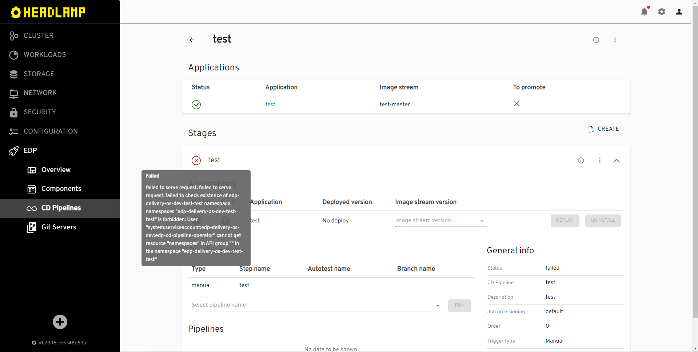
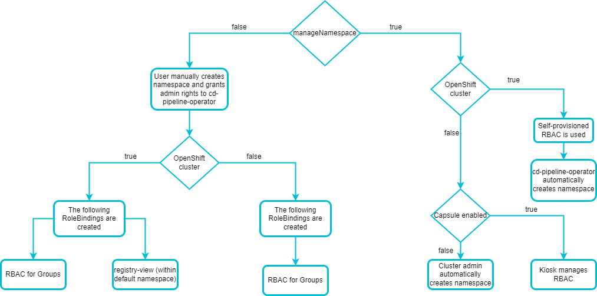

# Manage Namespace

EDP provides the ability to [deploy](../user-guide/add-cd-pipeline.md) services to namespaces. By default, EDP creates these namespaces automatically. This chapter describes the alternative way of namespace creation and management.

## Overview

Namespaces are typically created by the platform when running CD Pipelines. The operator creates them according to the specific format: `edp-<application-name>-<stage-name>`.
The `cd-pipeline-operator` should have the permissions to automatically create namespaces when deploying applications and delete them when uninstalling applications.

## Disable Automatic Namespace Creation

Occasionally, there are cases when automatic creation of namespaces is not allowed. For example, due to security reasons of the project, EDP user may need to disable this setting. This option is manipulated by the `manageNamespace` parameter which is located in the [values.yaml](https://github.com/epam/edp-cd-pipeline-operator/blob/release/2.14/deploy-templates/values.yaml#L30) file.
The `manageNamespace` parameter is set to `true` by default, but it can be changed to false. As an aftermath, after setting the `manageNamespace` parameter users are supposed to face the problem that they can not deploy their application in EDP Portal UI because of permission restrictions:

  !

The error message shown above says that user needs to create the namespace in the `edp-<application-name>-<stage-name>` format first before creating stages. In addition to it, the `cd-pipeline-operator` must be granted with the administrator permissions to have the ability to manage this namespace.
The manual namespace creation procedure does not depend on the deployment scenario whether Jenkins or Tekton is used. To create namespace manually, follow the steps below:

1. Create the namespace by running the command below:

       kubectl create namespace <edp_namespace>-<pipelineName>-<stageName>


2. Create the administrator RoleBinding resource by applying the file below with the `kubectl apply -f grant_admin_permissions.yaml` command:

  ??? note "View: grant_admin_permissions.yaml"

         ```yaml
          kind: RoleBinding
          apiVersion: rbac.authorization.k8s.io/v1
          metadata:
            name: edp-cd-pipeline-operator-admin
            namespace: <edp_namespace>-<pipelineName>-<stageName>
          subjects:
            - kind: ServiceAccount
              name: edp-cd-pipeline-operator
              namespace: <edp_namespace>
          roleRef:
            apiGroup: rbac.authorization.k8s.io
            kind: ClusterRole
            name: admin
         ```

3. Restart the cd-pipeline-operator pod, in order not to wait for the operator reconciliation.

## CD Pipeline Operator RBAC Model

The `manageNamespace` parameter also defines the resources that will be created depending on the cluster deployed whether it is OpenShift or Kubernetes. This scheme displays the nesting of operator input parameters:

  !

!!! Note
    When deploying application on the OpenShift cluster, the `registry-view` RoleBinding is created in the main namespace.

## Related Articles

* [EDP Access Model](edp-access-model.md)
* [EKS OIDC With Keycloak](configure-keycloak-oidc-eks.md)
