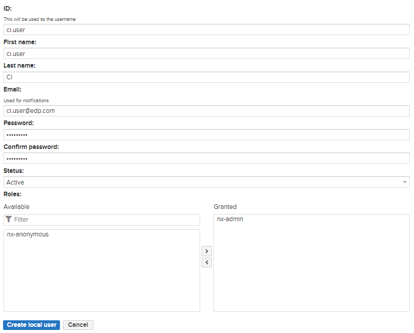
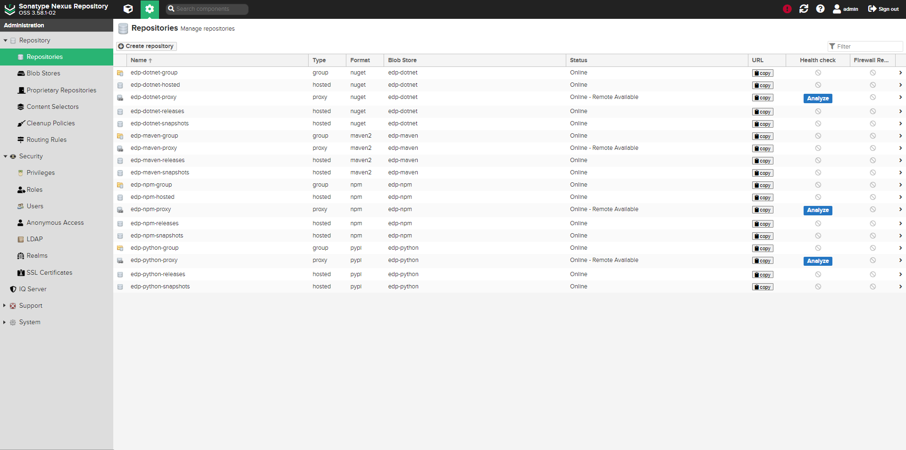
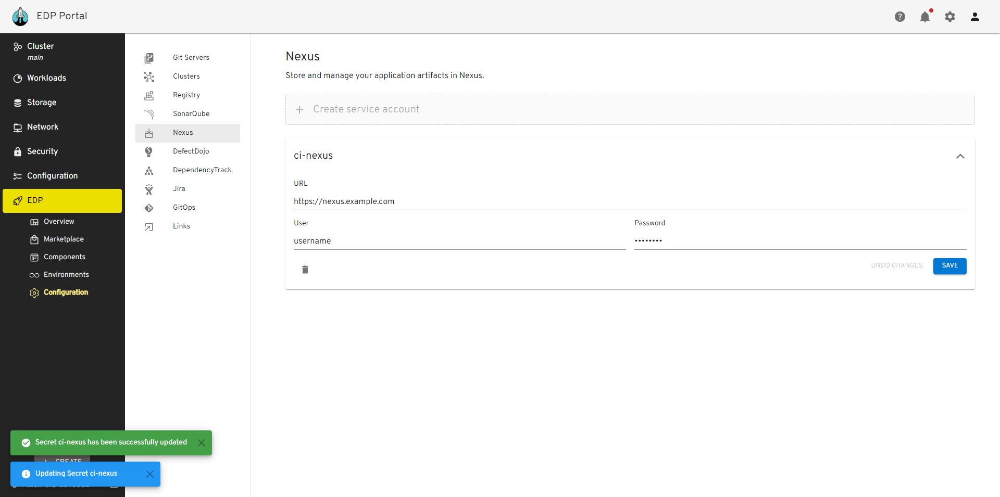
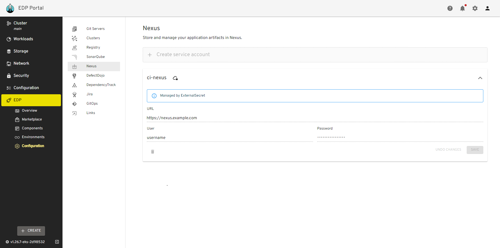

# Nexus Sonatype Integration

This documentation guide provides comprehensive instructions for integrating external Nexus with the EPAM Delivery Platform.

## Prerequisites

Before proceeding, ensure that you have the following prerequisites:

* [Kubectl](https://v1-26.docs.kubernetes.io/releases/download/) version 1.26.0 is installed.
* [Helm](https://helm.sh) version 3.12.0+ is installed.

EDP includes a pre-configured Nexus Sonatype instance, eliminating the need for extra setup and enabling immediate, hassle-free artifact management. Nevertheless, EDP also provides the versatility to incorporate external Nexus Sonatype instances, finely tuned to meet project-specific demands.

## Switch to External Nexus

1. To use external Nexus in EDP, redefine the following parameters in the EDP-install [values.yaml](https://github.com/epam/edp-install/blob/master/deploy-templates/values.yaml) file before installation. In the `nexusUrl` parameter, input the appropriate values for Nexus service, namespace and a port `http://<service-name>.<nexus-namespace>:8081`. Alternatively, use the address and a port to external Nexus `http(s)://<endpoint>` instead.

  ```yaml
  global:
    nexusUrl: ""

  nexus-operator:
    enabled: false
  ```

2. Proceed with the installation of EDP by following the [Install EDP](../operator-guide/install-edp.md) guide.

!!! note
    You can install preconfigured nexus with edp-nexus-operator using [EDP addons](https://github.com/epam/edp-cluster-add-ons) approach.

## Configuration

To ensure strong authentication and accurate access control, creating a Nexus Sonatype service account with the name  ci.user  is crucial. This user serves as a unique identifier, facilitating connection with the EDP ecosystem.

To create the Nexus `ci.user`and define repository parameters follow the steps below: <a name="values"></a>

1. Open the Nexus UI and navigate to `Server administration and configuration` -> `Security` -> `User`. Click the `Create local user` button to create a new user:

  !

2. Type the `ci-user` username, define an expiration period, and click the `Generate` button to create the token:

  !

3. EDP relies on a predetermined repository naming convention all repository names are predefined. Navigate to `Server administration and configuration` -> `Repository` -> `Repositories` in Nexus. You can only create a repository with the required language.

  !

  === "Java"

      a) Click Create a repository by selecting "maven2(proxy)" and set the name as "edp-maven-proxy". Enter the remote storage URL as "https://repo1.maven.org/maven2/". Save the configuration.

      b) Click Create a repository by selecting "maven2(hosted)" and set the name as "edp-maven-snapshot". Change the Version policy to "snapshot". Save the configuration.

      c) Click Create a repository by selecting "maven2(hosted)" and set the name as "edp-maven-releases". Change the Version policy to "release". Save the configuration.

      d) Click Create a repository by selecting "maven2(group)" and set the name as "edp-maven-group". Change the Version policy to "release". Add repository to group. Save the configuration.

  === "JavaScript"

      a) Click Create a repository by selecting "npm(proxy)" and set the name as "edp-npm-proxy". Enter the remote storage URL as "https://registry.npmjs.org". Save the configuration.

      b) Click Create a repository by selecting "npm(hosted)" and set the name as "edp-npm-snapshot". Save the configuration.

      c) Click Create a repository by selecting "npm(hosted)" and set the name as "edp-npm-releases". Save the configuration.

      d) Click Create a repository by selecting "npm(hosted)" and set the name as "edp-npm-hosted". Save the configuration.

      e) Click Create a repository by selecting "npm(group)" and set the name as "edp-npm-group". Add repository to group. Save the configuration.

  === "Dotnet"

      a) Click Create a repository by selecting "nuget(proxy)" and set the name as "edp-dotnet-proxy". Select Protocol version NuGet V3. Enter the remote storage URL as "https://api.nuget.org/v3/index.json". Save the configuration.

      b) Click Create a repository by selecting "nuget(hosted)" and set the name as "edp-dotnet-snapshot". Save the configuration.

      c) Click Create a repository by selecting "nuget(hosted)" and set the name as "edp-dotnet-releases". Save the configuration.

      d) Click Create a repository by selecting "nuget(hosted)" and set the name as "edp-dotnet-hosted". Save the configuration.

      e) Click Create a repository by selecting "nuget(group)" and set the name as "edp-dotnet-group". Add repository to group. Save the configuration.

  === "Python"

      a) Click Create a repository by selecting "pypi(proxy)" and set the name as "edp-python-proxy". Enter the remote storage URL as "https://pypi.org". Save the configuration.

      b) Click Create a repository by selecting "pypi(hosted)" and set the name as "edp-python-snapshot". Save the configuration.

      c) Click Create a repository by selecting "pypi(hosted)" and set the name as "edp-python-releases". Save the configuration.

      d) Click Create a repository by selecting "pypi(group)" and set the name as "edp-python-group". Add repository to group. Save the configuration.


4. Provision secrets using manifest, EDP Portal or with the externalSecrets operator

=== "manifest"

    ```yaml
    apiVersion: v1
    kind: Secret
    metadata:
      name: nexus-ci.user
      namespace: edp
      labels:
        app.edp.epam.com/secret-type: nexus
    type: Opaque
    stringData:
      password: <nexus-user-password>
      username: <nexus-user-id>
    ```

=== "EDP Portal UI"

    Go to the `EDP Platform` open `EDP` -> `Configuration` -> `Nexus Integration` change `<nexus-user-id>` and `<nexus-user-password>` and click `save` button.

    !

=== "External Secrets Operator"

    ```yaml
    "nexus-ci.user":
    {
      "nexus-user-id": "XXXXXXX",
      "nexus-user-password": "XXXXXXX"
    },
    ```

    Go to the `EDP Platform` open `EDP` -> `Configuration` -> `Nexus Integration` yo will see message `Managed by External Secret`.

    !

    More detail of External Secrets Operator Integration can found on [the following page](https://epam.github.io/edp-install/operator-guide/external-secrets-operator-integration/)

## Related Articles
* [Install EDP With Values File](install-edp.md)
* [Install External Secrets Operator](install-external-secrets-operator.md)
* [External Secrets Operator Integration](external-secrets-operator-integration.md)