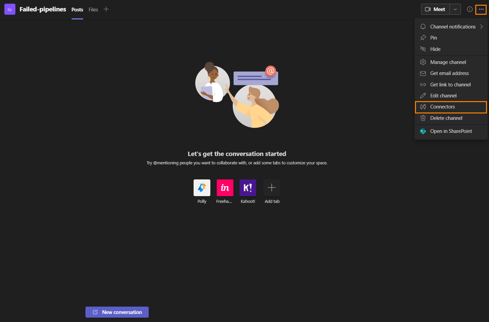
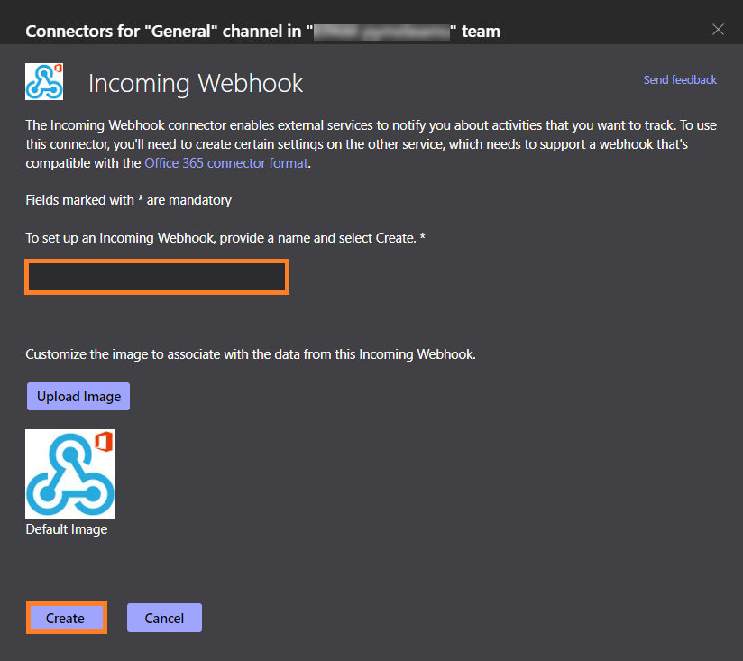
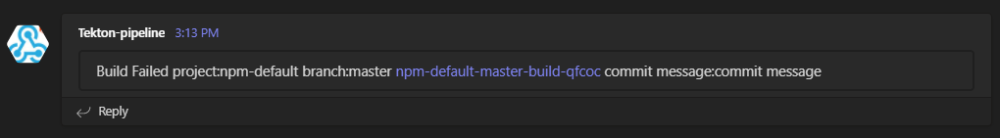

# Microsoft Teams Notification

This section describes how to set up and add notification status to Tekton pipelines by sending pipeline status to the Microsoft Teams channel.

## Create Incoming WebHook

To create a link to Incoming Webhook for the Microsoft Teams channel, follow the steps below:


  1. Open the channel which will be receiving notifications and click the `•••` button from the upper-right corner. Select `Connectors` in the dropdown menu:
     !

  2. In the search field, type `Incoming Webhook` and click `Configure`:
     !

  3. Provide a name and upload an image for the webhook if necessary. Click `Create`:
     !

  4. Copy and save the unique `WebHookURL` presented in the dialog. Click `Done`:
     !

  5. Create a secret with the <WebHookURL> within the edp namespace.

  ```yaml
    kubectl -n edp create secret generic microsoft-teams-webhook-url-secret \
    --from-literal=url=<webhookURL>
  ```

  6. Add the notification task to the pipeline and add the code below in `final-block` in the pipeline and save:

  ```yaml
  {{ include "send-to-microsoft-teams-build" . | nindent 4 }}
  ```

## Customize Notification Message

To make notification message informative, relevant text should be added to the message. Here are the steps to implement it:

1. Create a new pipeline with a unique name or modify your custom pipeline created before.

2. Add the task below in the `finally` block with a unique name. Edit the `params.message` value if necessary:

??? note "View: Task send-to-microsoft-teams"
    ```yaml
    - name: 'microsoft-teams-pipeline-status-notification-failed
      params:
      - name: webhook-url-secret
        value: microsoft-teams-webhook-url-secret
      - name: webhook-url-secret-key
        value: url
      - name: message
        value: >-
          Build Failed project: $(params.CODEBASE_NAME)<br> branch: $(params.git-source-revision)<br> pipeline: <a href=$(params.pipelineUrl)>$(context.pipelineRun.name)</a><br> commit message: $(params.COMMIT_MESSAGE)
      taskRef:
        kind: Task
        name: send-to-microsoft-teams
      when:
      - input: $(tasks.status)
        operator: in
        values:
        - Failed
        - PipelineRunTimeout
    ```

After customization, the following message is supposed to appear in the channel when failing pipelines:

  !

## Related Articles

* [Install EDP](install-edp.md)
* [Install Tekton](install-tekton.md)