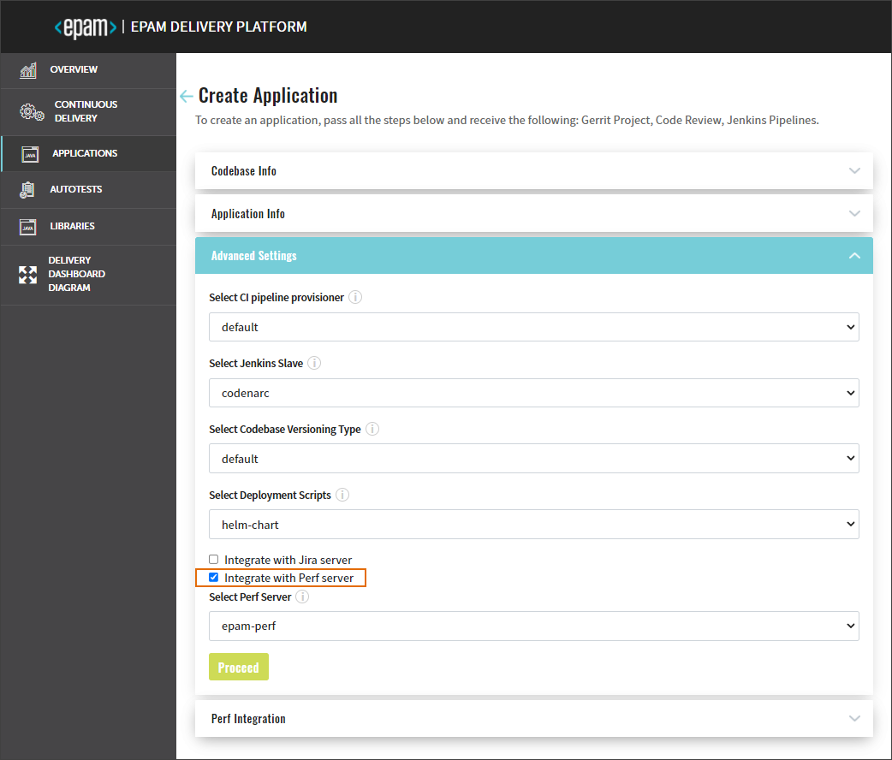

# Perf Server Integration

Integration with Perf Server allows connecting to the [PERF Board (Project Performance Board)](https://www.epam.com/telescopeai) and monitoring the overall team performance as well as setting up necessary metrics.

!!! note
    To adjust the PERF Server integration, make sure that PERF Operator is deployed. To get more information about the PERF Operator installation and architecture,
    please refer to the [PERF Operator](https://github.com/epam/edp-perf-operator#perf-operator) page.

For integration, take the following steps:

1. Create Secret in the OpenShift/Kubernetes namespace for Perf Server account with the **username** and **password** fields:

      apiVersion: v1
      data:
        password: passwordInBase64
        username: usernameInBase64
      kind: Secret
      metadata:
        name: epam-perf-user
      type: kubernetes.io/basic-auth

2. In the **edp-config** config map, enable the perf_integration flag and click **Save**:

       perf_integration_enabled: 'true'

3. Being in Admin Console, navigate to the Advanced Settings menu to check that the **Integrate with Perf Server** check box appeared:

  !

## Related Articles

* [Add Application](../user-guide/add-application.md)
* [Add Autotest](../user-guide/add-autotest.md)
* [Add Library](../user-guide/add-library.md)
