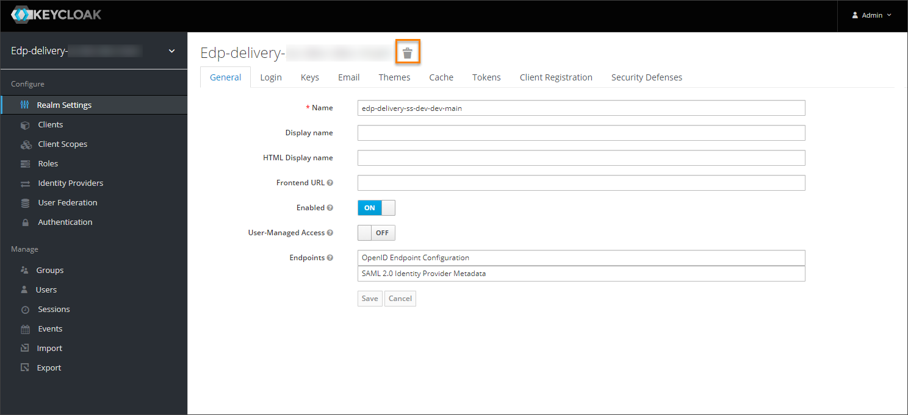

# Restore EDP Tenant With Velero

You can use the Velero tool to restore a EDP tenant. Explore the main steps for backup and restoring below.

1. Delete all related entities in **Keycloak**: realm and clients from **master/openshift** realms. Navigate to the entitities list in the Keycloak, select the necessary ones, and click the deletion icon on the entitiy overview page.
   If there are customized configs in Keycloak, save them before making backup.

  

2. To restore EDP, install and configure the Velero tool. Please refer to the [Install Velero](install-velero.md) documentation for details.

3. Remove all locks for operators. Delete all config maps that have **&#8249;OPERATOR_NAME&#8250;-operator-lock** names. Then restart all pods with operators, or simply run the following command:

           kubectl -n <EDP_NAMESPACE> delete cm $(kubectl -n <EDP_NAMESPACE> get cm | grep 'operator-lock' | awk '{print $1}')

4. Recreate the admin password and delete the Jenkins pod. Or change the script to update the admin password in Jenkins every time when the pod is updated.
