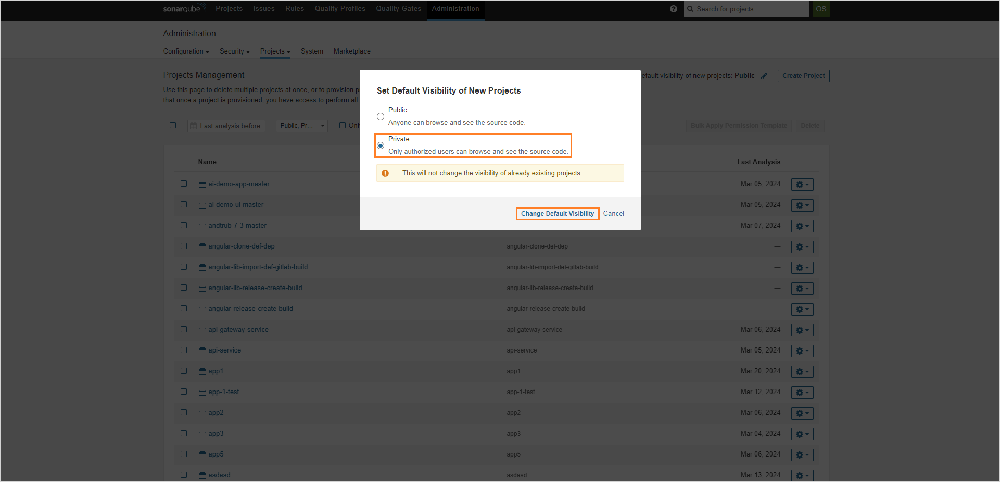

# SonarQube Project Visibility

This documentation serves as a detailed guide on configuring access rights within SonarQube projects. It is primarily aimed at ensuring that only authorized users can view and interact with the projects hosted on the SonarQube platform. The guide is structured to assist both new and existing SonarQube projects in managing their visibility settings effectively.

Upon logging into SonarQube through the OpenID Connect mechanism, users are automatically assigned to the sonar-users group, granting them access to all projects. However, this document outlines methods to customize these default settings to enhance security and privacy. It is divided into two main sections: one focusing on [restricting access for the new projects](#restrict-access-for-the-new-projects) and the other on [configuring access for the existing projects](#configure-access-for-existing-projects).

## Restrict Access for New Projects

In its default configuration, SonarQube does not restrict access to newly created projects, making them accessible to all instance users. To modify this behavior and set new projects to private by default, follow these instructions:

1. Open the SonarQube UI in the browser.

2. Navigate to the `Administration` tab:

  !

  !!! note
      Ensure you have admin rights to see the `Administration` section.

3. Click the `Projects` button and select `Management`:

  !

4. On the project management page, click pencil icon at the top-right corner::

  !

5. Select **Private** and click **Change Default Visibility**:

  !

## Configure Access for Existing Projects

To make all the current projects private, follow the steps below:

1. In the **Projects** tab, enter the project you want to make private.

2. In the project page, click the **Prject Settings** button and select **Permissions**:

  !

3. In the project permissions page, select **Private**:

  !

4. Repeat the procedure for all of the projects you want to make private.

## Related Articles

* [SonarQube Integration](sonarqube.md)
* [Nexus Sonatype Integration](nexus-sonatype.md)
* [Integrate SonarQube](../quick-start/integrate-sonarcloud.md)
