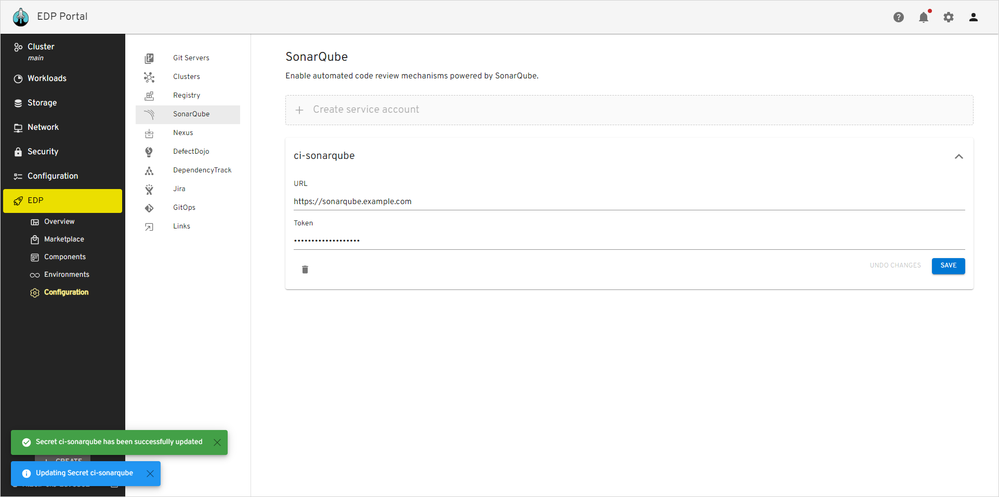
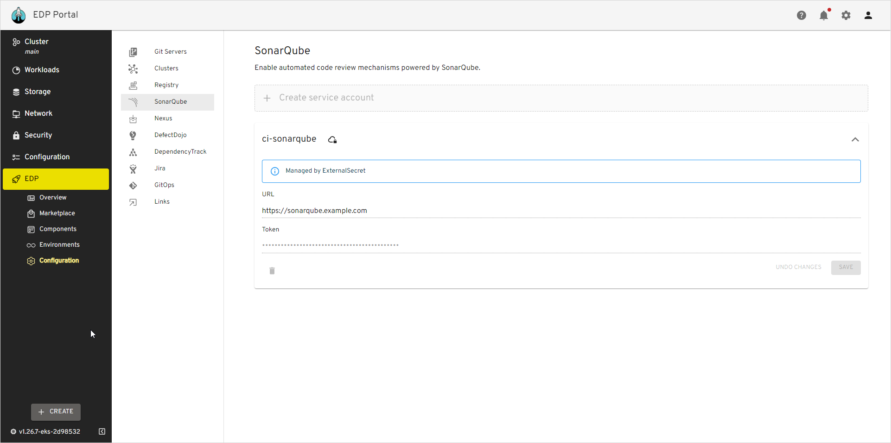

# SonarQube Integration

This documentation guide provides comprehensive instructions for integrating SonarQube with the EPAM Delivery Platform.

!!! info
    In EDP release 3.5, we have changed the deployment strategy for the sonarqube-operator component, now it is not installed by default. The `sonarURL` parameter management has been transferred from the values.yaml file to Kubernetes secrets.

## Prerequisites

Before proceeding, ensure that you have the following prerequisites:

* [Kubectl](https://v1-26.docs.kubernetes.io/releases/download/) version 1.26.0 is installed.
* [Helm](https://helm.sh) version 3.12.0+ is installed.

## Installation

To install SonarQube with pre-defined templates, use the sonar-operator installed via [Cluster Add-Ons](https://github.com/epam/edp-cluster-add-ons) approach.

## Configuration

To establish robust authentication and precise access control, generating a SonarQube token is essential. This token is a distinct identifier, enabling effortless integration between SonarQube and EDP. To generate the SonarQube token, proceed with the following steps:

1. Open the SonarQube UI and navigate to `Administration` -> `Security` -> `User`. Create a new user or select an existing one. Click the `Options List` icon to create a token:

  !

2. Type the `ci-user` username, define an expiration period, and click the `Generate` button to create the token:

  !

3. Click the `Copy` button to copy the generated `<Sonarqube-token>`:

  !

4. Provision secrets using Manifest, EDP Portal or with the externalSecrets operator:

=== "EDP Portal"

    Go to **EDP Portal** -> **EDP** -> **Configuration** -> **SonarQube**. Update or fill in the **URL** and **Token** fields and click the **Save** button:

    !

=== "Manifest"

    ```yaml
    apiVersion: v1
    kind: Secret
    metadata:
      name: ci-sonarqube
      namespace: edp
      labels:
        app.edp.epam.com/secret-type: sonar
    type: Opaque
    stringData:
      url: https://sonarqube.example.com
      token: <sonarqube-token>
    ```

=== "External Secrets Operator"

    ```json
    "ci-sonarqube":
    {
      "url": "https://sonarqube.example.com",
      "token": "XXXXXXXXXXXX"
    },
    ```

    Go to **EDP Portal** -> **EDP** -> **Configuration** -> **SonarQube** and see the `Managed by External Secret` message:

    !

    More details about External Secrets Operator integration can be found in the [External Secrets Operator Integration](https://epam.github.io/edp-install/operator-guide/external-secrets-operator-integration/) page.

## Related Articles
* [Install EDP With Values File](install-edp.md)
* [Install External Secrets Operator](install-external-secrets-operator.md)
* [External Secrets Operator Integration](external-secrets-operator-integration.md)
* [Cluster Add-Ons Overview](add-ons-overview.md)
