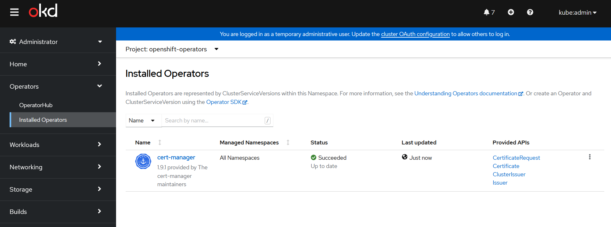
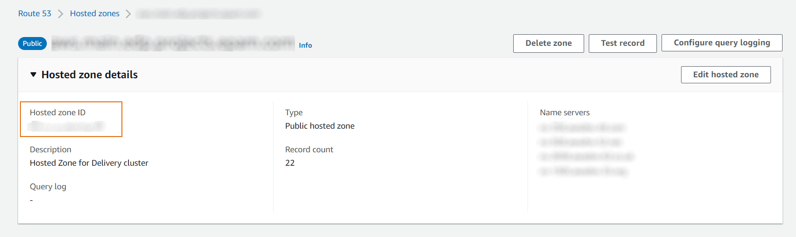
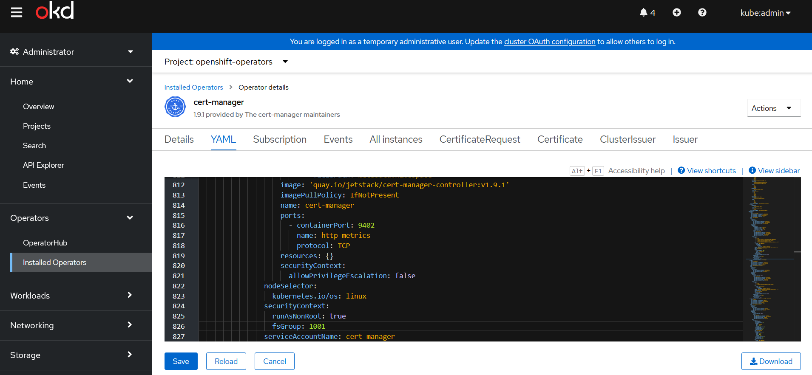
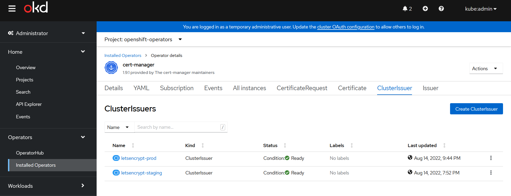
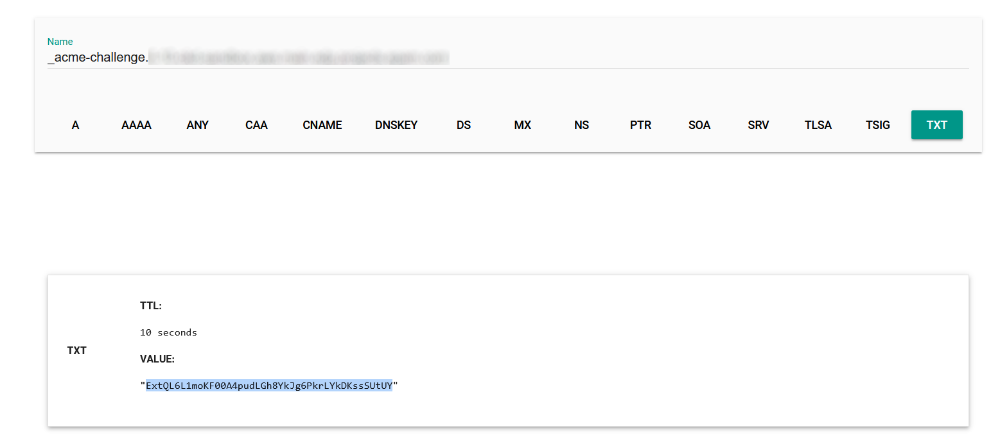

# Use Cert-Manager in OpenShift

The following material covers [Let's Encrypt](https://letsencrypt.org/) certificate automation with [cert-manager](https://github.com/cert-manager/cert-manager) using [AWS Route53](https://aws.amazon.com/route53/).

The [cert-manager](https://cert-manager.io/docs/) is a Kubernetes/OpenShift operator that allows to issue and automatically renew SSL certificates. In this tutorial, the steps to secure DNS Name will be demonstrated.

Below is an instruction on how to automatically issue and install wildcard certificates on OpenShift Ingress Controller and API Server covering all cluster Routes. To secure separate OpenShift Routes, please refer to the [OpenShift Route Support](https://github.com/cert-manager/openshift-routes) project for `cert-manager`.

### Prerequisites

* The cert-manager;
* OpenShift v4.7 - v4.11;
* Connection to the OpenShift Cluster;
* Enabled AWS IRSA;
* The latest [`oc` utility](https://github.com/openshift/okd/releases). The `kubectl` tool can also be used for most of the commands.

### Install Cert-Manager Operator

[Install](https://docs.openshift.com/container-platform/4.11/security/cert_manager_operator/cert-manager-operator-install.html) the `cert-manager` operator via OpenShift [OperatorHub](https://docs.openshift.com/container-platform/4.11/operators/understanding/olm-understanding-operatorhub.html) that uses [Operator Lifecycle Manager (OLM)](https://docs.openshift.com/container-platform/4.11/operators/understanding/olm/olm-understanding-olm.html):<br>

1. Go to the **OpenShift Admin Console** → **OperatorHub**, search for the `cert-manager`, and click **Install**:

  !

2. Modify the `ClusterServiceVersion` OLM resource, by selecting the **Update approval** → **Manual**. If selecting **Update approval** → **Automatic** after the automatic operator update, the parameters in the `ClusterServiceVersion` will be reset to default.

  !!! note
      Installing an operator with **Manual approval** causes all operators installed in namespace `openshift-operators` to function as [manual approval strategy](https://docs.openshift.com/container-platform/4.11/operators/user/olm-installing-operators-in-namespace.html). In case the **Manual approval** is chosen, review the manual installation plan and approve it.

  !

3. Navigate to **Operators** → **Installed Operators** and check the operator status to be **Succeeded**:

  !

4. In case of errors, [troubleshoot](https://docs.openshift.com/container-platform/4.11/operators/admin/olm-status.html) the Operator issues:

  ```bash
  oc describe operator cert-manager -n openshift-operators
  oc describe sub cert-manager -n openshift-operators
  ```

### Create AWS Role for Route53

The `cert-manager` should be configured to validate Wildcard certificates using the [DNS-based](https://cert-manager.io/docs/tutorials/acme/dns-validation/) method.<br>

1. Check the DNS **Hosted zone ID** in AWS Route53 for your domain.

  !

2. Create [Route53 Permissions policy](https://cert-manager.io/docs/configuration/acme/dns01/route53/#set-up-an-iam-role) in AWS for `cert-manager` to be able to create DNS TXT records for the certificate validation. In this example, `cert-manager` permissions are given for a particular DNS zone only. Replace **Hosted zone ID** *XXXXXXXX* in the *"Resource": "arn:aws:route53:::hostedzone/XXXXXXXXXXXX"*.

  ```json
  {
    "Version": "2012-10-17",
    "Statement": [
      {
        "Effect": "Allow",
        "Action": "route53:GetChange",
        "Resource": "arn:aws:route53:::change/*"
      },
      {
        "Effect": "Allow",
        "Action": [
          "route53:ChangeResourceRecordSets",
          "route53:ListResourceRecordSets"
        ],
        "Resource": "arn:aws:route53:::hostedzone/XXXXXXXXXXXX"
      }
    ]
  }
  ```

3. Create an AWS Role with **Custom trust policy** for the `cert-manager` service account to use the [AWS IRSA](https://cert-manager.io/docs/configuration/acme/dns01/route53/#eks-iam-role-for-service-accounts-irsa) feature and then attach the created policy. Replace the following:<br>
  * `${aws-account-id}` with the AWS account ID of the EKS cluster.<br>
  * `${aws-region}` with the region where the EKS cluster is located.<br>
  * `${eks-hash}` with the hash in the EKS API URL; this will be a random 32 character hex string, for example, 45DABD88EEE3A227AF0FA468BE4EF0B5.<br>
  * `${namespace}` with the namespace where cert-manager is running.<br>
  * `${service-account-name}` with the name of the ServiceAccount object created by cert-manager.<br>
  * By default, it is *"system:serviceaccount:openshift-operators:cert-manager"* if `cert-manager` is installed via OperatorHub.<br>
  * Attach the created **Permission policy** for Route53 to the Role.
  * Optionally, add **Permissions boundary** to the Role.

    ```json
    {
      "Version": "2012-10-17",
      "Statement": [
        {
          "Effect": "Allow",
          "Action": "sts:AssumeRoleWithWebIdentity",
          "Principal": {
            "Federated": "arn:aws:iam::* ${aws-account-id}:oidc-provider/oidc.eks.${aws-region}.amazonaws.com/id/${eks-hash}"
          },
          "Condition": {
            "StringEquals": {
              "oidc.eks.${aws-region}.amazonaws.com/id/${eks-hash}:sub": "system:serviceaccount:${namespace}:${service-account-name}"
            }
          }
        }
      ]
    }
    ```

4. Copy the created **Role ARN**.

### Configure Cert-Manager Integration With AWS Route53

1. [Annotate](https://cert-manager.io/docs/configuration/acme/dns01/route53/#service-annotation) the `ServiceAccount` created by `cert-manager` (required for [AWS IRSA](https://docs.aws.amazon.com/eks/latest/userguide/iam-roles-for-service-accounts.html)), and restart the `cert-manager` pod.

2. Replace the `eks.amazonaws.com/role-arn` annotation value with your own Role ARN.

  ```bash
  oc edit sa cert-manager -n openshift-operators
  ```

  ```yaml hl_lines="5"
  apiVersion: v1
  kind: ServiceAccount
  metadata:
    annotations:
      eks.amazonaws.com/role-arn: arn:aws:iam::XXXXXXXXXXXX:role/cert-manager
  ```

3. Modify the `cert-manager` `Deployment` with the correct file system permissions `fsGroup: 1001`, so that the `ServiceAccount` token can be read.

  !!! Note
      In case the `ServiceAccount` token cannot be read and the operator is installed using the OperatorHub, add `fsGroup: 1001` via OpenShift [ClusterServiceVersion](https://cert-manager.io/docs/installation/operator-lifecycle-manager/#configuration-via-clusterserviceversion-csv) OLM resource. It should be a `cert-manager` controller spec. These actions are not required for OpenShift v4.10.

  ```bash
  oc get csv
  oc edit csv cert-manager.${VERSION}
  ```

  ```yaml hl_lines="5"
  spec:
    template:
      spec:
        securityContext:
          fsGroup: 1001
        serviceAccountName: cert-manager
  ```

  !

  !!! Info
      A mutating admission controller will automatically modify all pods running with the service account:

       <details>
       <Summary><b>cert-manager controller pod</b></Summary>
      ```yaml
      apiVersion: apps/v1
      kind: Pod
      # ...
      spec:
        # ...
        serviceAccountName: cert-manager
        serviceAccount: cert-manager
        containers:
        - name: ...
          # ...
          env:
            - name: AWS_ROLE_ARN
              value: >-
                arn:aws:iam::XXXXXXXXXXX:role/cert-manager
            - name: AWS_WEB_IDENTITY_TOKEN_FILE
              value: /var/run/secrets/eks.amazonaws.com/serviceaccount/token
          volumeMounts:
            - name: aws-iam-token
              readOnly: true
              mountPath: /var/run/secrets/eks.amazonaws.com/serviceaccount
        volumes:
          - name: aws-iam-token
            projected:
              sources:
                - serviceAccountToken:
                    audience: sts.amazonaws.com
                    expirationSeconds: 86400
                    path: token
              defaultMode: 420
      ```
        </details>

4. If you have separate public and private DNS zones for the same domain (split-horizon DNS), modify the `cert-manager` `Deployment` in order to validate DNS TXT records via [public recursive nameservers](https://cert-manager.io/docs/configuration/acme/dns01/#setting-nameservers-for-dns01-self-check).

  !!! Note
      Otherwise, you will be getting an error during a record validation:

      ```bash
      Waiting for DNS-01 challenge propagation: NS ns-123.awsdns-00.net.:53 returned REFUSED for _acme-challenge.
      ```
      To avoid the error, add `--dns01-recursive-nameservers-only --dns01-recursive-nameservers=8.8.8.8:53,1.1.1.1:53` as ARGs to the `cert-manager` controller `Deployment`.

  ```bash
  oc get csv
  oc edit csv cert-manager.${VERSION}
  ```

  ```yaml hl_lines="13 14"
    labels:
      app: cert-manager
      app.kubernetes.io/component: controller
      app.kubernetes.io/instance: cert-manager
      app.kubernetes.io/name: cert-manager
      app.kubernetes.io/version: v1.9.1
  spec:
    containers:
      - args:
          - '--v=2'
          - '--cluster-resource-namespace=$(POD_NAMESPACE)'
          - '--leader-election-namespace=kube-system'
          - '--dns01-recursive-nameservers-only'
          - '--dns01-recursive-nameservers=8.8.8.8:53,1.1.1.1:53'
  ```
  !!! Note
      The `Deployment` must be modified via OpenShift [ClusterServiceVersion](https://cert-manager.io/docs/installation/operator-lifecycle-manager/#configuration-via-clusterserviceversion-csv) OLM resource if the operator was installed using the OperatorHub.
      The OpenShift `ClusterServiceVersion` OLM resource includes several Deployments, and the ARGs must be modified only for the `cert-manager` controller.

  * Save the resource. After that, OLM will try to reload the resource automatically and save it to the YAML file. If OLM resets the config file, double-check the entered values.

  !

### Configure ClusterIssuers

`ClusterIssuer` is available on the whole cluster.<br>

1. Create the [ClusterIssuer](https://cert-manager.io/docs/configuration/acme/) resource for Let's Encrypt Staging and Prod environments that signs a Certificate using `cert-manager`.

  !!! Note
      Let's Encrypt has a [limit](https://letsencrypt.org/docs/duplicate-certificate-limit/) of duplicate certificates in the Prod environment. Therefore, a `ClusterIssuer` has been created for [Let's Encrypt Staging](https://letsencrypt.org/docs/staging-environment/) environment. By default, Let's Encrypt Staging certificates will not be trusted in your browser. The certificate validation cannot be tested in the Let's Encrypt Staging environment.

  * Change `user@example.com` with your contact email.
  * Replace `hostedZoneID` XXXXXXXXXXX with the DNS **Hosted zone ID** in AWS for your domain.
  * Replace the region value `${region}`.
  * The secret under `privateKeySecretRef` will be created automatically by the `cert-manager` operator.

  ```yaml
  apiVersion: cert-manager.io/v1
  kind: ClusterIssuer
  metadata:
    name: letsencrypt-staging
  spec:
    acme:
      email: user@example.com
      server: https://acme-staging-v02.api.letsencrypt.org/directory
      privateKeySecretRef:
        name: letsencrypt-staging-issuer-account-key
      solvers:
      - dns01:
          route53:
            region: ${region}
            hostedZoneID: XXXXXXXXXXX
  ```

  ```yaml
  apiVersion: cert-manager.io/v1
  kind: ClusterIssuer
  metadata:
    name: letsencrypt-prod
  spec:
    acme:
      email: user@example.com
      server: https://acme-v02.api.letsencrypt.org/directory
      privateKeySecretRef:
        name: letsencrypt-prod-issuer-account-key
      solvers:
      - dns01:
          route53:
            region: ${region}
            hostedZoneID: XXXXXXXXXXX
  ```

  !

2. Check the `ClusterIssuer` status:

  !

  ```bash
  oc describe clusterissuer letsencrypt-prod
  oc describe clusterissuer letsencrypt-staging
  ```

3. If the `ClusterIssuer` state is not ready, investigate `cert-manager` controller pod logs:

  ```bash
  oc get pod -n openshift-operators | grep 'cert-manager'
  oc logs -f cert-manager-${replica_set}-${random_string} -n openshift-operators
  ```

### Configure Certificates

1. In two different namespaces, create a [Certificate](https://cert-manager.io/docs/usage/certificate/) resource for the OpenShift Router (Ingress controller for OpenShift) and for the OpenShift APIServer.

  * OpenShift Router supports a single wildcard certificate for Ingress/Route resources in different namespaces (so called, [default SSL certificate](https://cert-manager.io/docs/faq/sync-secrets/#serving-a-wildcard-to-ingress-resources-in-different-namespaces-default-ssl-certificate)). The Ingress controller expects the certificates in a `Secret` to be created in the `openshift-ingress` namespace; the API Server, in the `openshift-config` namespace. The `cert-manager` operator will automatically create these secrets from the `Certificate` resource.
  * Replace `${DOMAIN}` with your domain name. It can be checked with `oc whoami --show-server`. Put domain names in quotes.

  <details>
  <Summary><b>The certificate for OpenShift Router in the `openshift-ingress` namespace</b></Summary>
  ```yaml
  apiVersion: cert-manager.io/v1
  kind: Certificate
  metadata:
    name: router-certs
    namespace: openshift-ingress
    labels:
      app: cert-manager
  spec:
    secretName: router-certs
    secretTemplate:
      labels:
        app: cert-manager
    duration: 2160h # 90d
    renewBefore: 360h # 15d
    subject:
      organizations:
        - Org Name
    commonName: '*.${DOMAIN}'
    privateKey:
      algorithm: RSA
      encoding: PKCS1
      size: 2048
      rotationPolicy: Always
    usages:
      - server auth
      - client auth
    dnsNames:
      - '*.${DOMAIN}'
      - '*.apps.${DOMAIN}'
    issuerRef:
      name: letsencrypt-staging
      kind: ClusterIssuer
  ```
  </details>

  <details>
  <Summary><b>The certificate for OpenShift APIServer in the `openshift-config` namespace</b></Summary>
  ```yaml
  apiVersion: cert-manager.io/v1
  kind: Certificate
  metadata:
    name: api-certs
    namespace: openshift-config
    labels:
      app: cert-manager
  spec:
    secretName: api-certs
    secretTemplate:
      labels:
        app: cert-manager
    duration: 2160h # 90d
    renewBefore: 360h # 15d
    subject:
      organizations:
        - Org Name
    commonName: '*.${DOMAIN}'
    privateKey:
      algorithm: RSA
      encoding: PKCS1
      size: 2048
      rotationPolicy: Always
    usages:
      - server auth
      - client auth
    dnsNames:
      - '*.${DOMAIN}'
      - '*.apps.${DOMAIN}'
    issuerRef:
      name: letsencrypt-staging
      kind: ClusterIssuer
  ```
  </details>

  !!! Info
      * `cert-manager` supports [ECDSA](https://cert-manager.io/docs/faq/#is-ecc-elliptic-curve-cryptography-supported) key pairs in the `Certificate` resource. To use it, change RSA `privateKey` to ECDSA:

          ```yaml
          privateKey:
            algorithm: ECDSA
            encoding: PKCS1
            size: 256
            rotationPolicy: Always
          ```

      * `rotationPolicy: Always` is highly recommended since `cert-manager` does not [rotate private keys](https://cert-manager.io/docs/usage/certificate/#the-rotationpolicy-setting) by default.
      * Full `Certificate` spec is described in the `cert-manager` [API documentation](https://cert-manager.io/docs/reference/api-docs/#cert-manager.io/v1.CertificateSpec).

2. Check that the certificates in the namespaces are ready:

  !

  !

3. Check the details of the certificates via CLI:

  ```bash
  oc describe certificate api-certs -n openshift-config
  oc describe certificate router-certs -n openshift-ingress
  ```

4. Check the cert-manager controller pod logs if the Staging Certificate condition is not ready for more than 7 minutes:

   ```bash
   oc get pod -n openshift-operators | grep 'cert-manager'
   oc logs -f cert-manager-${replica_set}-${random_string} -n openshift-operators
   ```

5. When the certificate is ready, its private key will be put into the OpenShift `Secret` in the namespace indicated in the `Certificate` resource:

   ```bash
   oc describe secret api-certs -n openshift-config
   oc describe secret router-certs -n openshift-ingress
   ```

### Modify OpenShift Router and API Server Custom Resources

1. Update the Custom Resource of your Router (Ingress controller). Patch the `defaultCertificate` object value with `{ "name": "router-certs" }`:

  ```bash
  oc patch ingresscontroller default -n openshift-ingress-operator --type=merge --patch='{"spec": { "defaultCertificate": { "name": "router-certs" }}}' --insecure-skip-tls-verify
  ```

  !!! Info
      After updating the `IngressController` object, the OpenShift Ingress operator redeploys the router.

2. Update the Custom Resource for the OpenShift API Server:<br>
  * Export the name of `APIServer`:

    ```bash
    export OKD_API=$(oc whoami --show-server --insecure-skip-tls-verify | cut -f 2 -d ':' | cut -f 3 -d '/' | sed 's/-api././')
    ```

  * Patch the `servingCertificate` object value with `{ "name": "api-certs" }`:

    ```bash
    oc patch apiserver cluster --type merge --patch="{\"spec\": {\"servingCerts\": {\"namedCertificates\": [ { \"names\": [  \"$OKD_API\"  ], \"servingCertificate\": {\"name\": \"api-certs\" }}]}}}" --insecure-skip-tls-verify
    ```

### Move From Let's Encrypt Staging Environment to Prod

1. Test the Staging certificate on the OpenShift Admin Console. The `--insecure` flag is used because Let's Encrypt Staging certificates are not trusted in browsers by default:

  ```bash
  curl -v --insecure https://console-openshift-console.apps.${DOMAIN}
  ```

2. Change `issuerRef` to `letsencrypt-prod` in both `Certificate` resources:

  ```bash
  oc edit certificate api-certs -n openshift-config
  oc edit certificate router-certs -n openshift-ingress
  ```

  ```yaml hl_lines="2"
  issuerRef:
    name: letsencrypt-prod
    kind: ClusterIssuer
  ```

  !!! Note
      In case the certificate reissue is not triggered after that, try to force the certificate renewal with [cmctl](https://cert-manager.io/docs/usage/cmctl/):

      ```bash
      cmctl renew router-certs -n openshift-ingress
      cmctl renew api-certs -n openshift-config
      ```

      If this won't work, delete the `api-certs` and `router-certs` secrets. It should trigger the Prod certificates issuance:

      ```bash
      oc delete secret router-certs -n openshift-ingress
      oc delete secret api-certs -n openshift-config
      ```

      Please note that these actions will lead to logging your account out of the OpenShift Admin Console, since certificates will be deleted. Accept the certificate warning in the browser and log in again after that.<br>

3. Check the status of the Prod certificates:

    ```bash
    oc describe certificate api-certs -n openshift-config
    oc describe certificate router-certs -n openshift-ingress
    ```

    ```bash
    cmctl status certificate api-certs -n openshift-config
    cmctl status certificate router-certs -n openshift-ingress
    ```

4. Check the web console and make sure it has secure connection:

    ```bash
    curl -v https://console-openshift-console.apps.${DOMAIN}
    ```

### Troubleshoot Certificates

Below is an example of the DNS TXT `challenge` record created by the `cert-manager` operator:

!

Use `nslookup` or `dig` tools to check if the DNS propagation for the TXT record is complete:

```bash
nslookup -type=txt _acme-challenge.${DOMAIN}
dig txt _acme-challenge.${DOMAIN}
```

Otherwise, use web tools like [Google Admin Toolbox](https://toolbox.googleapps.com/apps/dig/#TXT/):

!

If the correct TXT value is shown (the value corresponds to the current TXT value in the DNS zone), it means that the DNS propagation is complete and Let's Encrypt is able to access the record in order to validate it and issue a trusted certificate.

!!! Note
    If the DNS validation challenge self check fails, `cert-manager` will retry the self check with a fixed 10-second retry interval. [Challenges](https://cert-manager.io/docs/concepts/acme-orders-challenges/#challenge-lifecycle) that do not ever complete the self check will continue retrying until the user intervenes by either retrying the `Order` (by deleting the `Order` resource) or amending the associated `Certificate` resource to resolve any configuration errors.

As soon as the domain ownership has been verified, any `cert-manager` affected validation TXT records in the AWS Route53 DNS zone will be cleaned up.

Please find below the issues that may occur and their troubleshooting:

* When certificates are not issued for a long time, or a `cert-manager` resource is not in a Ready state, [describing](https://cert-manager.io/docs/faq/troubleshooting/) a resource may show the reason for the error.

* Basically, the `cert-manager` creates the following resources during a `Certificate` issuance: `CertificateRequest`, `Order`, and `Challenge`. [Investigate](https://cert-manager.io/docs/faq/acme/) each of them in case of errors.

* Use the [cmctl](https://cert-manager.io/docs/usage/cmctl/) tool to show the state of a `Certificate` and its associated resources.

* Check the `cert-manager` controller pod logs:

  ```bash
  oc get pod -n openshift-operators | grep 'cert-manager'
  oc logs -f cert-manager-${replica_set}-${random_string} -n openshift-operators
  ```

* Certificate error debugging:<br>
  a. Decode certificate chain located in the secrets:

    ```bash
    oc get secret router-certs -n openshift-ingress -o 'go-template={{index .data "tls.crt"}}' | base64 -d | while openssl x509 -noout -text; do :; done 2>/dev/null
    oc get secret api-certs -n openshift-config -o 'go-template={{index .data "tls.crt"}}' | base64 -d | while openssl x509 -noout -text; do :; done 2>/dev/null
    ```

    ```bash
    cmctl inspect secret router-certs -n openshift-ingress
    cmctl inspect secret api-certs -n openshift-config
    ```

  b. Check the SSL RSA private key consistency:

    ```bash
    oc get secret router-certs -n openshift-ingress -o 'go-template={{index .data "tls.key"}}' | base64 -d | openssl rsa -check -noout
    oc get secret api-certs -n openshift-config -o 'go-template={{index .data "tls.key"}}' | base64 -d | openssl rsa -check -noout
    ```

  c. Match the SSL certificate public key against its RSA private key. Their modulus must be identical:

    ```bash
    diff <(oc get secret api-certs -n openshift-config -o 'go-template={{index .data "tls.crt"}}' | base64 -d | openssl x509 -noout -modulus | openssl md5) <(oc get secret api-certs -n openshift-config -o 'go-template={{index .data "tls.key"}}' | base64 -d | openssl rsa -noout -modulus | openssl md5)
    diff <(oc get secret router-certs -n openshift-ingress -o 'go-template={{index .data "tls.crt"}}' | base64 -d | openssl x509 -noout -modulus | openssl md5) <(oc get secret router-certs -n openshift-ingress -o 'go-template={{index .data "tls.key"}}' | base64 -d | openssl rsa -noout -modulus | openssl md5)
    ```

### Remove Obsolete Certificate Authority Data From Kubeconfig

After updating the certificates, the access to the cluster via Lens or CLI will be denied because of the untrusted certificate errors:

```bash
$ oc whoami
Unable to connect to the server: x509: certificate signed by unknown authority
```

Such behavior appears because the `oc` tool references an old CA data in the kubeconfig file.

!!! Note
    Examine the Certificate Authority data using the following command:

    ```bash
    oc config view --minify --raw -o jsonpath='{.clusters[].cluster.certificate-authority-data}' | base64 -d | openssl x509 -text
    ```

    This certificate has the `CA:TRUE` parameter, which means that this is a self-signed root CA certificate.

To fix the error, remove the old CA data from your OpenShift kubeconfig file:

```bash
sed -i "/certificate-authority-data/d" $KUBECONFIG
```

Since this field will be absent in the kubeconfig file, system root SSL certificate will be used to validate the cluster certificate trust chain. On Ubuntu, Let's Encrypt OpenShift cluster certificates will be validated against `Internet Security Research Group` root in `/etc/ssl/certs/ca-certificates.crt`.

### Certificate Renewals

The `cert-manager` automatically [renews](https://cert-manager.io/docs/usage/certificate/#renewal) the certificates based on the X.509 certificate's duration and the `renewBefore` value.
The minimum value for the `spec.duration` is 1 hour; for `spec.renewBefore`, 5 minutes. It is also required that `spec.duration` > `spec.renewBefore`.

Use the [cmctl](https://cert-manager.io/docs/usage/cmctl/) tool to manually trigger a single instant certificate renewal:

```bash
cmctl renew router-certs -n openshift-ingress
cmctl renew api-certs -n openshift-config
```

Otherwise, manually renew all certificates in all namespaces with the `app=cert-manager` label:

```bash
cmctl renew --all-namespaces -l app=cert-manager
```

Run the `cmctl renew --help` command to get more details.

## Related Articles

* [Cert-Manager Official Documentation](https://cert-manager.io/docs/)
* [Installing the Cert-Manager Operator for Red Hat OpenShift](https://docs.openshift.com/container-platform/4.11/security/cert_manager_operator/cert-manager-operator-install.html)
* [Checking Issued Certificate Details](https://crt.sh/)