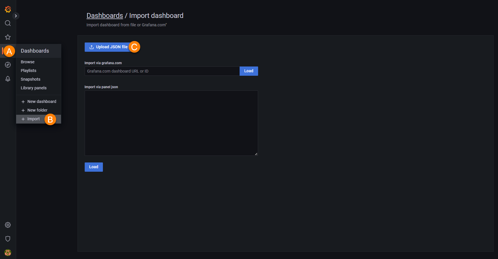
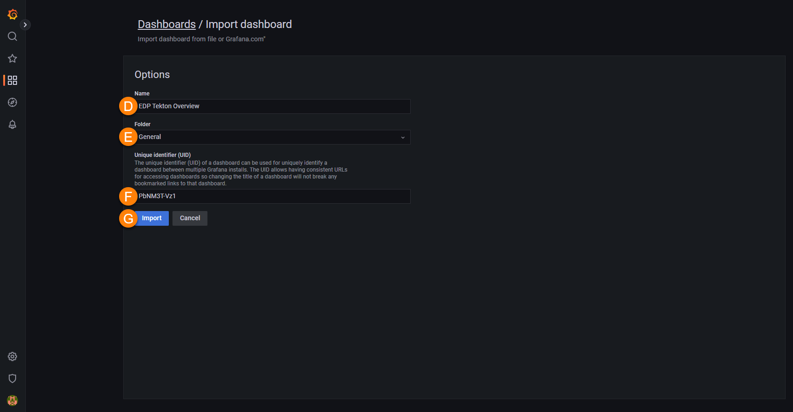
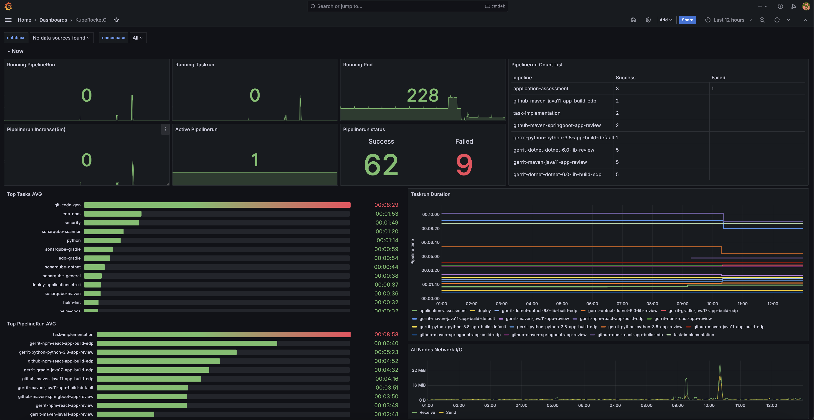

# Monitoring

This documentation describes how to integrate tekton-pipelines metrics with Prometheus and Grafana monitoring stack.

## Prerequisites

Ensure the following requirements are met first before moving ahead:

* [Kube prometheus stack](https://prometheus-community.github.io/helm-charts) is installed;
* [Tekton pipeline](https://github.com/tektoncd/pipeline/releases) is installed.

## Create and Apply the Additional Scrape Config

To create and apply the additional scrape config, follow the steps below:

1. Create the kubernetes secret file with the additional scrape config:

  ```title="additional-scrape-configs.yaml file"
  apiVersion: v1
  kind: Secret
  metadata:
    name: additional-scrape-configs
  stringData:
    prometheus-additional-job.yaml: |
      - job_name: "tekton-pipelines"
        scrape_interval: 30s
        static_configs:
        - targets: ["tekton-pipelines-controller.<tekton-pipelines-namespace>.svc.cluster.local:9090"]
  ```

2. Apply the created secret:

  ```bash
  kubectl apply -f additional-scrape-configs.yaml -n <monitoring-namespace>
  ```

3. Update the prometheus stack:

  ```bash
  helm update --install prometheus prometheus-community/kube-prometheus-stack --values values.yaml -n <monitoring-namespace>
  ```

  The `values.yaml` file should have the following contents:

  ```yaml title="values.yaml file"
  prometheus:
    prometheusSpec:
      additionalScrapeConfigsSecret:
        enabled: true
        name: additional-scrape-configs
        key: prometheus-additional-job.yaml
  ```

4. Download the [KubeRocketCi](https://grafana.com/grafana/dashboards/18321) dashboard:

  !

    a. Click on the dashboard menu;

    b. In the dropdown menu, click the `+ Import` button;

    c. Select the created `18321_rev*.json` file;

  !

    d. Type the name of the dashboard;

    e. Select the folder for the dashboard;

    f. Type the UID (set of eight numbers or letters and symbols);

    g. Click the `Import` button.

As soon as the dashboard procedure is completed, you can track the newcoming metrics in the dashboard menu:

  !

## Related Articles

* [Install Tekton](install-tekton.md)
* [Install EDP](install-edp.md)
