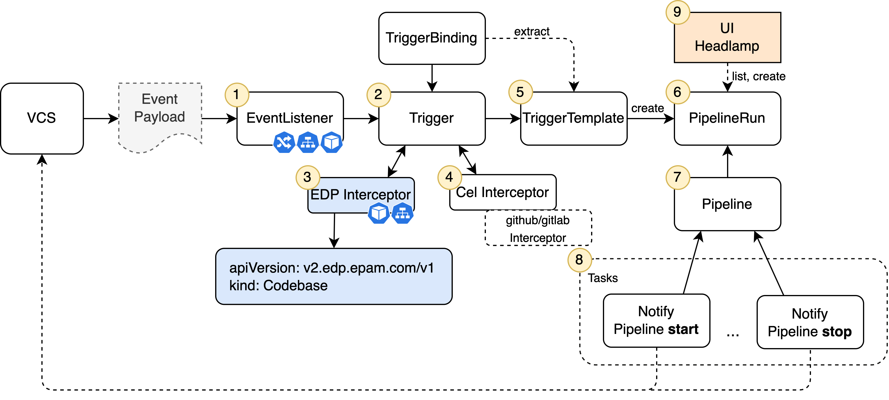

# Tekton Overview

EPAM Delivery Platform provides Continuous Integration based on [Tekton](https://tekton.dev/).

Tekton is an open-source Kubernetes native framework for creating CI pipelines, allowing a user to compile, build and
test applications.

The edp-tekton GitHub repository provides all Tekton implementation logic on the platform.
The Helm charts are used to deploy the resources inside the Kubernetes cluster.
Tekton logic is decoupled into separate components:

!

The diagram above describes the following:

* `Common-library` is the Helm chart of Library type which stores the common logic shareable across all Tekton pipelines.
This library contains Helm templates that generate common Tekton resources.

* `Pipelines-library` is the Helm chart of the Application type which stores the core logic for the EDP pipelines.
Tekton CRs like Pipelines, Tasks, EventListeners, Triggers, TriggerTemplates, and other resources are delivered with
this chart.

* `Custom-pipelines` is the Helm chart of the Application type which implements custom logic running
specifically for internal EDP development, for example, CI and Release.
It also demonstrates the customization flow on the platform.

* `Tekton-dashboard` is a multitenancy-adopted implementation of the upstream Tekton Dashboard.
It is configured to share Tekton resources across a single namespace.

* `EDP Interceptor` is the custom Tekton Interceptor which enriches the payload from the VCSs events with EDP data from
the Codebase CR specification. These data are used to define the Pipeline logic.

Inspect the schema below that describes the logic behind the Tekton functionality on the platform:

!

The platform logic consists of the following:

1. The `EventListener` exposes a dedicated Pod that runs the sink logic and receives incoming events from the
VCSs (Gerrit, GitHub, GitLab) through the Ingress. It contains triggers with filtering and routing rules for
incoming requests.

2. Upon the Event Payload arrival, the `EventListener` runs triggers to process information or validate it via
different interceptors.

3. The `EDP Interceptor` extracts information from the codebases.v2.edp.epam.com CR and injects the received data
into top-level 'extensions' field of the Event Payload. The Interceptor consists of running Pod and Service.

4. The `Tekton Cel Interceptor` does simple transformations of the resulting data and prepares them for the Pipeline
parameters substitution.

5. The `TriggerTemplate` creates a PipelineRun instance with the required parameters extracted from the Event Payload
by Interceptors. These parameters are mandatory for Pipelines.

6. The `PipelineRun` has a mapping to the EDP Tekton Pipelines using a template approach which reduces code duplication.
Each Pipeline is designed for a specific VCS (Gerrit, GitLab, GitHub), technology stack (such as Java or Python),
and type (code-review, build).

7. A `Pipeline` consists of separate EDP Tekton or open-source Tasks. They are arranged in a specific order of execution
in the Pipeline.

8. Each `Task` is executed as a Pod on the Kubernetes cluster.
Also, Tasks can have a different number of steps that are executed as a Сontainer in Pod.

9. The Kubernetes native approach allows the creation of PipelineRun either with the kubectl tool or
using the [EDP Headlamp UI](../../headlamp-user-guide/application/#build-branch).