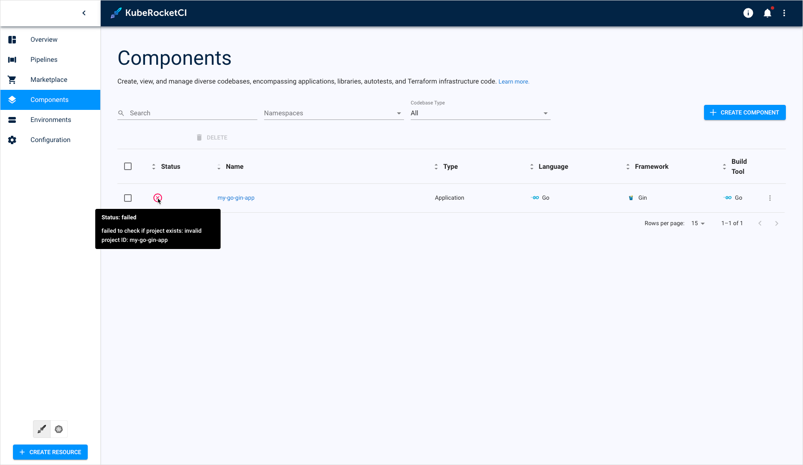

# Invalid Codebase ID Issue (GitHub/GitLab VCS)

## Problem

Users face unexpected "invalid project ID" error message when creating codebase:

  !

## Cause

The root cause of this issue lies in incorrectly setting the repository relative path. Users may overlook the requirement to add a prefix the repository name with the account or organization name when working with GitHub or GitLab version control systems. This oversight leads to the system interpreting the project ID as invalid.

## Solution

To solve this issue, follow the steps below:

1. Delete the codebase you failed to create.

2. Create a new one but with the correct Git repository relative path format specified.

  When creating a new codebase, ensure that the Git repository relative path is formatted correctly. This entails prefixing the repository name with the respective account or organization name. For example:

  ```bash
  account_or_organisation_name/repository_name
  ```

  Please refer to the [Add Application](https://epam.github.io/edp-install/user-guide/add-application/) page for more details.

3. Check if the porblem disappeared. It may take several minutes for the codebase to update its status.

  After creating the new codebase with the corrected repository path, check if the problem persists. It's important to note that it may take a few minutes for the codebase to update its status. Once the codebase is synced, ensure that the "invalid project ID" error no longer occurs:

  !

## Related Articles

* [Integrate GitHub/GitLab in Tekton](../../operator-guide/import-strategy-tekton.md)