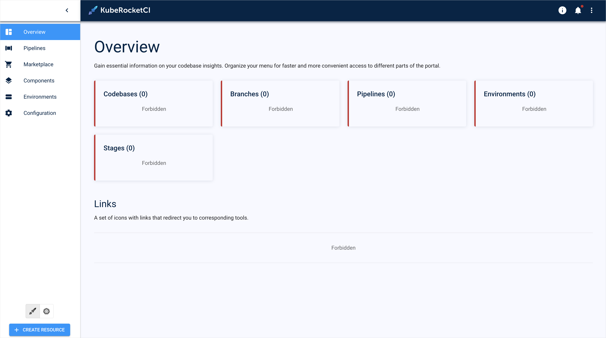

# Resource Observability Issue

## Problem

Users can't see resources within the KubeRocketCI dedicated namespace via KubeRocketCI portal:

  !

## Cause

The problem might be caused by several factors. First of all, default and allowed namespaces may be either unset or set incorrectly. Secondly, service account used for browsing the KubeRocketCI portal may have insufficient permission set. Thirdly, if Keycloak is used for as an authication mechanism, then the problem might be related to improper group membership.

## Solution

Solution can vary depending on the way users log into the platform, whether it is a service account token or an OpenID Connect mechanism.

### Solution 1 (Service Account Token)

This solution suits those who use a service account token to log into the KubeRocketCI portal.

To fix the problem, follow the steps below:

1. Check both default and allowed namespace by navigating to the **KubeRocketCI** portal -> **Account Settings** -> **Cluster**.

2. Check access rights of the service account at your disposal using the `kubectl describe` command:

  ```bash
  kubectl describe serviceaccount <service-account-name>> -n edp
  ```

3. Сheck the role binding associated with the account:

  ```bash
  kubectl describe serviceaccount <role-binding-name> -n edp
  ```

4. Check permissions of the role used in the role binding:

  ```bash
  kubectl desribe role <role-name> -n edp
  ```

5. Adjust resources to have sufficient permission set. Refer to the [KubeRocketCI Access Model](../../operator-guide/edp-access-model.md) page for more details about permissions required for proper resource visibility.

### Solution 2 (Keycloak)

This solution suits those who to log into the KubeRocketCI portal Keycloak.

To fix the problem, follow the steps below:

1. Log into your Keycloak portal.

2. Check you user membership among the predefined Keycloak groups. Please refer to the [KubeRocketCI Access Model](../../operator-guide/edp-access-model.md) page for details on the available Keycloak groups.

3. Add your user to the groups depending on which permissions you need to grant.

## Related Articles

* [KubeRocketCI Access Model](../../operator-guide/edp-access-model.md)