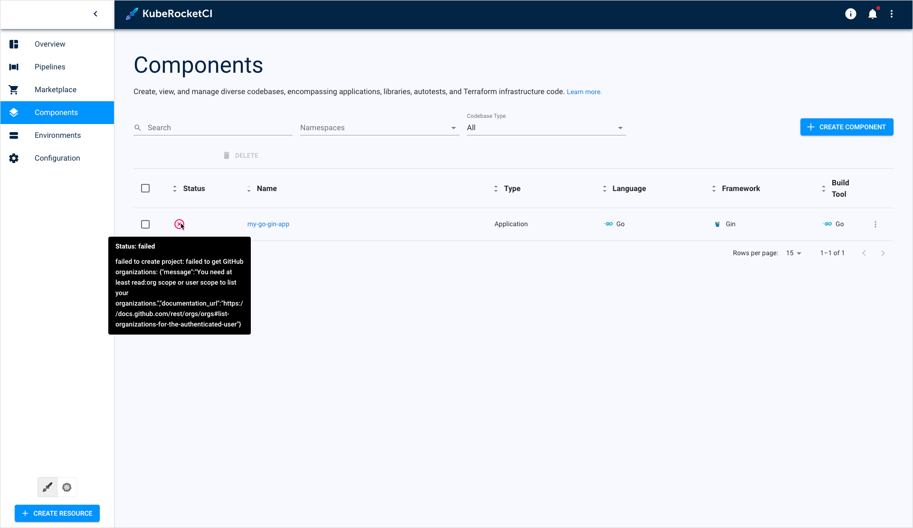
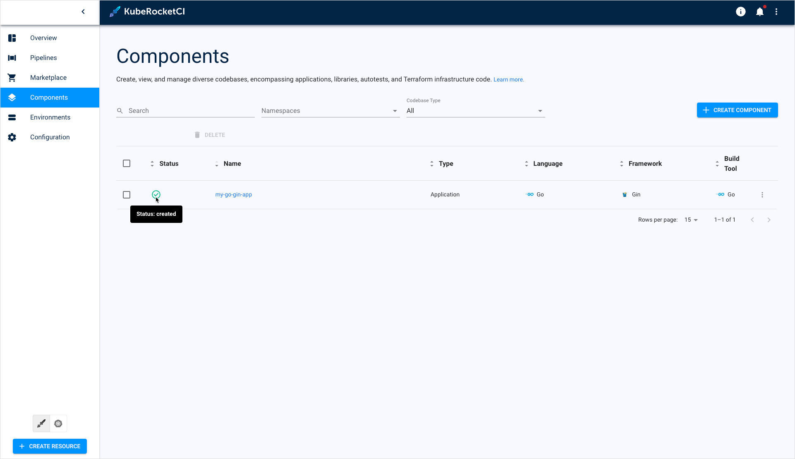

# Codebase Creation Issue

This troubleshooting page covers issues related to codebases.

## Problem

Application can't be added in the KubeRocketCI portal because of insufficient rights:

  !

## Cause

It is likely that the token that is created and used for Git Server integration lacks specific rights.

## Solution

To fix the problem, try the following method:

1. Adjust token rights or create a new token with the required set of permissions. Please refer to the [Integrate GitHub/GitLab in Tekton](https://epam.github.io/edp-install/operator-guide/import-strategy-tekton/) for details.

2. Ensure to set correct Git Server properties. The process of adding a Git Server is described in the [Manage Git Servers](https://epam.github.io/edp-install/user-guide/git-server-overview/) page.

3. Retry to create application.

  !

## Related Articles

* [Integrate GitHub/GitLab in Tekton](../import-strategy-tekton.md)