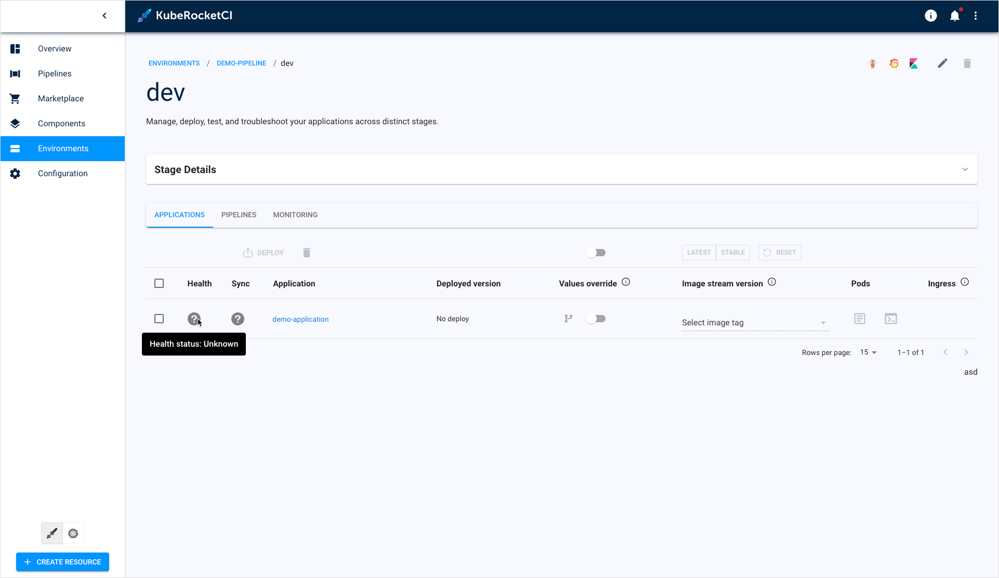
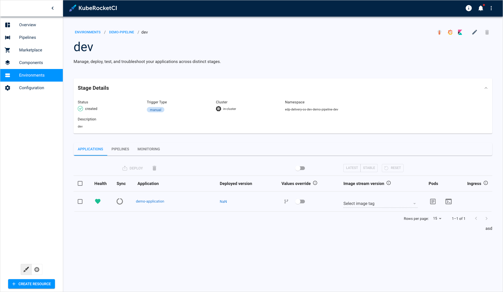

# Application Is Not Deployed

## Problem

In the **Stage Detail** page, the application status is unknown. The `deploy` button doesn't work when attempting to create a stage.

  !

## Cause

The `AppProject` custom resource may not be created or created incorrectly.

## Solution

1. Check logs of the application set controller pod using the `kubectl logs` command:

  ```bash
  kubectl get pods -n argocd
  kubectl logs <argo-cd-argocd-applicationset-controller-pod-name> -n argocd
  ```

  If the problem is related to the AppProject Argo CD resource, then you are supposed to see the following error message format:

  ```bash
  error generating application from params: failed to execute go template {{ .cluster }}: template: :1:3: executing "" at <.cluster>: map has no entry for key "cluster"
  ```

2. Check the AppProject Resource:

  ```bash
  kubectl get appprojects -n argocd
  ```

  It is supposed there are no resources or they are deployed incorrectly.

3. Create the `AppProject` custom resource. Please refer to the 4th step of the [Argo CD Integration](../../operator-guide/argocd-integration.md#argo-cd-configuration) page.

4. Apply the resource using the `kubectl apply` command and wait until the application is synced with Argo CD.

5. Check the status of the application:

  !

## Related Articles

* [Argo CD Integration](https://epam.github.io/edp-install/operator-guide/argocd-integration/#argo-cd-configuration)