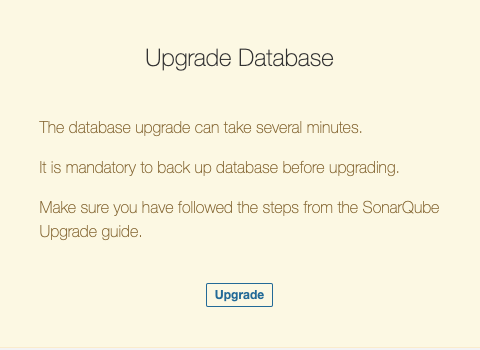
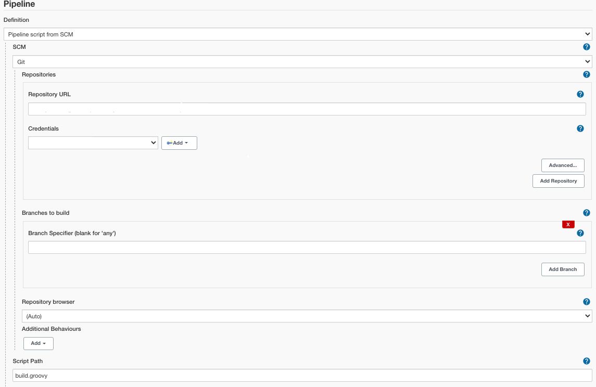

# Upgrade EDP v.2.9.0 to v.2.10.1

This section provides the details on the EDP upgrade from the v.2.9.0 to the v.2.10.1. Explore the actions and requirements below.

!!! Note
    Kiosk is optional for EDP v.2.9.0 and higher, and is [enabled](https://github.com/epam/edp-install/blob/release/2.10/deploy-templates/values.yaml#L34) by default. To disable it, add the following parameter to the `values.yaml` file: `global.kioskEnabled: false`. Please refer to the [Set Up Kiosk](install-kiosk.md) documentation for the details.

!!! Note
    In the process of updating the EDP, it is necessary to migrate the database for SonarQube, before performing the update procedure, please carefully read section 4 of this guide.

1. Before updating EDP from v.2.9.0 to v.2.10.1, delete SonarQube plugins by executing the following command in SonarQube pod:

      rm -r /opt/sonarqube/extensions/plugins/*

2. Update Custom Resource Definitions. Run the following command to apply all the necessary CRDs to the cluster:

      kubectl apply -f https://raw.githubusercontent.com/epam/edp-jenkins-operator/release/2.10/deploy-templates/crds/v2_v1alpha1_jenkins_crd.yaml
      kubectl apply -f https://raw.githubusercontent.com/epam/edp-keycloak-operator/release/1.10/deploy-templates/crds/v1_v1alpha1_keycloakclient_crd.yaml
      kubectl apply -f https://raw.githubusercontent.com/epam/edp-keycloak-operator/release/1.10/deploy-templates/crds/v1_v1alpha1_keycloakrealmcomponent_crd.yaml
      kubectl apply -f https://raw.githubusercontent.com/epam/edp-keycloak-operator/release/1.10/deploy-templates/crds/v1_v1alpha1_keycloakrealmidentityprovider_crd.yaml
      kubectl apply -f https://raw.githubusercontent.com/epam/edp-keycloak-operator/release/1.10/deploy-templates/crds/v1_v1alpha1_keycloakrealmrole_crd.yaml
      kubectl apply -f https://raw.githubusercontent.com/epam/edp-keycloak-operator/release/1.10/deploy-templates/crds/v1_v1alpha1_keycloakrealmuser_crd.yaml
      kubectl apply -f https://raw.githubusercontent.com/epam/edp-keycloak-operator/release/1.10/deploy-templates/crds/v1_v1alpha1_keycloak_crd.yaml
      kubectl apply -f https://raw.githubusercontent.com/epam/edp-nexus-operator/release/2.10/deploy-templates/crds/edp_v1alpha1_nexus_crd.yaml

3. To upgrade EDP to the v.2.10.1, run the following command:

      helm upgrade edp epamedp/edp-install -n <edp-namespace> --values values.yaml --version=2.10.1

  !!! Note
      To verify the installation, it is possible to test the deployment before applying it to the cluster with: 
      `helm upgrade edp epamedp/edp-install -n <edp-namespace> --values values.yaml --version=2.10.1  --dry-run`

4. Migrate the database for SonarQube according to the official [documentation](https://docs.sonarqube.org/latest/setup/upgrading/).

  !!! Note
      Please be aware of possible tables duplication for speeding up the migration process during the upgrade. Due to the duplication, the database disk usage can be temporarily increased to twice as the normal usage.
      Therefore, the recommended database disk usage is below 50% before the migration start.

  * Navigate to the project http://SonarQubeServerURL/setup link and follow the setup instructions:

    

  * Click the **Upgrade** button and wait for the end of the migration process.

5. Remove the resources related to the deprecated [Sonar Gerrit Plugin](https://plugins.jenkins.io/sonar-gerrit/) that is deleted in EDP 2.10.1:

  * Remove Sonar Gerrit Plugin from Jenkins(go to **Manage Jenkins** -> **Manage Plugins** -> **Installed** -> **Uninstall Sonar Gerrit Plugin**).
  * In Gerrit, edit the project.config file in All-Project view and remove the Sonar-Verified label declaration:

        [label "Sonar-Verified"]
            function = MaxWithBlock
            value = -1 Issues found
            value = 0 No score
            value = +1 Verified
            defaultValue = 0

   * Save the project.config file.
   * In Gerrit, edit the project.config file in All-Project view and remove the permissions for the Sonar-Verified label:

        label-Sonar-Verified = -1..+1 group Administrators
        label-Sonar-Verified = -1..+1 group Project Owners
        label-Sonar-Verified = -1..+1 group Service Users

   * Save the project.config file.

6. Update image versions for the Jenkins agents in the *ConfigMap*:

      kubectl edit configmap jenkins-slaves -n <edp-namespace>

   * The versions of the images should be:

        epamedp/edp-jenkins-codenarc-agent:1.0.1
        epamedp/edp-jenkins-dotnet-21-agent:1.0.5
        epamedp/edp-jenkins-dotnet-31-agent:1.0.4
        epamedp/edp-jenkins-go-agent:1.0.4
        epamedp/edp-jenkins-gradle-java8-agent:1.0.3
        epamedp/edp-jenkins-gradle-java11-agent:2.0.3
        epamedp/edp-jenkins-helm-agent:1.0.7
        epamedp/edp-jenkins-maven-java8-agent:1.0.3
        epamedp/edp-jenkins-maven-java11-agent:2.0.4
        epamedp/edp-jenkins-npm-agent:2.0.3
        epamedp/edp-jenkins-opa-agent:1.0.2
        epamedp/edp-jenkins-python-38-agent:2.0.4
        epamedp/edp-jenkins-terraform-agent:2.0.5

   * Restart the Jenkins pod.

7. Since EDP version v.2.10.x, the create-release.groovy, code-review.groovy, and build.groovy files are deprecated (`pipeline script from SCM` is replaced with `pipeline script`, see below).

   * Pipeline script from SCM:
     

   * Pipeline script:
      

   * Update the job-provisioner code and restart the codebase-operator pod. Consult the [default job-provisioners code](manage-jenkins-ci-job-provision.md) section.

### Related Articles

* [Manage Jenkins CI Pipeline Job Provisioner](manage-jenkins-ci-job-provision.md)
* [Set Up Kiosk](install-kiosk.md)
* [SonarQube Upgrade Guide](https://docs.sonarqube.org/latest/setup/upgrading/)
