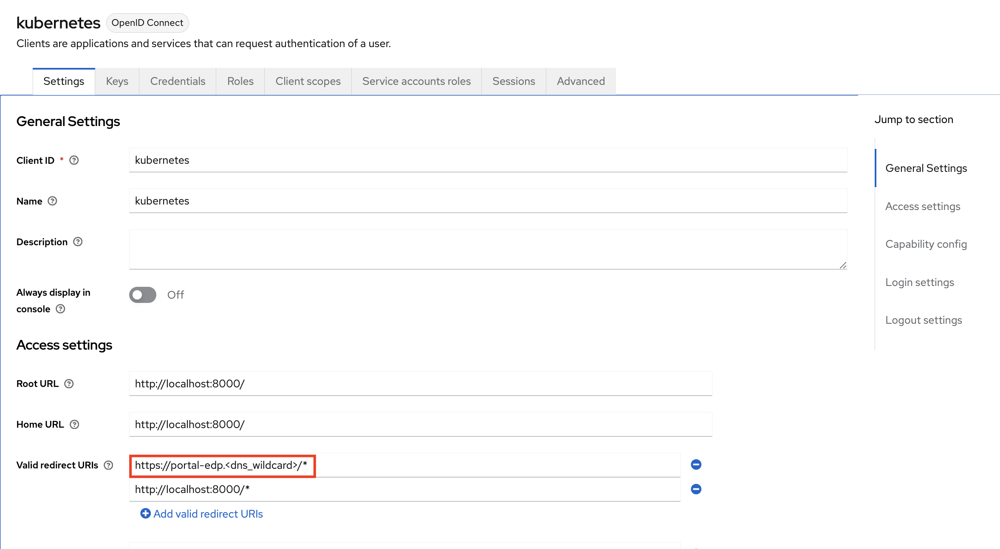

# Upgrade KubeRocketCI v3.7 to 3.8

!!! Important
    We suggest backing up the KubeRocketCI environment before starting the upgrade procedure.

This section provides detailed instructions for upgrading the KubeRocketCI to the 3.8.1 version. Follow the steps and requirements outlined below:

1. Delete the following resources:

    ```bash
    kubectl -n edp delete ingress edp-headlamp
    kubectl -n edp delete ingress edp-tekton-dashboard
    kubectl -n edp delete ingress el-github-listener

    ```

2. Delete the following Custom Resource Definitions (CRDs):

    ```bash
    kubectl delete CustomResourceDefinition edpcomponents.v1.edp.epam.com
    ```

  !!! Info
      Prior to deleting CRDs, please remove all the complementing resources:
      ```bash
      kubectl -n edp get edpcomponent -o custom-columns=":metadata.name" | xargs -I {} kubectl -n edp delete edpcomponent {}
      ```

3. In Keycloak, update the KubeRocketCI portal URL:

    Navigate to the Keycloak realm with the `Portal` client. Update the `Valid redirect URIs` field:

    Old value:

    ```text
    https://edp-headlamp-edp.<dns_wildcard>/*
    ```

    New value:
    ```
    https://portal-edp.<dns_wildcard>/*
    ```

    !

4. Remove all the Argo CD applications:

  !!! warning
      This command will delete all the deployments.

    ```bash
    kubectl -n edp get application -o custom-columns=":metadata.name" | xargs -I {} kubectl -n edp get application {} -o json | jq 'del(.metadata.finalizers)' | kubectl replace -f -
    ```

  !!! Info
      Beginning from version 3.8.x, KubeRocketCI uses Argo CD application set instead apllications to manage deploy environments, please ensure to upgrade your Argo CD instance to v2.10.3 and higher to work with this kind of resource. An example of how to install it is provided in the [edp-cluster-addons](https://github.com/epam/edp-cluster-add-ons/blob/main/add-ons/argo-cd/values.yaml#L30) repository.

5. Familiarize yourself with the updated file structure of the [values.yaml](https://raw.githubusercontent.com/epam/edp-install/v3.8.1/deploy-templates/values.yaml) file and adjust your values.yaml file accordingly:

  1. Starting from the version 3.8.x, KubeRocketCI supports multiple Git servers, so the `global.gitProvider` value was renamed:

    Old format:

    ```yaml
    global:
      gitProvider: github
    ```

    New format:

    ```yaml
    global:
      gitProviders:
        - github
        # - gitlab
        # - gerrit
    ...
    edp-tekton:
      gitServers:
        github:
          gitProvider: github
          host: github.com
          webhook:
            skipWebhookSSLVerification: false
          eventListener:
            enabled: true
            resources:
              requests:
                  memory: "64Mi"
                  cpu: "50m"
              limits:
                  memory: "128Mi"
                  cpu: "500m"
              ingress:
                enabled: true
    ```

  2. The `EDP-components` custom resources migrated to the `quick-links` section:

    Old format:
    ```yaml
    EDPComponents:
      - prometheus:
          url: https://ingress-prometheus.example.com
          visible: true
          icon: icon_in_base64
      - kibana:
          url: https://ingress-kibana.example.com
          visible: false
          icon: icon_in_base64
      - another_tool:
          url: https://ingress-anothertool.example.com
          visible: true
          icon: icon_in_base64
    ```

    New format for default components:
    ```yaml
    quickLinks:
      argocd: "https://argocd.example.com"
      defectdojo: "https://defectdojo.example.com"
      dependency_track: "https://dependency_track.example.com"
      docker_registry: "https://docker_registry.example.com"
      grafana: "https://grafana.example.com"
      kibana: "https://kibana.example.com"
      nexus: "https://nexus.example.com"
      sonar: "https://sonar.example.com"
    ```

    New format for extra components:
    ```yaml
    extraQuickLinks:
      - prometheus:
          url: https://ingress-prometheus.example.com
          visible: true
          icon: icon_in_base64
      - another_tool:
          url: https://ingress-anothertool.example.com
          visible: true
          icon: icon_in_base64
    ```

6. To upgrade KubeRocketCI to the v3.8.1, run the following command:

  ```bash
  helm upgrade edp epamedp/edp-install -n edp --values values.yaml --version=3.8.1
  ```

  !!! Note
      To verify the installation, test the deployment before applying it to the cluster using the `--dry-run` tag:<br>
      `helm upgrade edp epamedp/edp-install -n edp --values values.yaml --version=3.8.1 --dry-run`

7. Update webhooks for Github and GitLab:

  === "Command"

      ```bash
      kubectl -n edp get codebases -o custom-columns=":metadata.name" | xargs -I {} kubectl patch codebases -n edp {} --subresource=status --type=json -p '[{"op": "remove", "path": "/status/webHookID"}]'
      kubectl delete pod -l name=codebase-operator
      ```

  === "Manual"

      === "GitHub"
            Open repository in Github, navigate to `Settings` -> `Webhooks` -> Select exist webhook and click `edit`.
            Change Payload URL:

            ```text
            Old value: https://el-github-listener-edp.<dns_wildcard>

            New value: https://el-github-edp.<dns_wildcard>
            ```

      === "GitLab"
          Open repository in Github, navigate to `Settings` -> `Webhooks` -> Select exist webhook and click `edit`.
          Change URL:

          ```text
          Old value: https://el-gitlab-listener-edp.<dns_wildcard>

          New value: https://el-gitlab-edp.<dns_wildcard>
          ```
