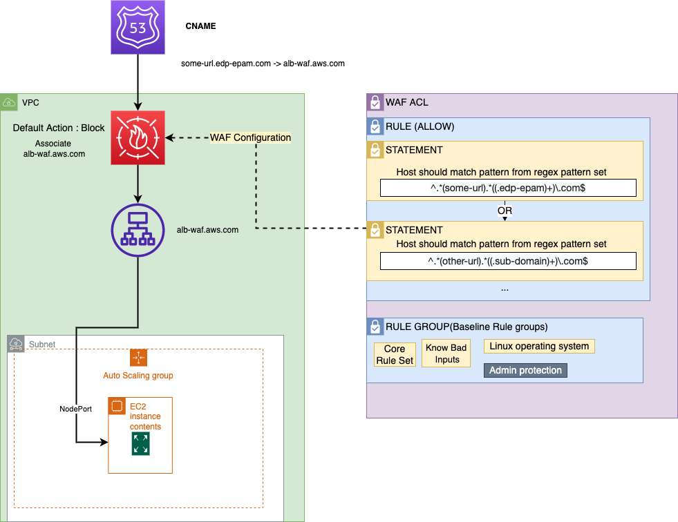

# Configure AWS WAF With Terraform

This page contains accurate information on how to configure [AWS WAF](https://aws.amazon.com/waf/) using Terraform with the aim to have a secured traffic exposure and to prevent the Host Header vulnerabilities.

## Prerequisites

To follow the instruction, check the following prerequisites:

1. Deployed infrastructure includes Nginx Ingress Controller
2. Deployed services for testing
3. Separate and exposed AWS ALB
5. terraform 0.14.10
6. hishicorp/aws = 4.8.0

## Solution Overview

The solution includes two parts:

1. Prerequisites (mostly the left part of the scheme) - AWS ALB, Compute Resources (EC2, EKS, etc.).
2. WAF configuration (the right part of the scheme).

The WAF ACL resource is the main resource used for the configuration; The default web ACL option is Block.

!

The ACL includes three managed AWS rules that secure the exposed traffic:

- AWS-AWSManagedRulesCommonRuleSet
- AWS-AWSManagedRulesLinuxRuleSet
- AWS-AWSManagedRulesKnownBadInputsRuleSet

AWS provides a lot of rules such as baseline and use-case specific rules, for details, please refer to the [Baseline rule groups](https://docs.aws.amazon.com/waf/latest/developerguide/aws-managed-rule-groups-baseline.html).

There is the _PreventHostInjections_ rule that prevents the Host Header vulnerabilities. This rule includes one statement that declares that the Host Header should match Regex Pattern Set, thus only in this case it will be passed.

The Regex Pattern Set is another resource that helps to organize regexes, in fact, is a set of regexes. All regexes added to the single set are matched by the OR statement, i.e. when exposing several URLs, it is necessary to add this statement to the set and refer to it in the rule.

## WAF ACL Configuration

To create the Regex Pattern Set, inspect the following code:

```terraform
resource "aws_wafv2_regex_pattern_set" "common" {
  name  = "Common"
  scope = "REGIONAL"

  regular_expression {
    regex_string = "^.*(some-url).*((.edp-epam)+)\\.com$"
  }

  #  Add here additional regular expressions for other endpoints, they are merging with OR operator, e.g.

  /*
   regular_expression {
      regex_string = "^.*(keycloak).*((.edp-epam)+)\\.com$"
   }
   */

  tags = var.tags
}
```

It includes 'regex_string', for example: url - some-url.edp-epam.com,
In addition, it is possible to add other links to the same resource using the regular_expression element.

There is the Terraform code for the aws_wafv2_web_acl resource:

```terraform
resource "aws_wafv2_web_acl" "external" {
  name  = "ExternalACL"
  scope = "REGIONAL"

  default_action {
    block {}
  }

  rule {
    name     = "AWS-AWSManagedRulesCommonRuleSet"
    priority = 1

    override_action {
      none {}
    }

    statement {
      managed_rule_group_statement {
        name        = "AWSManagedRulesCommonRuleSet"
        vendor_name = "AWS"
      }
    }

    visibility_config {
      cloudwatch_metrics_enabled = true
      metric_name                = "AWS-AWSManagedRulesCommonRuleSet"
      sampled_requests_enabled   = true
    }
  }

  rule {
    name     = "AWS-AWSManagedRulesLinuxRuleSet"
    priority = 2

    statement {
      managed_rule_group_statement {
        name        = "AWSManagedRulesLinuxRuleSet"
        vendor_name = "AWS"
      }
    }

    override_action {
      none {}
    }

    visibility_config {
      cloudwatch_metrics_enabled = true
      metric_name                = "AWS-AWSManagedRulesLinuxRuleSet"
      sampled_requests_enabled   = true
    }
  }

  rule {
    name     = "AWS-AWSManagedRulesKnownBadInputsRuleSet"
    priority = 3

    override_action {
      none {}
    }

    statement {
      managed_rule_group_statement {
        name        = "AWSManagedRulesKnownBadInputsRuleSet"
        vendor_name = "AWS"
      }
    }

    visibility_config {
      cloudwatch_metrics_enabled = true
      metric_name                = "AWS-AWSManagedRulesKnownBadInputsRuleSet"
      sampled_requests_enabled   = true
    }
  }

  rule {
    name     = "PreventHostInjections"
    priority = 0

    statement {
      regex_pattern_set_reference_statement {
        arn = aws_wafv2_regex_pattern_set.common.arn

        field_to_match {
          single_header {
            name = "host"
          }
        }

        text_transformation {
          priority = 0
          type     = "NONE"
        }
      }
    }

    action {
      allow {}
    }

    visibility_config {
      cloudwatch_metrics_enabled = true
      metric_name                = "PreventHostInjections"
      sampled_requests_enabled   = true
    }
  }

  visibility_config {
    cloudwatch_metrics_enabled = true
    metric_name                = "ExternalACL"
    sampled_requests_enabled   = true
  }

  tags = var.tags
}
```

As mentioned previously, ACL includes three managed AWS rules (group rules), for visibility, enabling sampling, and CloudWatch in the config.
The 'PreventHostInjections' custom rule refers to the created pattern set and declares the Host Header, as well as sets the 'Action' if matched to 'Allow'.

## Associate AWS Resource

To have the created ACL working, it is necessary to associate an AWS resource with it, in this case, it is AWS ALB:

```terraform
resource "aws_wafv2_web_acl_association" "waf_alb" {
  resource_arn = aws_lb.<aws_alb_for_waf>.arn
  web_acl_arn  = aws_wafv2_web_acl.external.arn
}
```

!!! note
    AWS ALB can be created in the scope of this Terraform code or created previously. When creating ALB to expose links, the ALB should have a security group that allows some external traffic.

When ALB is associated with the WAF ACL, direct the traffic to the ALB by the Route53 CNAME record:

```terraform
module "some_url_exposure" {
  source  = "terraform-aws-modules/route53/aws//modules/records"
  version = "2.0.0"

  zone_name = "edp-epam.com"

  records = [
    {
      name    = "some-url"
      type    = "CNAME"
      ttl     = 300
      records = [aws_lb.<aws_alb_for_waf>.dns_name]
    }
  ]
}
```

In the sample above, the module is used, but it is also possible to use a Terraform resource.
