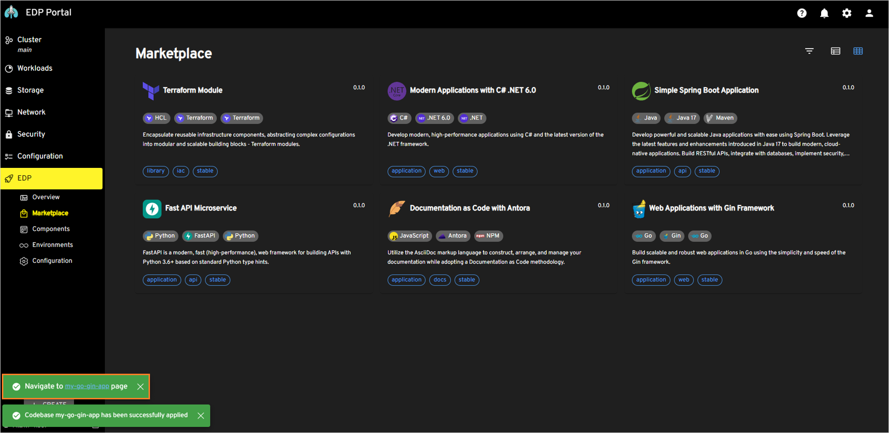
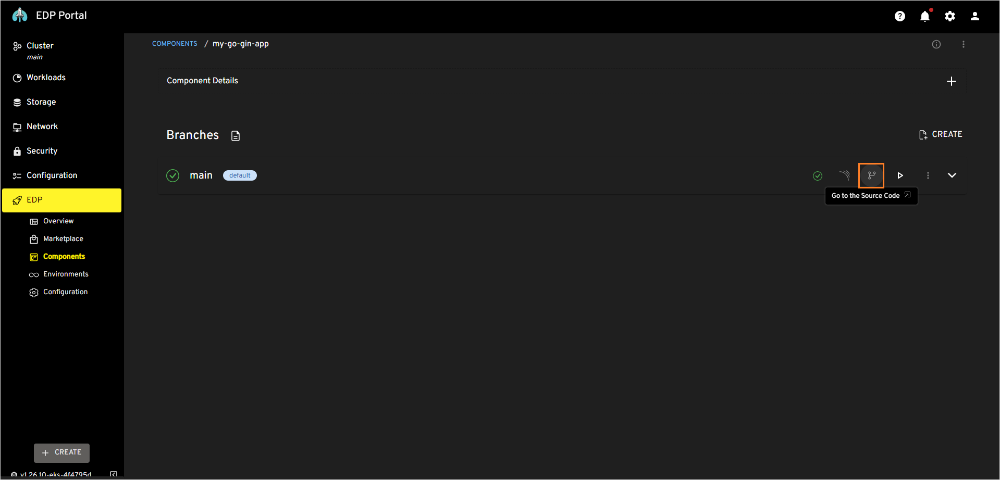
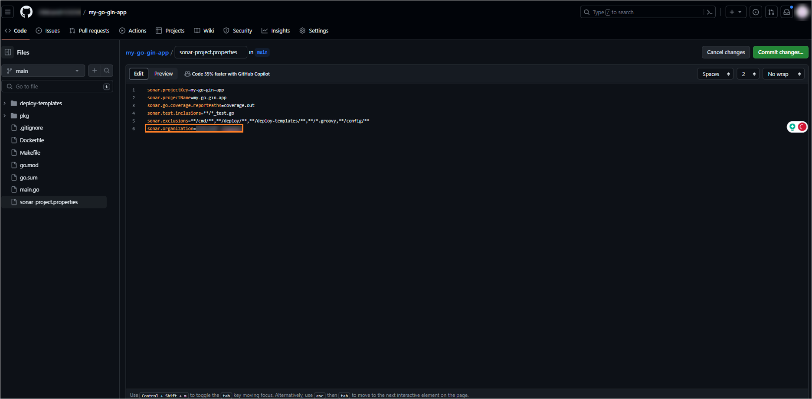
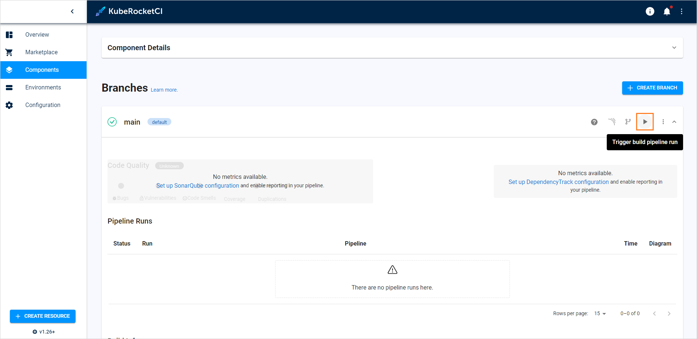
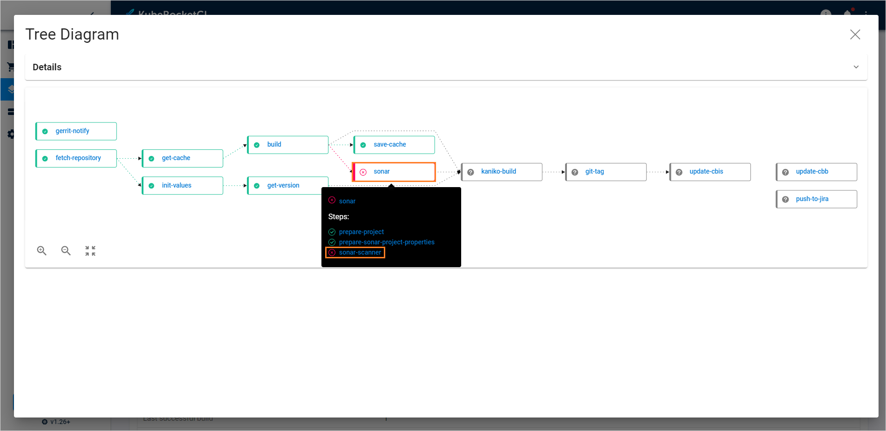
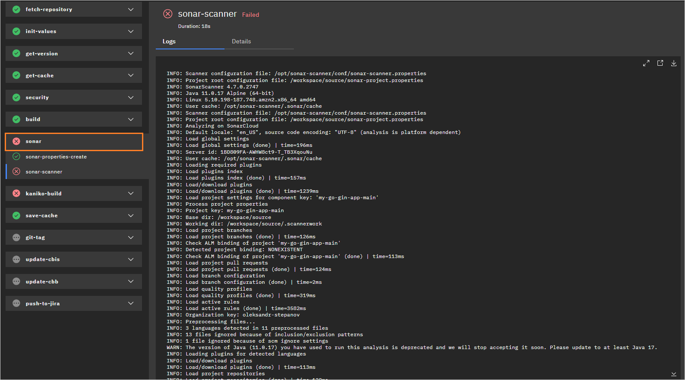

# Create Application

In EDP, all software components, such as applications, libraries, Terraform infrastructures, and automated tests, are termed as codebases. EDP provides flexible methods for scaffolding these components.

This guide will lead you through creating a Go application using the Gin framework. The [EDP Marketplace](../user-guide/marketplace.md) will be utilized to streamline the application creation process.

## Application Onboarding

To create the first application, complete the instructions below:

1. In the EDP Portal, navigate to `EDP` -> `Marketplace`.

2. In the `Marketplace` section, select **Web Applications with Gin Framework**:

  !

3. In the appeared window, define the following values and click **Apply**:

  * Component name: `my-go-gin-app`<br>
  * Description: `My first application`<br>
  * Git server: `github`<br>
  * Repository name: `<github_account_name>/my-go-gin-app`<br>
  * Codebase versioning type: `edp`<br>
  * Start version from: `0.1.0`<br>
  * Suffix: `SNAPSHOT`

  !

4. As soon as the codebase is created, navigate to it via the notification at the bottom left corner:

  !

## Build Application

Having created the Go application, proceed to build it by performing the following actions:

1. In the component details page, expand the application and click the **Go to the Source Code** button:

  !

2. In the opened Source Code, create new branch called **test**.

3. In the SonarCloud organization page, copy the value of the SonarCloud organization name:

  !

4. In the **test** branch in GitHub, open the `sonar-project.properties` file and include the `sonar.language=go`, `sonar.scanner.force-deprecated-java-version=true`, and `sonar.organization` parameters where `sonar.organization` is equal to the value copied in the previous step, resulting in the following configuration:

    ```bash
    sonar.projectKey=my-go-gin-app
    sonar.projectName=my-go-gin-app
    sonar.go.coverage.reportPaths=coverage.out
    sonar.test.inclusions=**/*_test.go
    sonar.exclusions=**/cmd/**,**/deploy/**,**/deploy-templates/**,**/*.groovy,**/config/**
    sonar.language=go
    sonar.organization=<organization-key>
    sonar.scanner.force-deprecated-java-version=true
    ```

  !

5. Commit the changes.

6. Create and merge a pull request:

  !

7. Run the `kubectl edit task` command to update the version of the image that is used in the **sonarqube-scanner** task from `4.7` to `5.0.1`:

  ```bash
  kubectl edit task sonarqube-scanner -n edp
  ```

  ```yaml
      - image: sonarsource/sonar-scanner-cli:5.0.1
      name: sonar-scanner
      workingDir: $(workspaces.source.path)
      env:
        - name: SONAR_TOKEN
          valueFrom:
            secretKeyRef:
              name: $(params.ci-sonarqube)
              key: token
      command:
        - sonar-scanner
  ```

  !!! note
      This step is necessary due to SonarCloud's discontinuation of support for Java 11, which is utilized in the sonarqube-scanner image. This solution is designed specifically for the EDP 3.7.x and lower versions. Users of EDP 3.8.x and higher versions can skip this step.

8. In the component details page, click the **Trigger build pipeline run** button:

  !

9. Enable port-forwarding for the edp-tekton-dashboard service (in case ingress is not deployed):

      kubectl port-forward service/edp-tekton-dashboard 64372:8080 -n edp

    ```bash
    localhost:64372
    ```

10. To observe the build pipeline status, click the tree diagram icon in the Diagram column:

  !


11. Once the build is failed, click the failed stage name to open the Tekton pipeline run:

  !

  The initial pipeline is expected to fail, primarily due to SonarCloud intricacies. It is imperative to set a Quality Gate in SonarCloud after the initial pipeline run and subsequently re-trigger the build pipeline. After the pipeline failure, a new project is expected to appear in the organization.

12. In the SonarCloud organization, select the newly appeared project and click the **Set New Code Definition** button:

  !

13. In the **New Code** page, set the **Previous version** option and click **Save**:

  !

14. In EDP Portal, trigger build pipeline run one more time and wait until the pipeline run is finished.

Build pipelines are designed to generate an executable image of an application. Once built, the image can be run in a target environment.

Now that you have successfully built an application, the next step involves creating an environment for deployment. To deploy the application, it is necessary to install and integrate Argo CD. To deploy the application, we need to install and integrate Argo CD. To do this, navigate to the [Integrate Argo CD](integrate-argocd.md) page.
