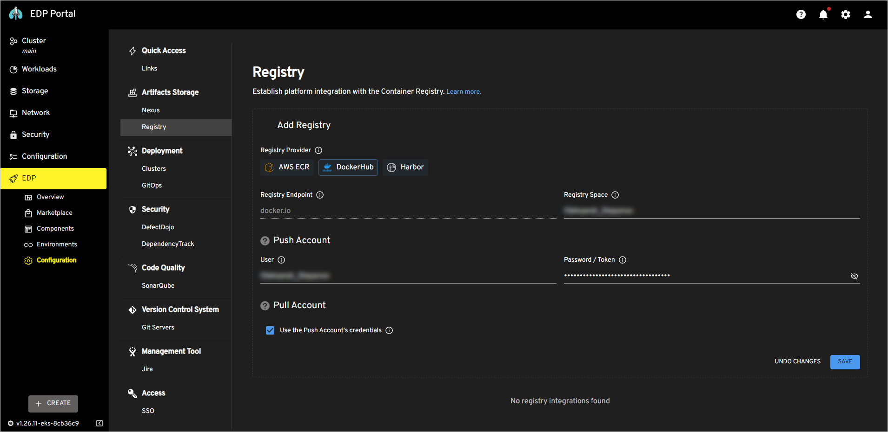

# Integrate DockerHub

EDP utilizes container registries for storing and distributing application images. This page provides instructions on integrating your platform with DockerHub.

## Integration Procedure

To integrate EPAM Delivery Platform with DockerHub, complete the guidelines below:

1. Log in to your DockerHub account.

2. In the DockerHub main page, click your user icon at the top right corner and select **Account Settings**.

3. In the **Account Settings** page, select the **Security** tab and click **New Access Token**.

4. Enter the token description, select the **Read, Write, Delete** permission and click **Generate**.

5. Copy the generated token:

  !

6. In EDP Portal, navigate to `EDP` -> `Configuration` -> `Registry` and click the **Add Registry** button.

7. In the **Registry Provider** field, select DockerHub. Define the following values and click **Save**:

  * Registry Endpoint: `https://docker.io` 
  * Registry Space: `DockerHub account name` 
  * User: `DockerHub account name` 
  * Password/Token: `Your generated access token` 
  * Use the Push Account's credentials: `check`

  !

!!! note
    In the DockerHub context, the **Registry Space** field is equivalent to the account/organization name.

With all integrations in place, let us move forward with creating applications. Please proceed to the [Create Application](create-application.md) page for further instructions.
