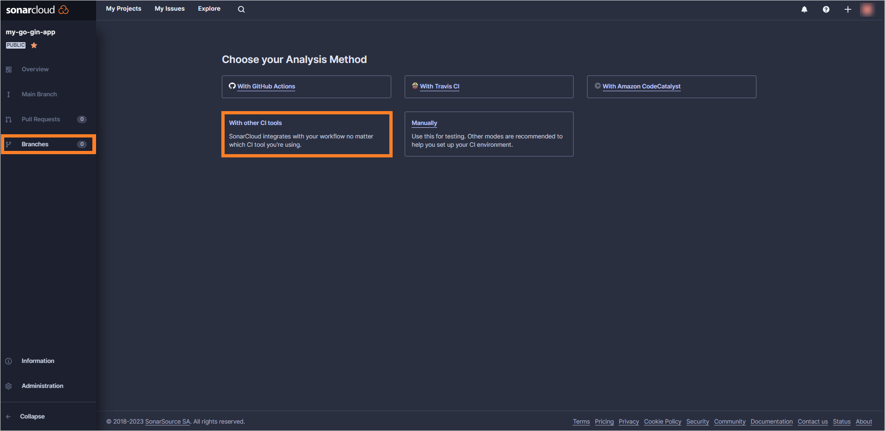
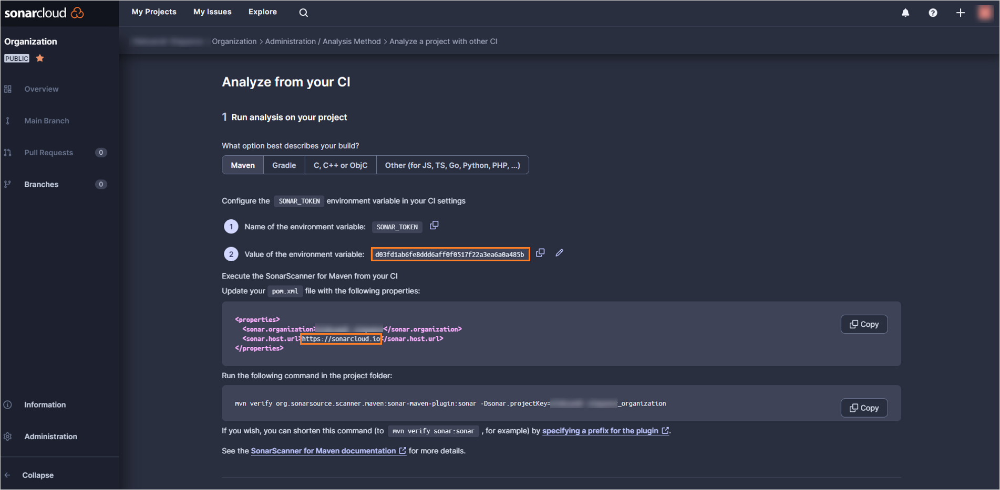
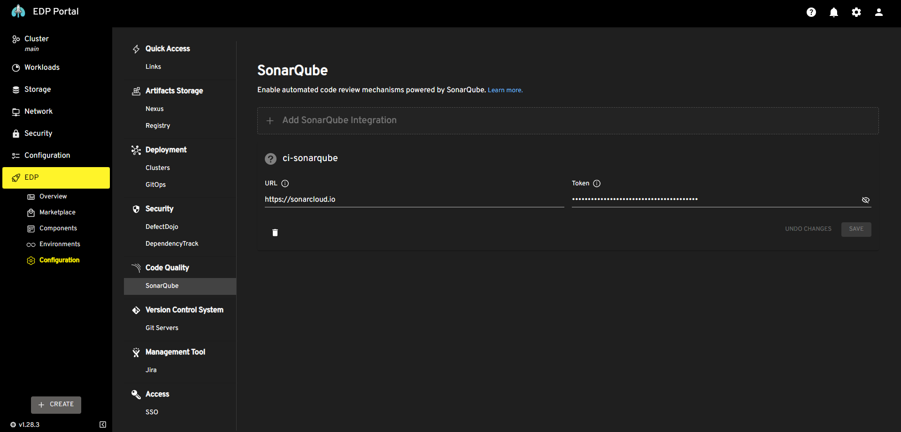

# Integrate SonarQube

SonarQube is a robust tool employed in build and code review pipelines to elevate code quality by detecting and reporting issues, along with offering improvement recommendations. SonarCloud, the SaaS solution provided by SonarQube, serves this purpose. This guide will lead you through the configuration process of SonarCloud for your project.

!!! note
    An alternative option is to use an independent [SonarQube instance](../operator-guide/sonarqube.md).

## Integrate SonarCloud

To integrate SonarCloud with the platform, follow the steps below:

1. Sign up in the [SonarCloud](https://sonarcloud.io).

2. Once you are logged in, click the **+** icon at the right upper corner and select **Analyze new project**.

3. In the **Analyze projects** page, enter the organization name (e.g., My-Organization) and click **Next**:

  !

4. In the **Set up project for Clean as You Code** page, select the **Create a project manually** option.

5. Set the project name, select the **Number of days** option set to 48 and click **Create project**:

  !

6. Once the project is created, navigate to the **Branches** tab and select the **With other CI tools** option:

  !

7. Copy both the environment variable and `sonar.host.url` values:

  !

8. In EDP Portal, navigate to `EDP` -> `Configuration` -> `SonarQube`. Insert the copied values in the corresponding fields:

  !

After completing the SonarQube integration, proceed to integrate the platform with GitHub. Navigate to the [Integrate GitHub](integrate-github.md) page for further instructions.
